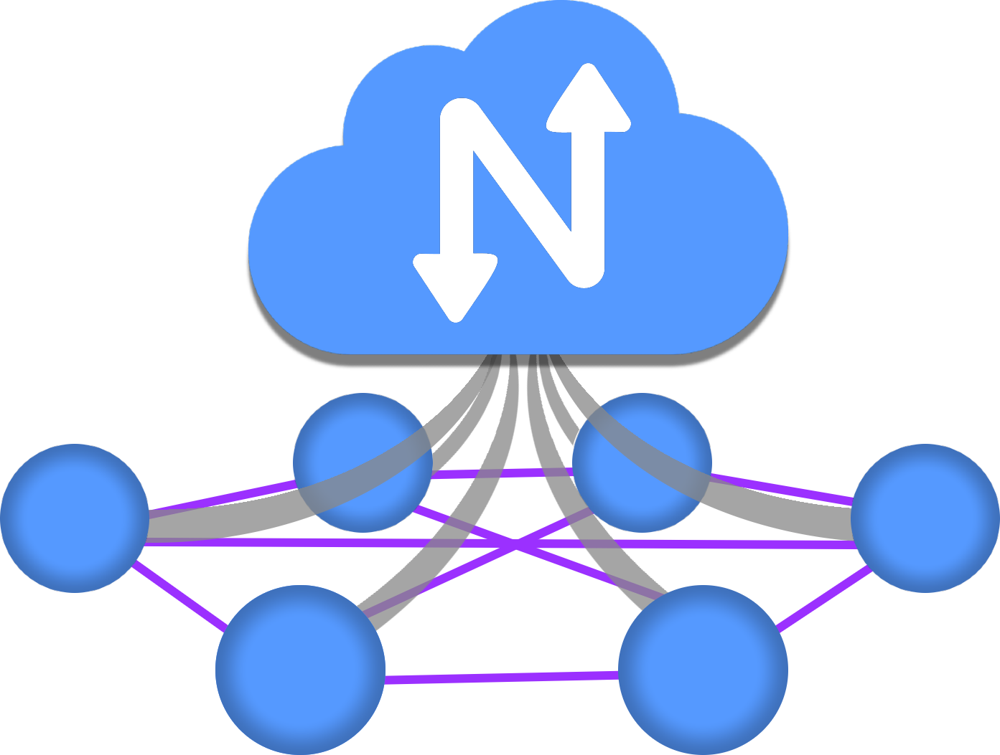

==========
About
==========

What is Netmaker?
==================

Netmaker is a tool for creating and managing virtual overlay networks. If you have at least two machines with internet access that you need to connect with a secure tunnel, Netmaker is for you. If you have thousands of servers spread across multiple locations, data centers, or clouds, Netmaker is also for you. Netmaker connects machines securely, wherever they are.

.. image:: images/mesh-diagram.png
   :width: 50%
   :alt: WireGuard Mesh
   :align: center

Netmaker takes these machines and creates a flat network so that they can all talk to each other easily and securely. 
If you're familiar with AWS, it's like a VPC but made up of arbitrary computers. From the machine's perspective, all these other machines are in the same neighborhood, even if they're spread all over the world.

Beyond creating a flat network, Netmaker introduces Ingress and Egress, which are gateways that control the flow of traffic into and out of the network. Netmaker also has ACLs, which control exactly which machines can reach each other. The end result is you can create much more complex networks than a simple mesh.

.. image:: images/netmaker-advanced.png
   :width: 80%
   :alt: Netmaker Architecture Diagram
   :align: center

Netmaker has many similarities to Tailscale, ZeroTier, and Nebula. What makes Netmaker different is the speed and flexibility. Netmaker is faster because it uses kernel WireGuard. It is more dynamic because the server and agents are fully configurable, which lets you handle all sorts of different use cases. And, of course, you can also self-host Netmaker, which gives you complete control of your network traffic.

How Does Netmaker Work?
=======================

Netmaker relies on WireGuard to create tunnels between machines. At its core, Netmaker is managing WireGuard across machines to create sensible networks. Technically, Netmaker is two things:

- the admin server, called Netmaker
- the agent, called Netclient

As the network manager, you interact with the server to create and manage networks and devices. The server holds configurations for these networks and devices and pushes updates to the agents (netclient) over a message queue.

The netclient is installed on any machine you would like to add to a given network, whether that machine is a VM, Server, Kubernetes node, or IoT device. The netclient subscribes to the MQ broker, and the server tells it how to configure WireGuard. The client will let the server know when any local changes (like ip address, port) should be pushed out to the other clients. By doing this across many machines simultaneously, we create fully dynamic and configurable virtual networks.

The Netmaker server does not typically route traffic, which would be a hub-and-spoke model (much slower). Instead, Netmaker just tells the machines on the network how they can reach each other directly. This is called a *full mesh* network and is much faster. Even if the server goes down, as long as none of the existing machines change substantially, your network will still run just fine.

Use Cases for Netmaker
=============================

There are many use cases for Netmaker. In fact, you could probably be using it right now. Because of Netmaker's extreme speed, there is almost no cost to putting a Netmaker overlay network on top of any existing Network. The question becomes, why not use Netmaker? You've already got the machines; why not encrypt the traffic and make your network dynamic?

This list is not all-encompassing but provides a sample of how many users use Netmaker in production today. Guided setup for many of these use cases can be found in the :doc:`Using Netmaker <./usage>` documentation. 

 0. Automate the creation of a large WireGuard-based network
 1. Create a flat, secure network between multiple environments (VPCs, clouds, data centers)
 2. Secure access to a home or office network
 3. Provide remote access to resources like an AWS VPC, data center, or K8S cluster  
 4. Create distributed, cross-cloud Kubernetes clusters or database clusters
 5. Manage a secure mesh of IoT devices 