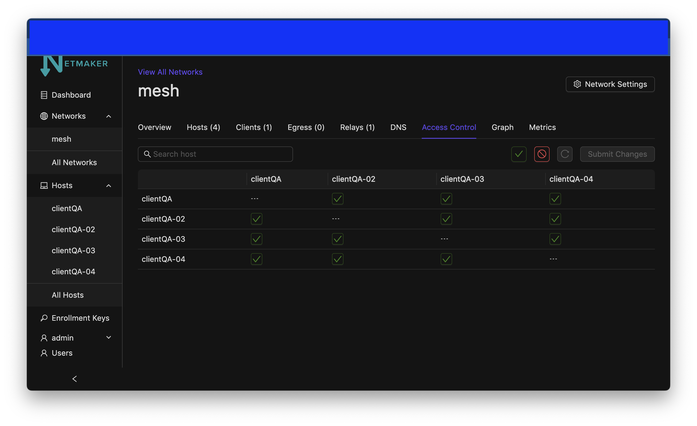
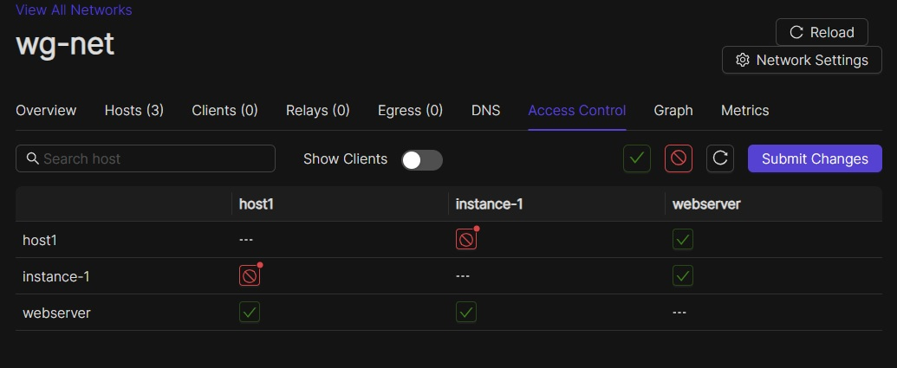
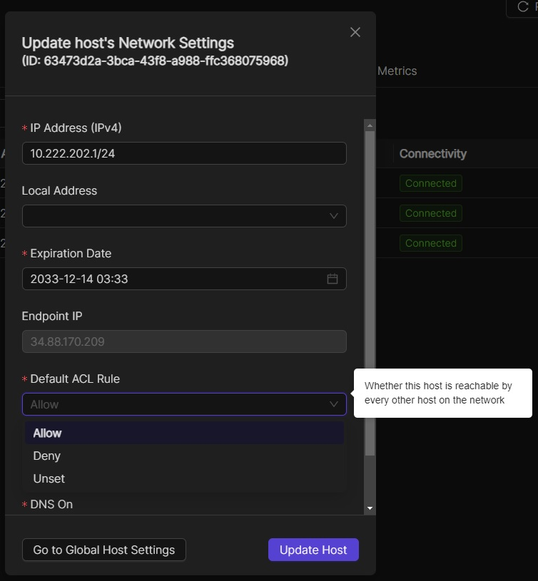

=====================================
Access Control Lists
=====================================

Introduction
===============

By default, Netmaker creates a "full mesh," meaning every node in your network can talk to every other node. You don't always want this to be the case. Sometimes, only some connections should be valid. That's why Netmaker has ACLs. By using Netmaker's ACL feature, you can enable/disable any peer-to-peer connection in your network to remove its ability to communicate.

Configuring ACLs
==================================

The ACL feature can be accessed by either clicking on "ACLs" in the sidebar, or by clicking on a Node in either the Node List or in the Graph view.

ACL Screen
--------------

If you are on the ACLs tab (pictured above), you will have a complete list of all ACLs for the whole network. You can simply click on any one of these to enable or disable a pair of connections. You will note that when you "disable" the connection from any one node, it will automatically "disable" the matching connection on the other node. An update is sent to the nodes over MQ, telling them to remove the connection locally.

In the upper right-hand corner of the screen, you will also notice an "Allow All" button and a "Block All" button. "Allow All" will enable all connections, and "Block All" will block all connections. If you block all connections, no nodes will be able to talk to each other.

For more information, see the :doc:`UI reference. <./ui-reference>`

Node ACL Screen
---------------------

Alternatively, you can reach the individual node ACLs by clicking on a Node in either the Node List or the Graph view. This will give you the ACLs for just this individual node, making it easier to enable/disable peers at an individual level.

Default Node-Level ACLs
============================

When you create a network, you set a "default ACL" of either "Allow" or "Deny." This means all nodes either reach each other by default, or cannot reach each other by default.

As of 0.16.0, there is another option, the default node-level ACL.

This allows you to set the default connectivity status of an individual node. This is useful for two scenarios.

Scenario 1: Remote Access to/from Client devices
-------------------------------------------------------

In many cases, you have many machines which should be reachable from one machine. OR, you have one machine which should be reachable from many machines.

Example 1: A file server for employees. Employees need to access the file server from their individual devices, but should not have access to each other.

Example 2: Managing client devices. An MSP or IT Shop needs to remote into client devices, but those devices definitely should not have access to each other.

For either of these scenarios, we should do the following:

1. Create a network with default "DENY" policy

2. Create a node with default "ALLOW" policy

Once this is done, all devices in the network will have access only to the device with the default "ALLOW" policy. However, you can still override this to allow access for specific other machines.

Scenario 2: Priviledged Access to Device
-------------------------------------------------------

In some cases, you want a machine in your network to be accessible from some, but not all, of your devices. Or maybe you have an Egress Gateway on a device, and only want some devices to use it.

In this case, we can set up a network as follows:

1. Create a network with default "ALLOW" policy

2. Create a node with default "DENY" policy

Once this is done, all devices in the network will have access to everything except the device(s) with a defult DENY policy, which can be manually overridden in the ACL management pane.
