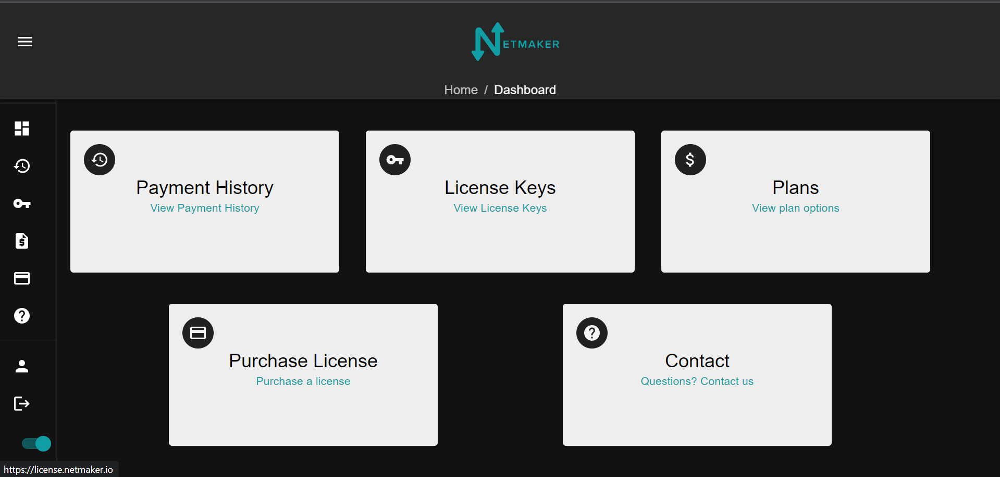
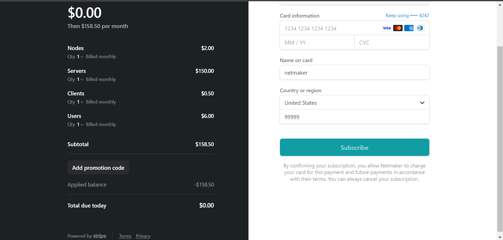
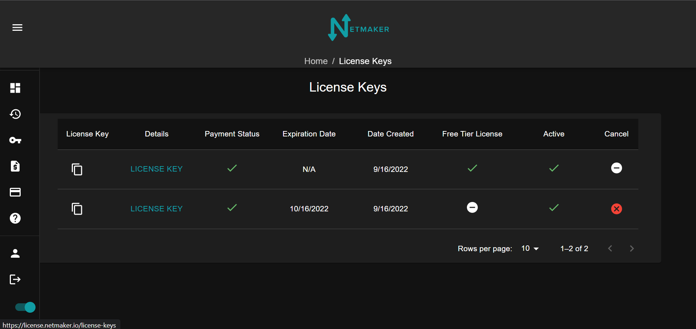

=================================
Netmaker Enterprise
=================================
Netmaker Enterprise is our paid version Netmaker. It offers all the great features of our community edition plus metrics, easier access to server logs, and the ability to set users with different access levels.

Get a License
=================================

Visit `<https://license.netmaker.io>`_ to get a license. After creating an account, you will be taken to the dashboard.

Choose which plan fits your needs. 

.. image:: images/ee-plans.png
   :width: 80%
   :alt: Plans to choose
   :align: center

You will have the option of choosing to pay yearly or monthly. You will also see a layout of the cost of each node, server, user, and ext client.

.. image:: images/ee-purchase-license.png
    :width: 80%
    :alt: Purchase yearly or monthly
    :align: center

Choose how many of each node, server, user, ext clients, that you need. You can also change these amounts in the license tab should you need to adjust those numbers later.

After a successful payment, you will get a confirmation email.

Setup your server
=================================

You will first need to get your license key and account ID. Your confirmation email after you make an account will have a license key for a free trial version and your user ID. The confirmation email after buying a licence will have your new license key.

You can also find your license keys in the license key tab. The copy icon on the left will have the license key.

Also in this same tab, you can click on the license key and add or remove any servers, nodes, users, or ext clients to your plan.

.. image:: images/ee-license-edit.png
    :width: 80%
    :alt: edit plan
    :align: center

Once you have your license key and account ID, go to your netmaker server and add the following to your docker-compose.yml environment variables

.. code-block:: yaml

    LICENSE_KEY: “<license key>”
    NETMAKER_ACCOUNT_ID: "<account id>"

Also change the netmaker image to ``image: gravitl/netmaker:v0.16.0-ee``. After that ``docker kill netmaker netmaker-ui && docker-compose up -d`` and you should see the enterprise UI on dashboard.<YOUR_BASE_DOMAIN> 

You should see a new Dashboard with an Admin tab added. On the arrow will be tabs for the server logs and metrics.

.. image:: images/ee-new-dashboard.png
    :width: 80%
    :alt: new dashboard
    :align: center
