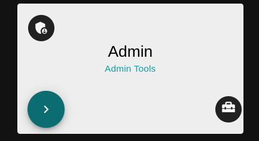
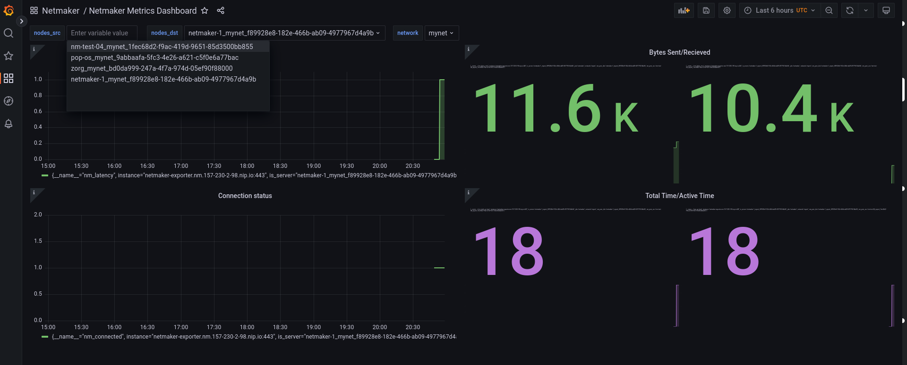

=================================
Netmaker Enterprise Metrics
=================================

Navigation
===============

Netmaker EE offers metrics. With Metrics, admin users can view connectivity, 
latency and data transferred between two peers or nodes on a Netmaker network.  
All of this data may be visualised in the Netmaker UI. In addition, Netmaker 
has included a custom exporter for Prometheus/Grafana integration to view 
the data as well.

Below are the steps in order to view metrics on your Netmaker EE instance.

**NOTE: Metrics currently relies on ICMP to be allowed between nodes.**

First, there are two ways for a Netmaker Admin to view metrics. 
- Using the `Admin Tools` card on their dashboard.

- Or by using the Metrics link in their side Drawer.

.. image:: images/metrics/metrics-select-2.png
   :width: 40%
   :alt: Metrics Select 2
   :align: center

Viewing Details
===============

Then, once you have successfully navigated to the metrics page,
simply select the Netmaker network you would like to view metrics for.
The metrics of the nodes currently on that network will be presented and 
indicate if nodes are connected with a blue check mark or red 'X' if not.
This page is a general overview of the network. If you hover a blue-checkmark
connection, it will tell you the latency in Tooltip fashion. 

NOTE: Metrics may take up to 5 minutes for nodes to report data. 

.. image:: images/metrics/metrics-view-1.png
   :width: 80%
   :alt: Metrics View 1
   :align: center

Then, if the Admin wishes to see more details, they can select a specific node from the 
`Node Name` column or row in the metrics table to view more details of that node's connections. 

.. image:: images/metrics/metrics-view-2.png
   :width: 80%
   :alt: Metrics View 2
   :align: center

Once a node is selected, the Netmaker Admin will be presented with 
total data sent and received from all connections at the top.
The Netmaker Admin may also choose to view details of connections between
individual peers under the `Peer Connections` table and can search
for other nodes by name.

Grafana Dashboard
=================================

If your Netmaker instance includes the Prometheus/Grafana setup and is configured with the `METRICS_EXPORTER="on"`, you 
can also view your metrics via Grafana. Simply navigate to the `dashboards` section of your Grafana instance. There,
you will be presented with two out-of-the-box Netmaker options of the following:
- `Netmaker Metrics Dashboard`
- `Netmaker Network Graph`

.. image:: images/metrics/metrics-grafana1.png
    :width: 80%
    :alt: Netmaker Grafana Dashboards
    :align: center

First try viewing the `Netmaker Metrics Dashboard`.
This view will give you the option to select and view data on individual nodes in your Netmaker network.

Then try out the `Netmaker Network Graph` view.
This graph gives a Network graph, in which the user may hover individual nodes to see statistics of that node.
Or hover an edge to view information about the connection between two nodes. The node edges will vary depending on connection status (green for connected or red for disconnected).

.. image:: images/metrics/metrics-grafana2.png
    :width: 80%
    :alt: Netmaker Grafana View 2
    :align: center

Also you can view your metrics on `prometheus dashboard`,for the first time you will be prompted for credentials in your brower when you visit your prometheus dashboard.
.. code-block::

    UserName: "Netmaker-Prometheus"
    Password: "<YOUR_LICENSE_KEY>" 