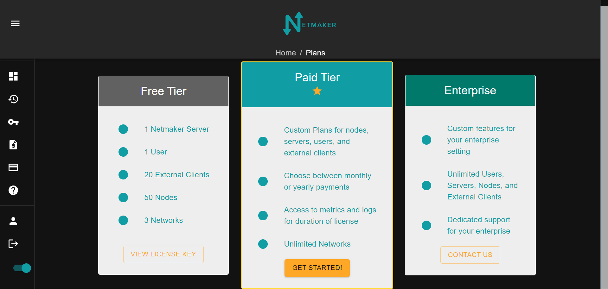
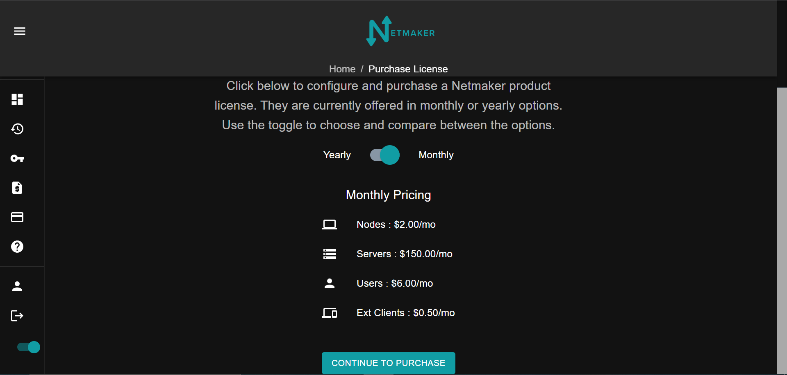
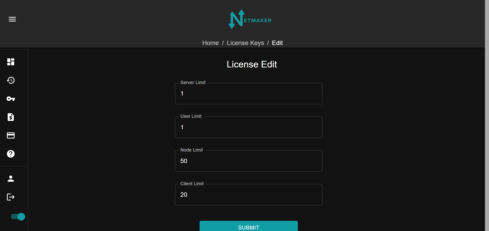
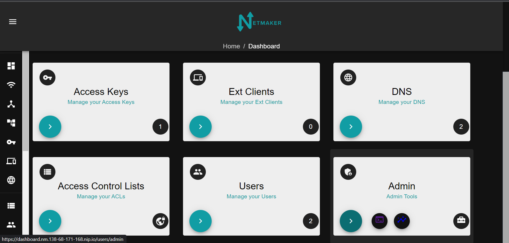

=================================
Netmaker Enterprise
=================================

This guide covers how to get setup with Netmaker Enterprise.

Notes on Free Tier
=======================

Netmaker Enterprise includes a generous free tier, which should cover most use cases for individual users. To use Netmaker Enterprise with the free tier, simply follow the same instructions, but use the included license in your license dashboard, instead of buying one.

**Free Tier License Limits:**  

- Netmaker Servers: 1 

- Netmaker Users: 1  

- Netclients: 50  

- Ext Clients: 20  

Get a License
=================================

Visit `<https://license.netmaker.io>`_ to get a license. After creating an account, you will be taken to the dashboard.

.. image:: images/ee-dashboard.png
   :width: 80%
   :alt: License Dashboard
   :align: center

Choose which plan fits your needs. 

You will have the option of choosing to pay yearly or monthly. You will also see a layout of the cost of each node, server, user, and ext client.

Choose how many of each node, server, user, ext clients, that you need. You can also change these amounts in the license tab should you need to adjust those numbers later.

.. image:: images/ee-payment.png
    :width: 80%
    :alt: Checkout screen
    :align: center

After a successful payment, you will get a confirmation email.

Setup your server
=================================

You will first need to get your license key and account ID. Your confirmation email after you make an account will have a license key for a free trial version and your user ID. The confirmation email after buying a licence will have your new license key.

You can also find your license keys in the license key tab. The copy icon on the left will have the license key.

.. image:: images/ee-licenses.png
    :width: 80%
    :alt: License keys
    :align: center

Also in this same tab, you can click on the license key and add or remove any servers, nodes, users, or ext clients to your plan.

Once you have your license key and account ID, go to your netmaker server and add the following to your docker-compose.yml environment variables

.. code-block:: yaml

    LICENSE_KEY: “<license key>”
    NETMAKER_ACCOUNT_ID: "<account id>"

Also change the netmaker image to ``image: gravitl/netmaker:<version>-ee``. For example: ``image: gravitl/netmaker:v0.16.0-ee`` After that ``docker kill netmaker netmaker-ui && docker-compose up -d`` and you should see the enterprise UI on dashboard.<YOUR_BASE_DOMAIN> 

You should see a new Dashboard with an Admin tab added. On the arrow will be tabs for the server logs and metrics.

(Optional) Setup your server for Prometheus and Grafana
==========================================================

If you would like to use Netmaker's custom Prometheus exporter and Grafana dashboard, you must make some modifications to your docker-compose.

Use the EE Compose file as a reference:

https://raw.githubusercontent.com/gravitl/netmaker/master/compose/docker-compose.ee.yml

You must add in sections (as in the above) for :
  
- Grafana  
  
- Prometheus  
  
- Netmaker Exporter  

Additionally, you must make the following changes to Netmaker and MQ:

In Netmaker, Add the following env var:

.. code-block::

    METRICS_EXPORTER: "on"

In MQ, add the following volume mount:

.. code-block::

    - /root/mosquitto.passwords:/etc/mosquitto.passwords

Additionally, add mosquitto.passwords and mosquitto.conf (must be modified) to your local filesystem using the following files:

Passwords file: https://raw.githubusercontent.com/gravitl/netmaker/master/docker/mosquitto.passwords  
  
Conf file: https://raw.githubusercontent.com/gravitl/netmaker/master/docker/mosquitto-ee.conf 
  
These changes allow the Netmaker Exporter to access metrics data, via MQ.