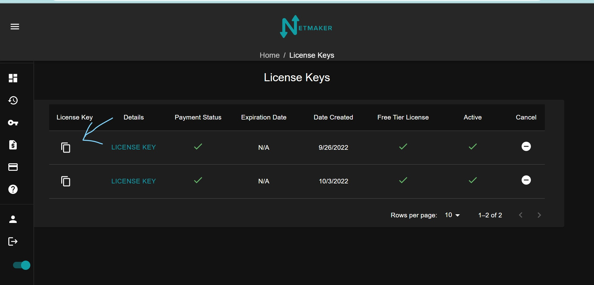
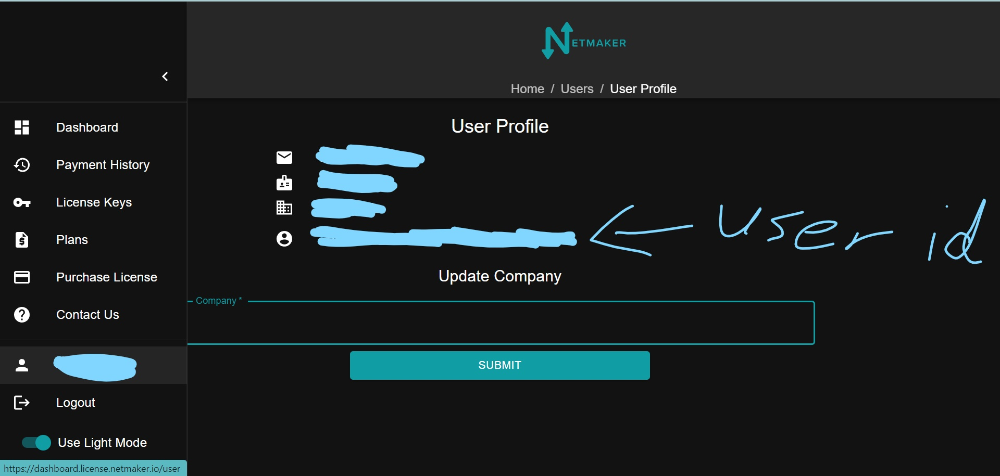

=================================
Netmaker Enterprise
=================================

This guide covers how to get setup with Netmaker Enterprise.

Notes on Free Tier
=======================

Netmaker Enterprise includes a generous free tier, which should cover most use cases for individual users. To use Netmaker Enterprise with the free tier, simply follow the same instructions, but use the included license in your license dashboard, instead of buying one.

**Free Tier License Limits:**  

- Netmaker Servers: 1 

- Netmaker Users: 1  

- Netclients: 50  

- Ext Clients: 20  

Get a License
=================================

Visit `<https://dashboard.license.netmaker.io>`_ to get a license. When you first visit the site, You should be prompted to create an account. After you make one, You will get a free tier licence key. You will also recieve an email that contains this key along with your user ID. Your keys can be found by clicking on the license key tab on the dashboard. Your user id can be found by clicking on the user profile tab on the side menu.

.. image:: images/ee-dashboard.png
   :width: 80%
   :alt: License Dashboard
   :align: center

If you want to get a new key, You can click on the plans tab. You will be taken to a screen wich shows our plans we offer. The free tier is the one that is initially given when you create your account. You can upgrade to the paid tier on this page, or if you need more of an enterprise level plan, there is a button to contact us to set that up.

.. image:: images/ee-plans.png
   :width: 80%
   :alt: Plans to choose
   :align: center

You will have the option of choosing to pay yearly or monthly. You will also see a layout of the cost of each node, server, user, and ext client.

.. image:: images/ee-purchase-license.png
    :width: 80%
    :alt: Purchase yearly or monthly
    :align: center

Choose how many of each node, server, user, ext clients, that you need. You can also change these amounts in the license tab should you need to adjust those numbers later.

.. image:: images/ee-payment.png
    :width: 80%
    :alt: Checkout screen
    :align: center

After a successful payment, you will get a confirmation email containing your new license key. The next section will show how to get that key and setup your server.

Setup your server
=================================

You will first need to get your license key and account ID. Your confirmation email after you make an account will have a license key for a free trial version and your user ID. The confirmation email after buying a licence will have your new license key.

You can also find your license keys in the license key tab. The copy icon on the left will copy the license key to your clipboard.

Also in this same tab, you can click on the license key and add or remove any servers, nodes, users, or ext clients to your plan.

.. image:: images/ee-license-edit.png
    :width: 80%
    :alt: edit plan
    :align: center

Your user ID will be located in your user profile found on the side menu

Once you have your license key and account ID, go to your netmaker server and add the following to your netmaker.env file.

.. code-block:: yaml

    LICENSE_KEY: “<license key>”
    NETMAKER_ACCOUNT_ID: "<account id>"

Also change ``SERVER_IMAGE_TAG`` in netmaker.env to ``<version>-ee``. For example: ``SERVER_IMAGE_TAG=v0.20.2-ee`` 

Also change the ``INSTALL_TYPE`` from ce to ee.

Then you will need to get the docker-compose ee file from here

.. code-block::

    wget -O docker-compose.override.yml https://github.com/gravitl/netmaker/blob/master/compose/docker-compose.ee.yml

No changes will need to be made to that file. It will use the configs listed in your netmaker.env file.

After that ``docker kill netmaker netmaker-ui && docker-compose up -d`` and you should see the enterprise UI on dashboard.<YOUR_BASE_DOMAIN> 

You should see a new Dashboard. The top menu bar will have relays and metrics added.

.. image:: images/ee-new-dashboard.png
    :width: 80%
    :alt: new dashboard
    :align: center

(Optional) Setup your server for Prometheus and Grafana
==========================================================

If you would like to use Netmaker's custom Prometheus exporter and Grafana dashboard, your docker-compose.override.yml file will already have those section.

In Netmaker.env, change the following:

.. code-block::

    METRICS_EXPORTER=on