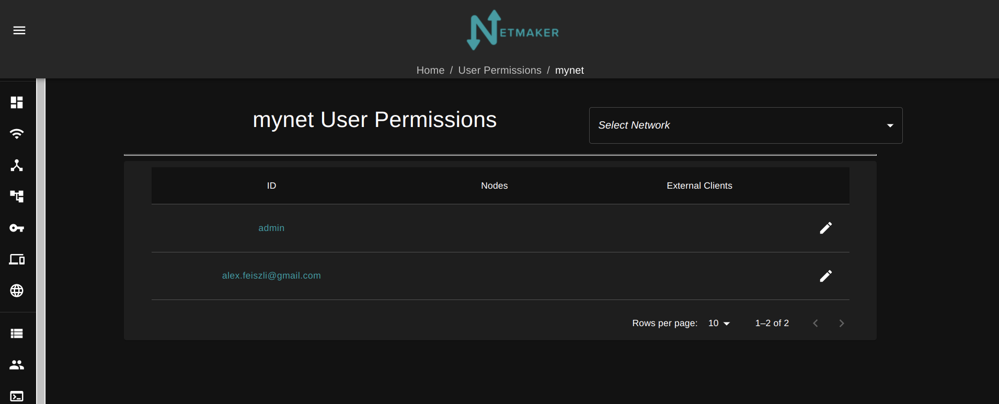
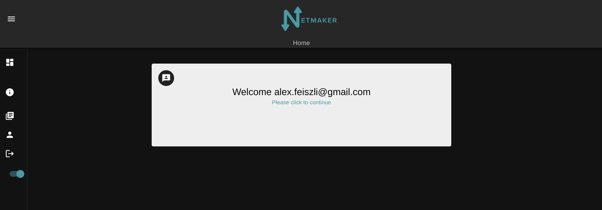
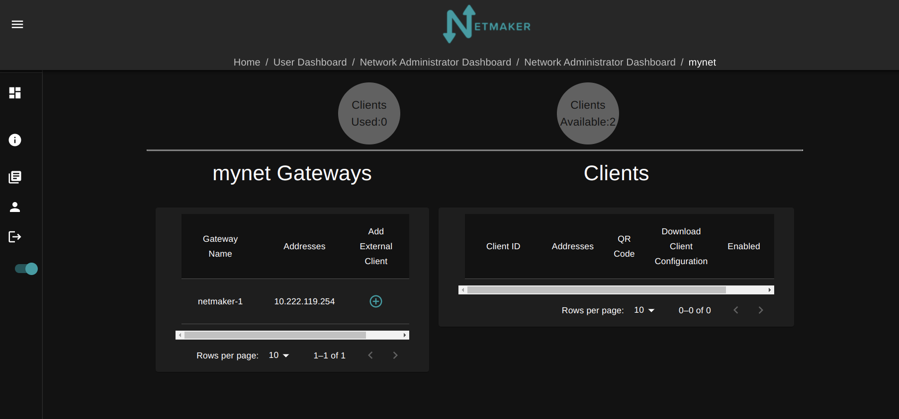
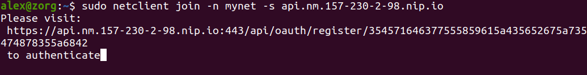
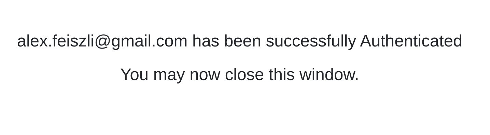
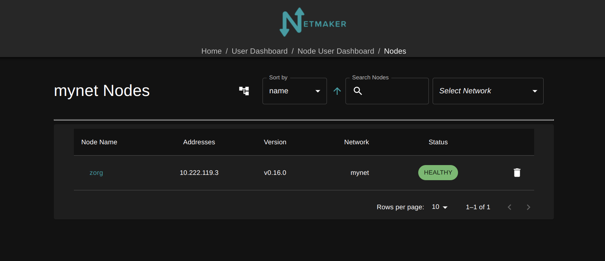

=================================
Users in Netmaker Enterprise
=================================
Netmaker Enterprise offers advanced user management. This includes the ability to create and manage groups of users, set default access levels on networks, and manage individual access levels. This also comes with an updated UI, which will display access to components based on access level.

Access Levels, Explained
=================================

An Access Level determines what, in a network, a user is able to access. Netmaker defines 4 Access Levels:
  
**0: Network Admin** - User has full control over a network (this is equivalent to the Network Admin in the Community version)  
  
**1: Node Access** - User is allowed to create, view, and delete their own nodes/ext clients (up to their limit)  
  
**2: Remote Access (ext clients)** - User is allowed to create, view, and delete their own ext clients (up to their limit)  
  
**3: No Access** - User has no access to the network
  
Setting Access Levels (Networks)
----------------------------------

.. image:: images/users/groups-3.png
   :width: 80%
   :alt: Network Access Level
   :align: center

Default Access Levels are defined in the network settings. By default, users will have no access (3) and their limits are set to zero.

This can be modified so that, for instance, any user joining will have an access level of 2, with a limit of 1 ext client. This would show them the remote access panel when signing in for the first time.

Setting Access Levels (Users)
----------------------------------

In the Users tab of enterprise, there is a new section for "User Permissions."

.. image:: images/users/users-1.png
   :width: 80%
   :alt: Network Access Level
   :align: center

This allows you to set user permissions per-network.

You can modify an idividual users permissions by editing them in this screen.

.. image:: images/users/users-3.png
   :width: 80%
   :alt: Network Access Level
   :align: center

Groups
============

You can more easily organize access to networks by creating and managing Groups of users.

Groups are created under the "Users" tab

You can modify an idividual users permissions by editing them in this screen.

.. image:: images/users/groups-1.png
   :width: 80%
   :alt: Groups
   :align: center

Back in the Users tab, you can edit a user and add them to any number of groups.

.. image:: images/users/groups-2.png
   :width: 80%
   :alt: Groups
   :align: center

In the Network Settings tab (click on Network, click "edit"), you can then edit the "Allowed Groups."

.. image:: images/users/groups-3.png
   :width: 80%
   :alt: Groups
   :align: center

Any group in "allowed groups" will be given the default ACLs defined in the network settings.

The Star ("*") Group
-------------------------

By default, every User is added to the * group. By default, every network has * in allowed groups. This means that if you create a new network, all users will have the "Default Access Level" and limits.

To limit a network to particular users, remove the * group from Allowed Groups.

To limit a user to particular networks, remove the * group from their group settings.

User Access to Netmaker
=====================================

Different access levels will user Netmaker differently. Below is a short explainer of what that access looks like, by level.

Level 3: No Access
------------------------

A user logging into the Netmaker UI, who has only Level 3 access to Networks, will be greeted with the following:

.. image:: images/users/dashboard-no-access.png
   :width: 80%
   :alt: No Access
   :align: center

This users network-level permissions must be modified in order to have a network be accessible to them.

Level 2: Remote Access
------------------------

Lets say we add this user to a network, "mynet", with Level 2 access, and a limit of 2 ext clients. They will have Remote Access, and will be able to create and manage up to 2 ext clients.

Logging in, they will see this screen:

Clicking continue, they will be prompted to select a network:

.. image:: images/users/user-dashboard-1.png
   :width: 80%
   :alt: Select Network
   :align: center

They will then be at their Dashboard, and will need to select an option. Since they are Level 2, they have only one option, "Remote Access:"

.. image:: images/users/user-dashboard-2.png
   :width: 80%
   :alt: Remote Access 1
   :align: center

Clicking this brings them to the familiar "ext clients" screen. Here, they can create, manage, delete, view, and download their own ext clients for any Ingress Gateways on the network. At the top, it shows how many clients they have used, as opposed to their limit.

After creating 2 clients, the user will be unable to create any more (in this example, their limit was set to "2").

.. image:: images/users/user-dashboard-4.png
   :width: 80%
   :alt: Remote Access 3
   :align: center

Level 1: Node Access 4
------------------------

Now let's modify this user's Access Level to 1. Now, when they log in, they will have two options in their panel. Remote Access, and Nodes.

.. image:: images/users/user-dashboard-5.png
   :width: 80%
   :alt: Node User 1
   :align: center

This user can create and delete nodes in the network, up to their limit. To do this, they join via SSO (or username/password):

This will associate the node with their user, which they can then view and delete in the UI. Edit permission is limited to Admins.

Level 0: Network Admin
------------------------

Lastly, if we increase the user's permission to "0", they will become a full Network Admin, who has no limits on the number of nodes and ext clients they can create. When they log in, they will see the following:

.. image:: images/users/user-dashboard-10.png
   :width: 80%
   :alt: Network Admin
   :align: center

They can create nodes with Access Keys, edit the Network Settings, and manage all nodes in the network.

