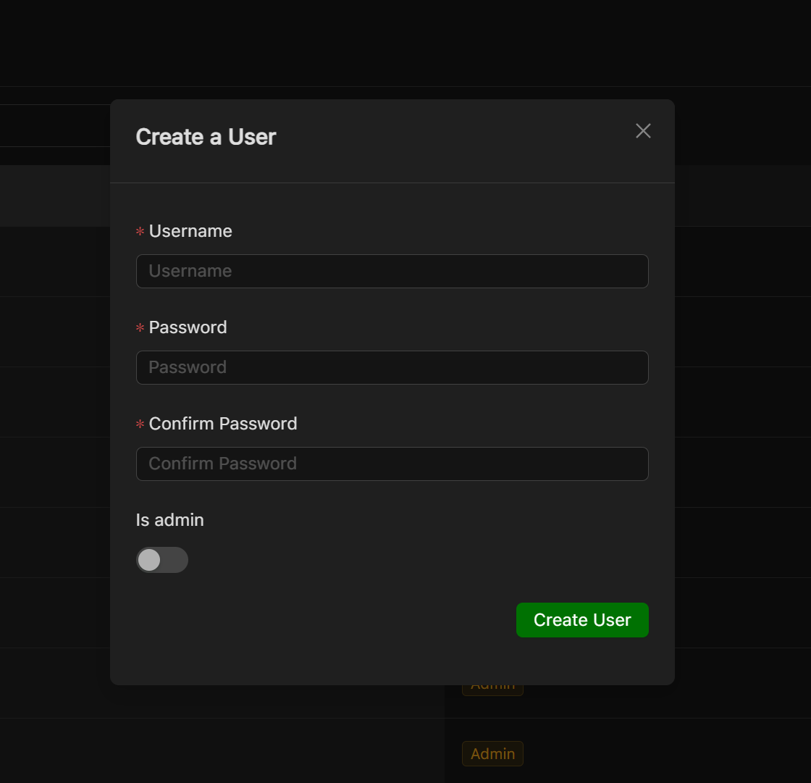
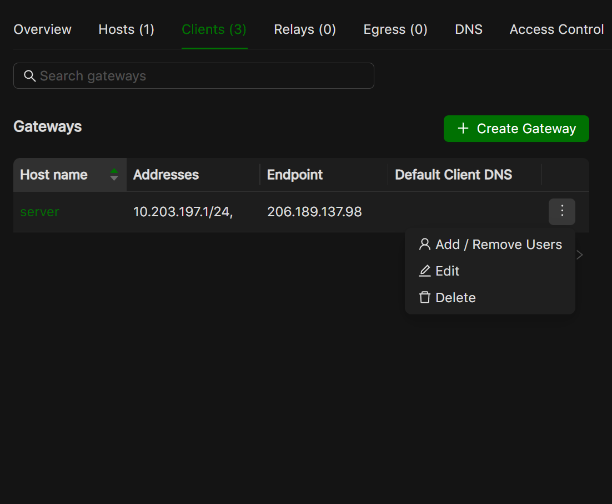

=================================
Users in Netmaker Enterprise
=================================
Netmaker Enterprise provides advanced user management features. The super admin can create a user with either a user role or admin role, such as normal users and admins. A user does not have access to the dashboard, but they can use the remote access client to connect to a gateway. Admins can add a user and assign them to ingress gateways. This includes the ability to manage the user's access to different ingress gateways.

Here is a breakdown of the different user types and their permissions:

* User: A user does not have access to the Netmaker dashboard. They can only use the remote access client to connect to a gateway.

* Admin: An admin has full access to the Netmaker dashboard. They can create and manage users, networks, and gateways. They can also manage user permissions.

Adding users
=================================
To add a user, go to the Users section and click the Add User button. Fill in the user's details, including their name, password, and role.

* As a super admin, you can add users with the role of admin or user.
* As an admin, you can only add users with the role of user.

The credentials will need to be shared with the added user.

Attaching or removing user from ingress
=================================
To attach users to a gateway ore remove users from a gateway, you will need to have the gateway set up. 
Once the gateway is set up, you will see an option to remove users from the dropdown menu.

You can click the button to either attach or remove a user

.. image:: images/users/attach-remove-users.png
   :width: 80%
   :alt: Attach Remove User Modal
   :align: center

Transferring super admin rights
===============================

Super admin rights can be transferred only to another admin. To do this, on the users page, go to the superadmin row and hover over the ellipsis.
In the dropdown menu, an option to transfer admin rights should be present. On clicking it, a dialog box will open allowing you to select any admin 
to transfer super admin rights to.

.. image:: images/users/transfer-super-admin-rights.png
   :width: 80%
   :alt: transfer super admin rights
   :align: center