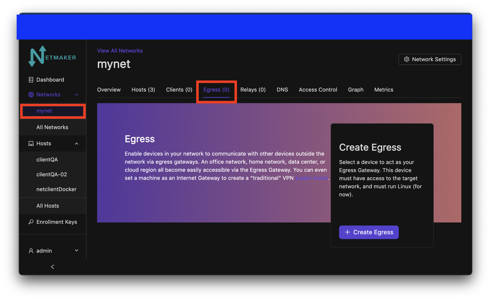
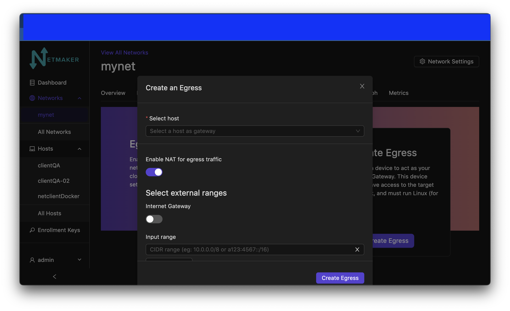
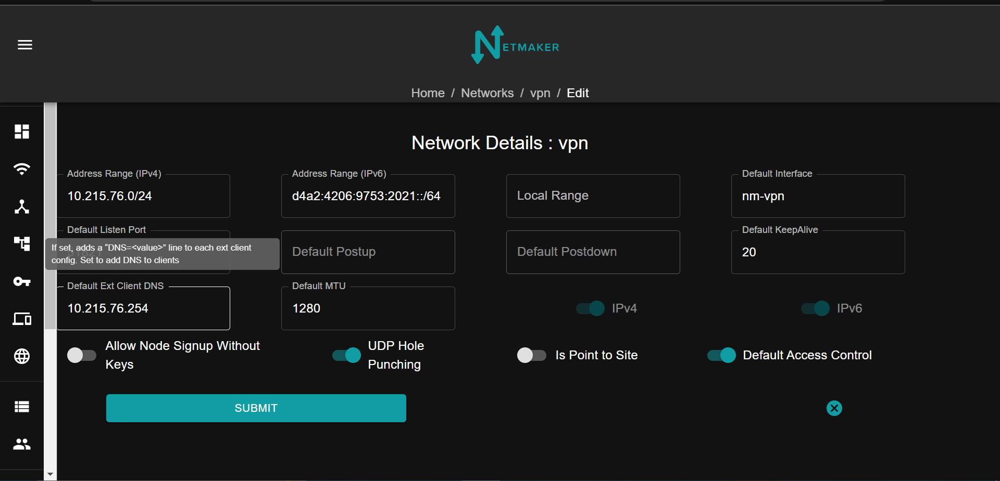

=====================================
Egress Gateway
=====================================

Introduction
===============

.. image:: images/egress1.png
   :width: 80%
   :alt: Gateway
   :align: center

Netmaker allows your clients to reach external networks via an Egress Gateway. The Egress Gateway is a netclient which has been deployed to a server or router with access to a given subnet.

In the netmaker UI, that node is set as an "egress gateway." Range(s) are specified which this node has access to. Once created, all clients (and all new ext clients) in the network will be able to reach those ranges via the gateway.

Configuring an Egress Gateway
==================================

Configuring an Egress Gateway is very straight forward. As a prerequisite, you must know what you are trying to access remotely. For instance:

- a VPC
- a Kubernetes network
- a home network
- an office network
- a data center

After you have determined this, you must next deploy a netclient in a compatible location where the network is accessible. For instance, a Linux server or router in the office, or a Kubernetes worker node. This machine should be stable and relatively static (not expected to change its IP frequently or shut down unexpectedly).

Next, you must determine which interface to use in order to reach the internal network. As an example, lets say there is a machine in the network at 10.10.10.2, and you have deployed the netclient on a different machine. You can run 

.. code-block::

   ip route get 10.10.10.2

This should return the interface used to reach that address (e.x. "eth2")

Finally, once you have determined the interface, the subnet, and deployed your netclient, you can go to your Netmaker UI and set the node as a gateway.

At this point simply insert the range(s) into the first field, and the interface name into the second field, and click "create".

Netmaker will set iptables rules on the node, which will then implement these rules, allowing it to route traffic from the network to the specified range(s).
Alternatively, if you would like to maintain the source IPs yourself, you can disable the NAT for egress gateways with the toggle switch.

Use Cases
============

1) Remote Access
-------------------

A common scenario would be to combine this with an "Ingress Gateway" to create a simple method for accessing a home or office network. Such a setup would typically have only two nodes: the ingress and egress gateways. The Ingress Gateway should usually be globally accessible, which makes the Netmaker server itself a good candidate. This means you need only the netmaker server as the Ingress, and one additional machine (in the private network you wish to reach), as the Egress.

.. image:: images/egress2.png
   :width: 80%
   :alt: Gateway
   :align: center

In some scenarios, a single node will act as both ingress and egress! For instance, you can enable acess to a VPC using your Netmaker server, deployed with a public IP. Traffic comes in over the public IP (encrypted of course) and then routes to the VPC subnet via the egress gateway.

.. image:: images/egress3.png
   :width: 50%
   :alt: Gateway
   :align: center

2)  / NAT Gateway
-----------------------

Most people think of a VPN as a remote server that keeps your internet traffic secure while you browse the web, or as a tool for accessing internet services in another country,using a VPN server based in that country.

These are not typical use cases for Netmaker, but can be easily enabled.

To avoid DNS leaks, navigate to the networks tab and click on the ID of the network you created. Edit the default ext client DNS tab.

In this example, I put the IP address of the netmaker server node.

After that, set up an egress gateway with ``0.0.0.0/0,::/0`` as the ranges with the public interface (eth0 most likely). Your clients should now begin routing public-facing traffic over the gateway.

Note: using ``0.0.0.0/0,::0`` is only effective as of version 0.15.0. Any version before that requires a big list of ranges to work around ``0.0.0.0/0,::0``. Make sure you have your netmaker server and client updated to ba able to use that range.

Our 5-minute installer of Netmaker in the README on GitHub: https://github.com/gravitl/netmaker also offers an option to configure a VPN if you have not built your server yet.
simply type:

.. code-block::
   
   wget -qO - https://raw.githubusercontent.com/gravitl/netmaker/master/scripts/nm-quick.sh | sudo bash -s -- -v true

This will configure a VPN with a default of 5 external clients for you.

.. image:: images/egress5.png
   :width: 50%
   :alt: Gateway
   :align: center
