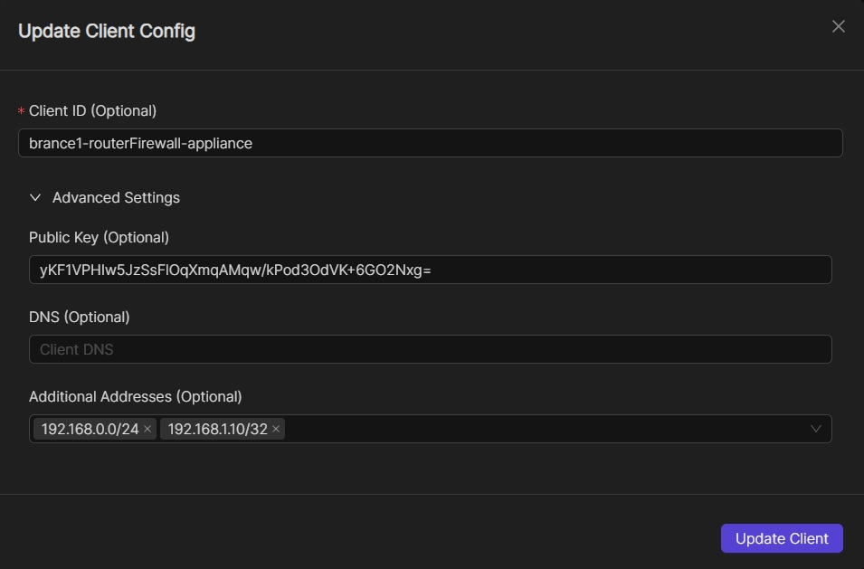

.. _egress:

=======
egress
=======

Introduction
===============

.. image:: images/egress1.png
   :width: 80%
   :alt: Gateway
   :align: center

Netmaker allows your clients to reach external networks via an Egress Gateway. The Egress Gateway is a netclient which has been deployed to a server or router with access to a given subnet.

In the Netmaker UI, that node is set as an "egress gateway." Range(s) are specified which this node has access to. Once created, all clients (and all new ext clients) in the network will be able to reach those ranges via the gateway.

Configuring an Egress Gateway
==================================

Configuring an Egress Gateway is very straight forward. As a prerequisite, you must know what you are trying to access remotely. For instance:

- a VPC
- a Kubernetes network
- a home network
- an office network
- a data center

After you have determined this, you must next deploy a netclient in a compatible location where the network is accessible. For instance, a Linux server or router in the office, or a Kubernetes worker node. This machine should be stable and relatively static (not expected to change its IP frequently or shut down unexpectedly).

Once you have determined the subnet, and deployed your netclient, you can go to your Netmaker UI and set the node as a gateway. click on the network on the sidebar and navigate to the egress section.

.. image:: images/egress7.png
   :width: 80%
   :alt: Gateway
   :align: center

At this point you will choose your selected host to use as an egress. You can choose if you would like to use NAT or not with the switch. You can put the selected CIDR for your egress range(s) in the field. click the add range button to add more egress ranges for the host. The interface is automatically chosen and will not be shown in this window. With everything filled out, click the create button.

.. image:: images/ui-6.png
   :width: 80%
   :alt: Gateway
   :align: center

Netmaker will set either iptables or nftables rules on the node depending on which one you have installed on your client. This will then implement these rules, allowing it to route traffic from the network to the specified range(s).

Use Cases
============

1) Remote Access
-------------------

A common scenario would be to combine this with a "Remote Access Gateway" to create a simple method for accessing a home or office network. Such a setup would typically have only two nodes: the remote access and egress gateways. The Remote Access Gateway should usually be globally accessible, which makes the Netmaker server itself a good candidate. This means you need only the Netmaker server as the Remote Access Gateway, and one additional machine (in the private network you wish to reach), as the Egress.

.. image:: images/egress2.png
   :width: 80%
   :alt: Gateway
   :align: center

In some scenarios, a single node will act as both remote access gateway and egress! For instance, you can enable acess to a VPC using your Netmaker server, deployed with a public IP. Traffic comes in over the public IP (encrypted of course) and then routes to the VPC subnet via the egress gateway.

.. image:: images/egress3.png
   :width: 50%
   :alt: Gateway
   :align: center

Advanced Use Cases
======================

1) Segmenting Traffic Flow Through Egress Gateways

   User will need to add these additional routing rules on the egress machine to segment traffic to multiple egress ranges as desired when on multiple networks

.. code-block::
   
   iptables -t filter -N netmakeregress 
   iptables -t filter -I FORWARD -i netmaker -d egressGwRangeA,egressGwRangeB -j netmakeregress

   iptables -t filter -I netmakeregress -s networkRangeA -d egressRangeA -j ACCEPT
   iptables -t filter -I netmakeregress -s networkRangeB -d egressRangeB -j ACCEPT
   iptables -t filter -A netmakeregress -j DROP

   # NAT Rules

   iptables -t nat -I POSTROUTING -s networkRangeA -d egressGwRangeA -j MASQUERADE

   iptables -t nat -I POSTROUTING -s egressGwRangeA -d networkRangeA -j MASQUERADE

   iptables -t nat -I POSTROUTING -s networkRangeB -d egressGwRangeB -j MASQUERADE

   iptables -t nat -I POSTROUTING -s egressGwRangeB -d networkRangeB  -j MASQUERADE 

2) IPv6 NAT Masquerading for Egress Gateways

   Currently IPv6 Egress Gateways are not working because the default kernel builds for most common linux distributions do not support ipv6 masquerading. Custom linux kernel needs to be built with flag for enabling ipv6 masquerading to get ipv6 egress gateways working.

   Some online resources about the topic:

.. code-block::

   https://superuser.com/questions/1751062/ipv6-masquerading-on-linux

   https://www.kernelconfig.io/config_nf_nat_masquerade_ipv6?q=&kernelversion=5.15.116&arch=x86

   https://www.reddit.com/r/PFSENSE/comments/vb4r3s/ip6_masquerading

Egressing External Clients
============================

Unmanaged external clients that are directly connected to a Remote Access Gateway can also act as egressing machines. The idea is the same as egress gateways. The only difference is that Netclient is necessary with egress gateways, whilst only Wireguard is needed with egressing external clients. This feature is provisioned for situations or scenarios where installation of Netclient is not ideal or even possible. For example most VPN routers support WireGuard, but they are available only as plugins that are tailormade or closely coupled with the router's firmware or user interface. 
While there are ways to make Netclient work for some routers, the integration could get cumbersome, obsolete, or compromising. Of course this feature is also applicable for simple or ad-hoc networking purposes so long as the external client supports iptables and IP forwarding.

At the time of this writing, this feature only supports Linux-based external clients. But the remote machines can be anything, provided they are in the same local network as one of the egressing external client's network interface.

Configuring Egressing External Clients
----------------------------------------

The configuration is pretty much the same as Egress Gateways. First, make sure that iptables is installed and IP forwarding is enabled. Please refer to your distro's documentation on how to do this. For Ubuntu you might do:

.. code-block::

   #update
   apt-get update

   #install iptables
   apt-get install iptables

   #enable IP forwarding
   sysctl -w net.ipv4.ip_forward=1

You can then responsibly specify the applicable egress ranges on the external client's VPN configuration, specifically in the "Additional Addresses" field as shown in the image below. It goes without saying that you can specify single addresses such as `172.16.1.2/32`.

Your Netmaker server will then pick up the egress ranges and propagate it to all the other managed devices in the netmaker network. And of course you can edit them anytime when necessary. For more information on how to create or edit client VPN configurations, please refer to these links:

   - https://docs.netmaker.io/external-clients.html#adding-clients-to-a-gateway
   - https://docs.netmaker.io/integrating-non-native-devices.html#generating-a-wireguard-configuration-file-on-remote-access-gateway

In some cases you might need to add POSTROUTING rules. In Ubuntu, you might do:

.. code-block::

   #get the name of the specific network interface of the egressing client machine
   # that is associated with the egress ranges that you have specified 
   ip a

   #add the necessary POSTROUTING rule, say the interface name is `eth1`
   iptables -t nat -I POSTROUTING -o eth1 -j MASQUERADE