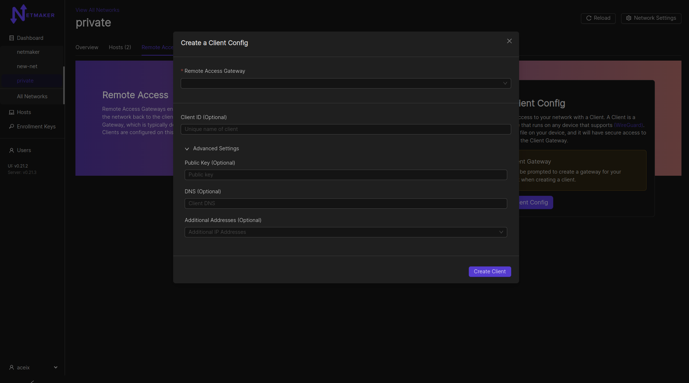
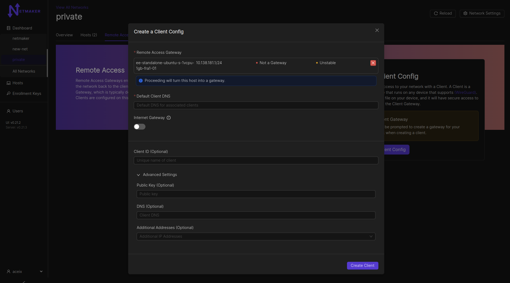

.. _remote-access:

=====================================
Remote Access Gateways and Clients
=====================================

Introduction
===============

.. image:: images/ingress1.png
   :width: 50%
   :alt: Gateway
   :align: center

Netmaker allows for **Remote Access Clients (RAC)** to reach into a network and access services via a Remote Access Gateway (ingress). So what is a "Remote Access Clients"? A remote access clients is any machine which cannot or should not be meshed, but can be connected to a Netmaker network. They are more or less VPN clients of a remote access gateway. This can include:
        - Phones
        - Laptops
        - Desktops
        - Other devices that support WireGuard

Remote Access Client can also refer to the slim client software that runs on a machine to allow it to connect to a Netmaker network.

A remote access client is not "managed," meaning it does not automatically pull the latest network configuration or push changes to its configuration. Instead, it uses a generated WireGuard config file to access the designated **Remote Access Gateway**, which **is** a managed server (ie: a machine running netclient). This server then forwards traffic to the appropriate endpoint, acting as a middleman/relay.

By using this method, you can hook any machine that can run WireGuard into a netmaker network.

It is recommended to run the netclient where compatible, but for all other cases, a machine can be configured as a Remote Access Clients.

Configuring a Remote Access Gateway
====================================

Clients must attach to a Remote Access Gateway. By default, your network will not have a remote access gateway. To configure one, navigate to the network and go to the "Remote Access" tab.

.. image:: images/extclient1.png
   :width: 80%
   :alt: Gateway
   :align: center

After clicking the "Create Client Config" button, a modal window will pop up asking which host you would like to use as a gateway. You can use any host in your network, but it should have a public IP address (not behind a NAT). Your Netmaker server can be a remote access gateway and makes for a good default choice if you are unsure of which node to select. You can also specify whether the gateway should route all public traffic to the internet (internet gateway). Lastly, there is an option to specify a default DNS server for all attached Clients.

Adding Clients to a Gateway
=============================

Once you have figured out your gateway, You can fill in any other info you need for your client. You can give it a name (Client ID), otherwise one will be auto-generated for you. You can specify your own public key for better security. You can set a DNS for the client (if left empty, fallback would be the gateway's default client DNS), and any specific addresses you would need for the client. You can also leave these fields blank and the name, address, and public key will be automatically configured for you. Clients will be able to access other nodes in the network just as the gateway does, of course unless blocked via network ACLs.

After clicking create, your Remote Access Client configuration will be ready.

.. image:: images/extclient4.png
   :width: 80%
   :alt: ext client pop up
   :align: center

Then, you can either download the configuration file directly or scan the QR code from your phone (assuming you have the WireGuard app installed). It will accept the configuration just as it would accept a typical WireGuard configuration file.

.. image:: images/extclient5.png
   :width: 80%
   :alt: Gateway
   :align: center

Example config file: 

.. literalinclude:: ./examplecode/myclient.conf

Your client should now be able to access the network! A client can be invalidated at any time by simply deleting it from the UI.

Disabling Remote Access Clients
================================

To (temporarily) disable an Remote Access Client's access to the Netmaker network that it belongs to, click the switch below "Enabled" on the line with the Client ID that you would like to disable.  Click "Accept" when asked "Are you sure you want to disable access to this Ext. Client?"

.. image:: images/extclient-disable.png
   :width: 80%
   :alt: Disable an Remote Access Client
   :align: center

After you click the switch and click Accept the ext client will no longer be reachable and the switch will be turned off.

.. image:: images/extclient-disabled.png
   :width: 80%
   :alt: Disabled Remote Access Client
   :align: center

To re-enable the client click the switch again and accept.  It will turn on again and the client will be re-enabled.

Internet Gateway/Traditional VPN
=================================

Most people think of a VPN as a remote server that keeps your internet traffic secure while you browse the web, or as a tool for accessing internet services in another country, using a VPN server based in that country.
This is not a typical use case for Netmaker, but can be easily enabled via the Remote Access Gateway feature. This is a **Pro-only** feature.

Navigate to the remote access gateway setup mentioned above. Click the Internet Gateway switch. Click "Create Gateway".

After that, your public IPv4 traffic for any connected client, will be routed through the internet gateway. Support for IPv6 is work in progress.
**NOTE**: You need to specify the "Default client DNS" so as to avoid DNS leaks. If you do not specify a Default client DNS, the client's local gateway DNS will be most likely used.
