=================
Getting Started
=================

.. toctree::
   :maxdepth: 1

   install
   manual-install
   netclient
   advanced-client-install
   server-installation

Setup
=================

#. Create your admin user, with a username and password.
#. Login with your new user
#. Create your first network by clicking on Create Network

Create a Network
=================

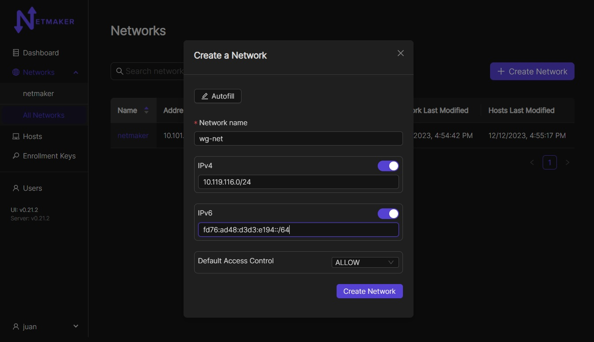

This network should have a sensible name.

More importantly, it should have a non-overlapping, private address range. 

If you are running a small (less than 254 machines) network, and are unsure of which CIDR's to use, you could consider:

- 10.11.12.0/24
- 10.20.30.0/24
- 10.99.98.0/24

Network Settings Description
-------------------------------

The Network creation form has a few fields which may seem unfamiliar. Here is a brief description:

**IPv4:** Adds private IPv4 to all nodes in a network

**IPv6:** Adds private IPv6 to all nodes in a network

**Default Access Control:** Indicates the default ACL value for a node when it joins in respect to it's peers (enabled or disabled).

Once your network is created, you should see the network (wg-net here but it will be the name you chose when creating the network):

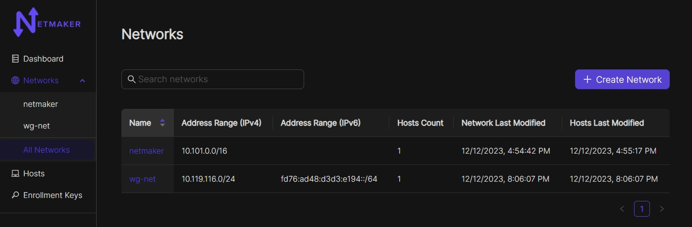

When you click on the NetId and then the Nodes button (or go direct via the left-hand menu and then Nodes) you see that the netmaker server has added itself to the network. From here, you can move on to adding additional nodes to the network. 

As of v0.18.0, netclient has been moved out of the netmaker repo and into its own repo. This means that the netmaker server will no longer create its own default node. To recreate that default node, Netclient will also have to be installed on the netmaker server and joined to the network. You can then set that node as a default node in the Hosts tab. This will make every new network have that node automatically on creation. More on hosts are mentioned in the manage Nodes/Hosts section of this page.

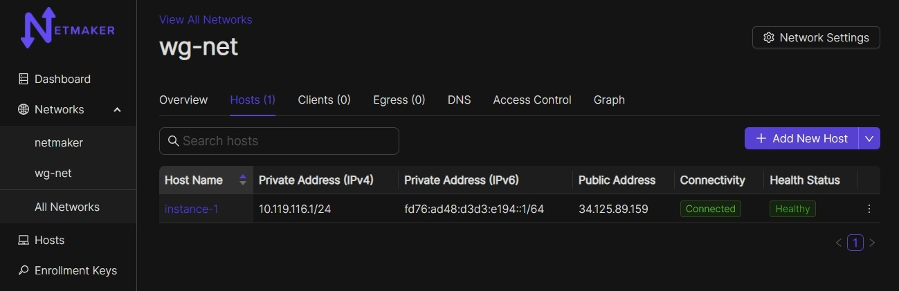

Create a Key
===============

Adding nodes to the network typically requires a key. If You are on version 0.18 or newer, you will use the enrollment key to acces a netmaker server. Enrollment keys offer different ways to register with a server.

Navigate to the enrollment keys tab on the side menu. You should see a create button in the top right corner. After clicking that, you should be brought to a window like this.

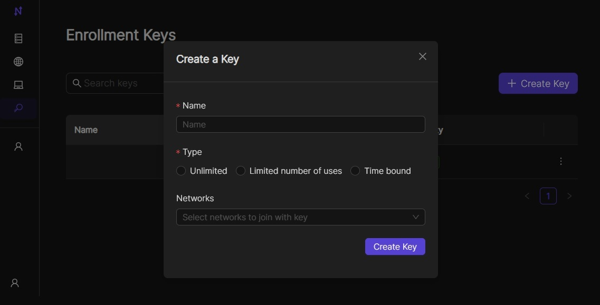

This will give you a few different options on how you want to set up your enrollment key. you can set it up with unlimited uses, limited uses, or timebound uses. You can also setup one or multiple networks to join, or you can set it to no networks and then join a network through the UI in the hosts tab. Click on newly registered host and go to the networks tab. Then click on show all networks. You can also create any tags you would like for that key

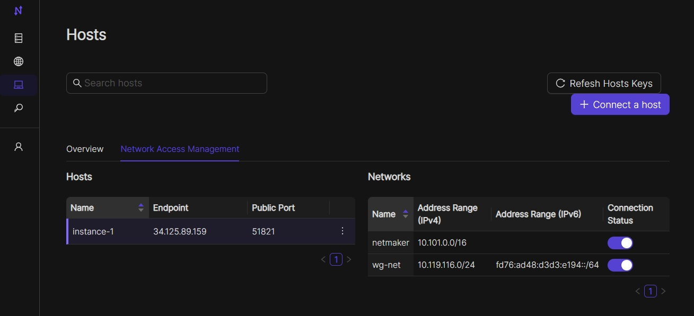

If an enrollment key runs out of uses, or is expired, the key will show as invalid like in the image below.

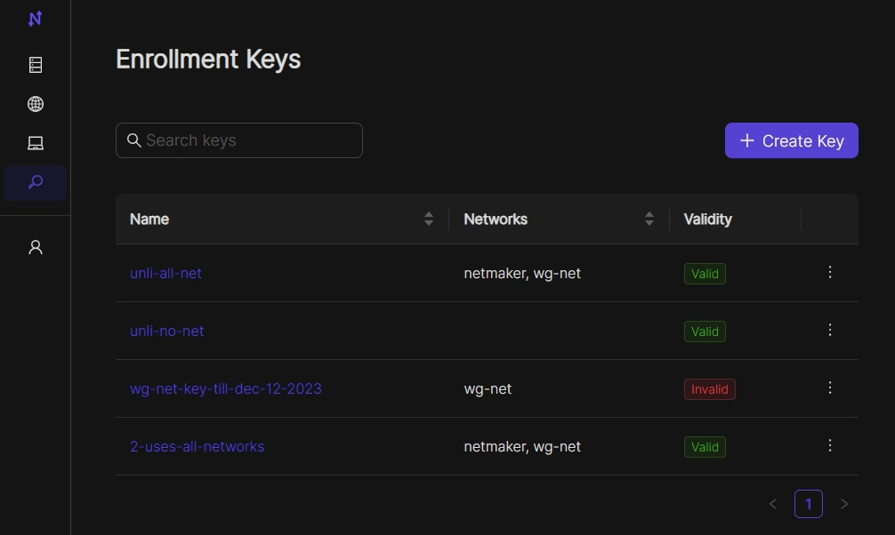

After your enrollment key is created, you can click on that key to get the registration token.

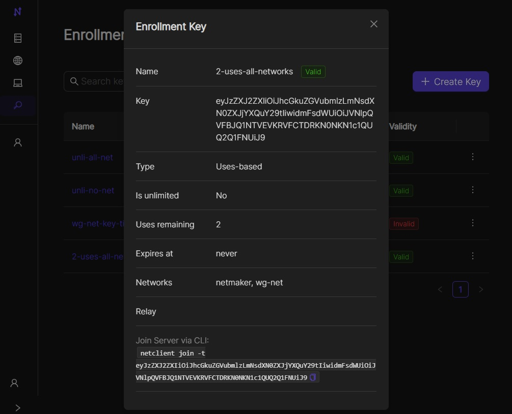

* The **Enrollment Key** value is the secret string that will allow your node to authenticate with the Netmaker network. This can be used with existing netclient installations where additional configurations (such as setting the server IP manually) may be required. This is not typical. E.g. ``netclient register -k <enrollment key> -s grpc.myserver.com -p 50051``
* The **Registration Token** value is a base64 encoded string that contains the server IP and grpc port, as well as the enrollment key. This is decoded by the netclient and can be used with existing netclient installations like this: ``netclient register -t <registration token>``. You should use this method for adding a network to a node that is already on a network. For instance, Node A is in the **mynet** network and now you are adding it to **default**.
* The **Register Command** value is a command that can be run on Linux systems after installing the Netclient.  It will register with the server directly from the command line.
  
Other variations (eg Docker) are covered with the remaining values.

Deploy Nodes
=================

0. Prereqisite: Every machine on which you install should have WireGuard and systemd already installed.

1. SSH to each machine 
2. ``sudo su -``
3. **Prerequisite Check:** Every Linux machine on which you run the netclient must have WireGuard and systemd installed
4. Follow the installation instructions for your operating system `here <https://docs.netmaker.io/netclient.html#installation>`_ 

You should get output similar to the below. The netclient retrieves local settings, submits them to the server for processing, and retrieves updated settings. Then it sets the local network configuration. For more information about this process, see the :doc:`client installation <./netclient>` documentation. If this process failed and you do not see your node in the console (see below), then reference the :doc:`troubleshooting <./troubleshoot>` documentation.

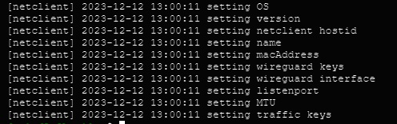

Repeat the above steps for every machine you would like to add to your network. You can re-use the same install command so long as you do not run out of uses on your access key (after which it will be invalidated and deleted).

Once installed on all nodes, you can test the connection by pinging the private address of any node from any other node.

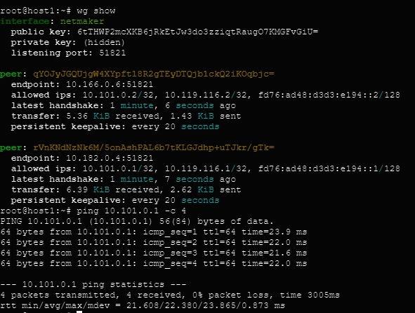

Manage Nodes/Hosts
==================

Your machines should now be visible in the control panel. 

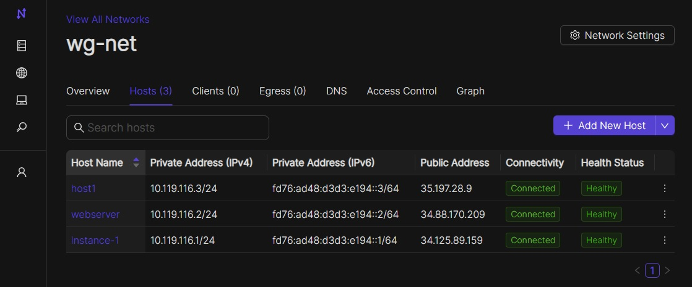

As of v0.18.0 each node has an associated host. The host is a structure that encapsulates the node and gives it the information it needs like the name and network. The host will have features like creating a proxy, setting the hosted node as a default node, joining the hosted node to new networks without the need for another access key, setting verbosity, and changing listening ports and default interfaces. Server relays will also be handled by the host. The Hosts can be found in the Hosts tab on the UI. You should be taken to a screen like this.

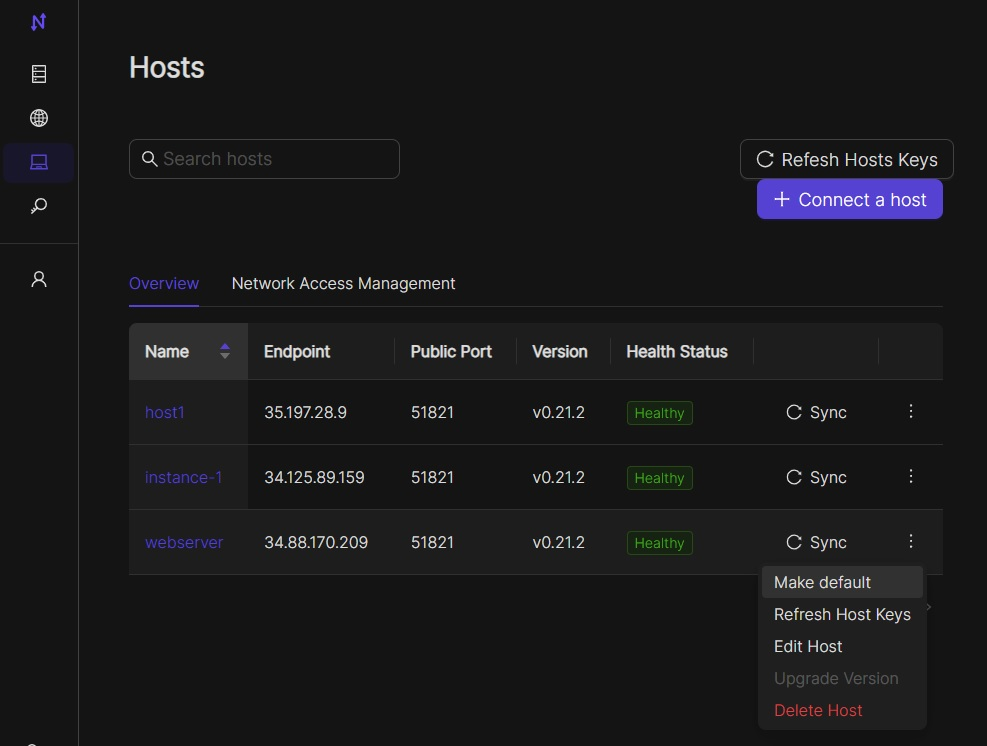

In here you can see the host's name, the endpoint of the server running netclient, the public key for that host, the version number, and a switch to set that host's node as the default node. When this is switched on, that node will serve as the default node when a network is created (similar to netmaker-1 in versions before v0.18.0). Clicking on a host will bring you to the host's details.

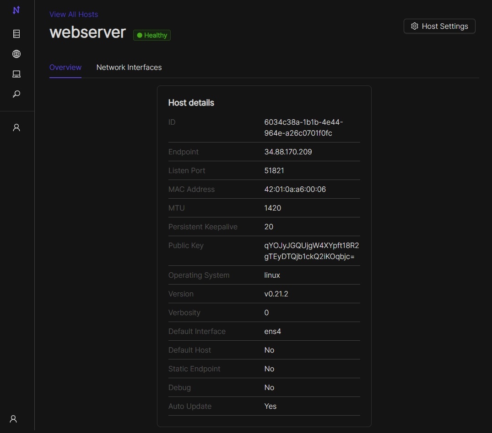

This will give you more information like the firewall in use, MTUs, and listening port. You can also see networks associated with that host and options to edit or delete the host. If you are going to delete a Host, you need to delete the associated node first.

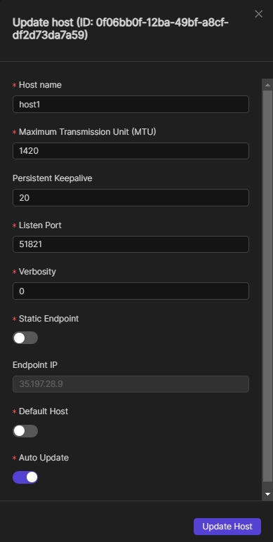

In the edit screen, you can make changes to the logging verbosity, listening port and proxy listening port, local range, MTU, and name. These fields will also update in the node, as the node gets this info from the host. If you want to change the endpoint, the associated node has to be static.

You can view/modify/delete any node by selecting it in the NODES tab. For instance, you can change the name to something more sensible like "workstation" or "api server". You can also modify network settings here, such as keys or the WireGuard port. These settings will be picked up by the node on its next check-in. For more information, see Advanced Configuration in the :doc:`Using Netmaker <./usage>` docs.

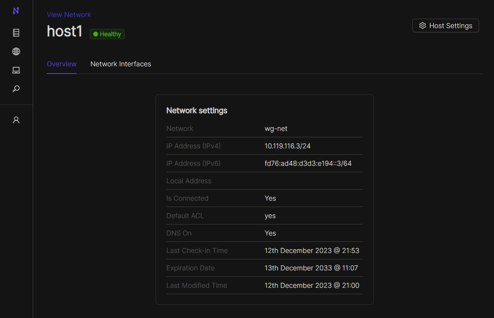

Nodes can be added/removed/modified on the network at any time. Nodes can also be added to multiple Netmaker networks. Any changes will get picked up by any nodes on a given network and will take about ~30 seconds to take effect.

Netclient (host) proxy has been removed in v0.20.5.

Uninstalling the netclient
=============================

1. To remove your nodes from a network (default here), run the following on each node: ``sudo netclient leave default`` (replacing default with the actual name of the network eg wg-net)
2. To remove the netclient entirely from each node (after running the above step), run ``sudo systemctl stop netclient && sudo systemctl disable netclient && sudo systemctl daemon-reload && sudo rm -rf /etc/netclient /etc/systemd/system/netclient.service /usr/sbin/netclient``

Uninstalling Netmaker
===========================

To uninstall Netmaker from the server, simply run ``docker-compose down`` or ``docker-compose down --volumes`` to remove the docker volumes for a future installation.
