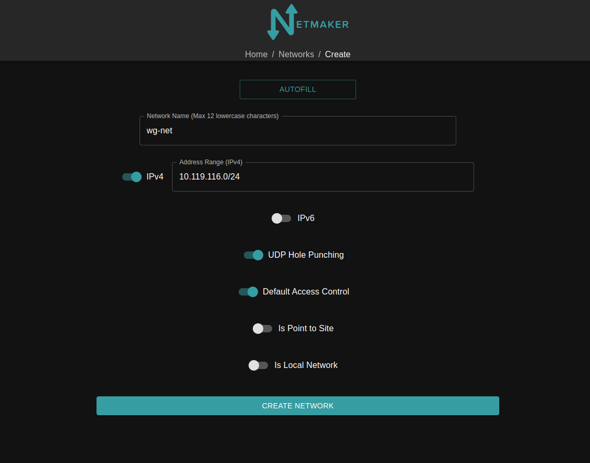
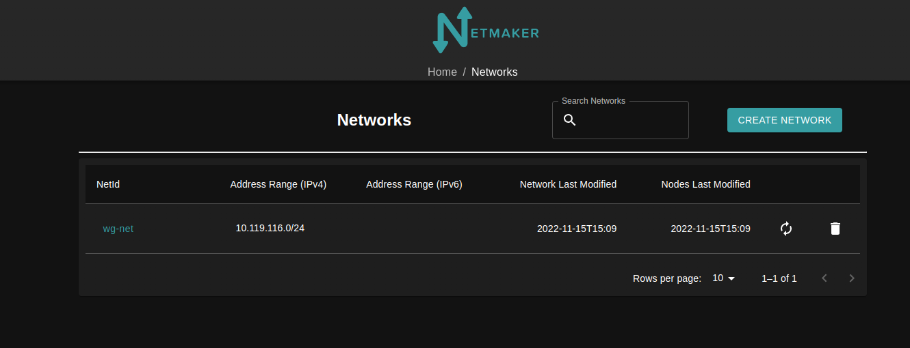
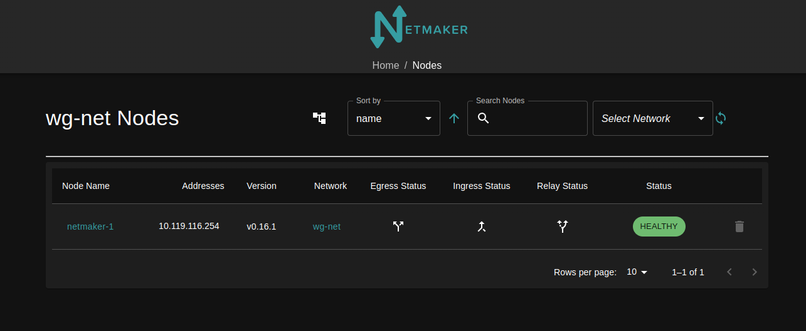
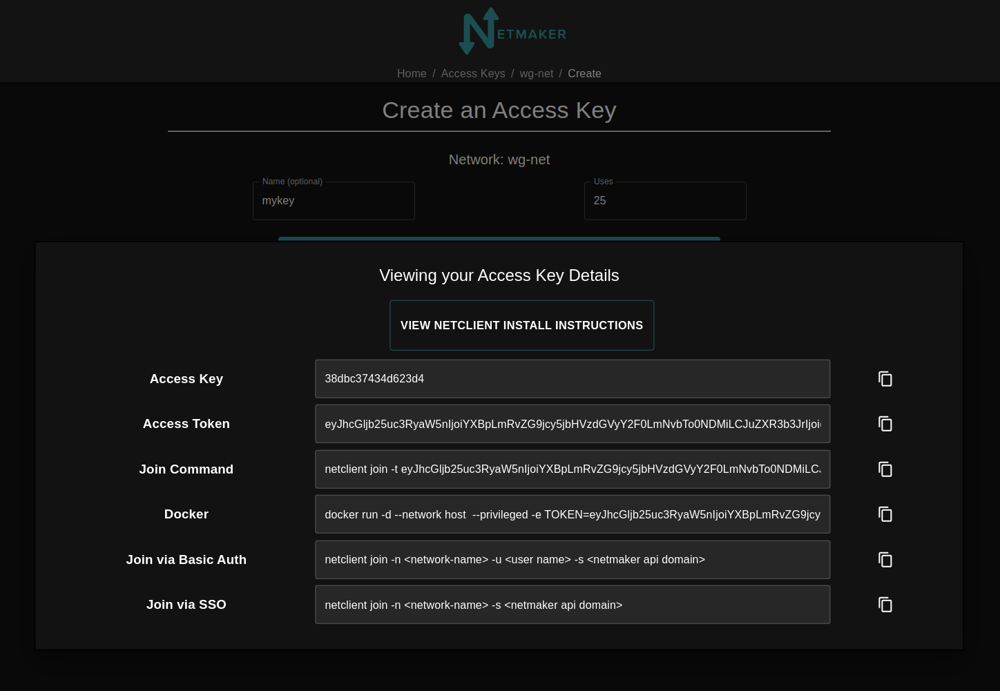
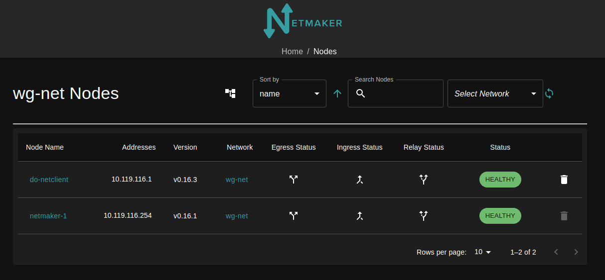
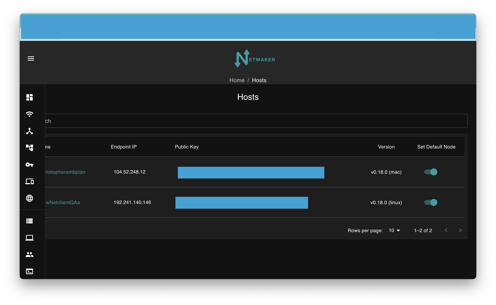
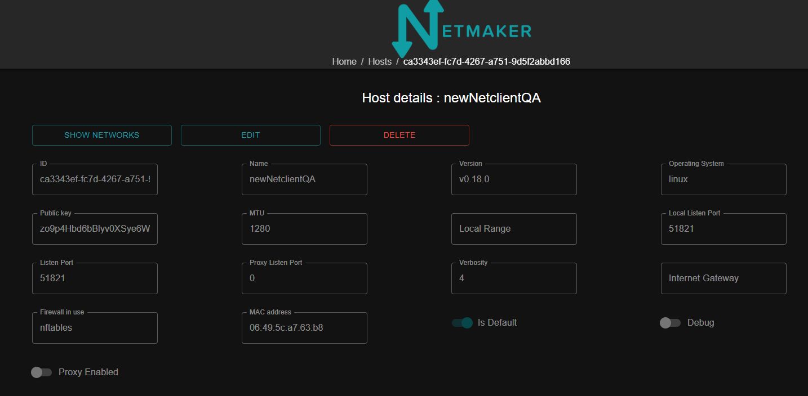
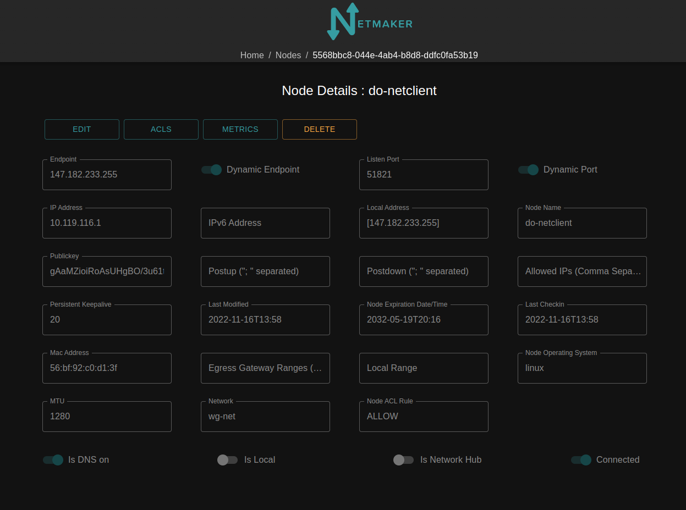

=================
Getting Started
=================

Once you have Netmaker installed via the :doc:`Quick Install <./quick-start>` guide, you can use this Getting Started guide to help create and manage your first network.

Setup
=================

#. Create your admin user, with a username and password.
#. Login with your new user
#. Create your first network by clicking on Create Network

Create a Network
=================

This network should have a sensible name (nodes will use it to set their interfaces).

More importantly, it should have a non-overlapping, private address range. 

If you are running a small (less than 254 machines) network, and are unsure of which CIDR's to use, you could consider:

- 10.11.12.0/24
- 10.20.30.0/24
- 100.99.98.0/24

Network Settings Description
-------------------------------

The Network creation form has a few fields which may seem unfamiliar. Here is a brief description:

**IPv4:** Adds private IPv4 to all nodes in a network

**IPv6:** Adds private IPv6 to all nodes in a network

**UDP Hole Punching:** UDP Hole Punching enables the server to perform STUN. This means, when nodes check-in, the server will record return addresses and ports. It will then communicate this information to the other nodes when they check in, allowing them to reach their peers more easily.  **This setting is usually good to turn on, with some noteable exceptions.** This setting can also break peer-to-peer functionality if, for whatever reason, nodes are unable to reach the server.  This can enhance connectivity in cases where NAT may block communication.

**Default Access Control:** Indicates the default ACL value for a node when it joins in respect to it's peers (enabled or disabled).

**Is Local Network:**  This is almost always best to leave this turned off and is left for very special circumstances. If you are running a data center or a private WAN, you may want to enable this setting. It defines the range that nodes will set for Endpoints. Usually, Endpoints are just the public IP. But in some cases, you don't want any nodes to be reachable via a public IP, and instead want to use a private range.  Use if the server is on the same network (LAN) as you.

Once your network is created, you should the network (wg-net here but it will be the name you chose when creating the network):

When you click on the NetId and then the Nodes button (or go direct via the left-hand menu and then Nodes) you see that the netmaker server has added itself to the network. From here, you can move on to adding additional nodes to the network.

Create a Key
===============

Adding nodes to the network typically requires a key.

#. Click on the ACCESS KEYS tab and select the network you created.
#. Click CREATE ACCESS KEY
#. Give it a name (ex: "mykey") and a number of uses (ex: 25)
#. Click CREATE 
#. Visit https://docs.netmaker.org/netclient.html#install to install netclient on your nodes.

There are different values for difference scenarios.  The top 3 values cover these scenarios:

* The **Access Key** value is the secret string that will allow your node to authenticate with the Netmaker network. This can be used with existing netclient installations where additional configurations (such as setting the server IP manually) may be required. This is not typical. E.g. ``netclient join -k <access key> -s grpc.myserver.com -p 50051``
* The **Access Token** value is a base64 encoded string that contains the server IP and grpc port, as well as the access key. This is decoded by the netclient and can be used with existing netclient installations like this: ``netclient join -t <access token>``. You should use this method for adding a network to a node that is already on a network. For instance, Node A is in the **mynet** network and now you are adding it to **default**.
* The **Join Command** value is a command that can be run on Linux systems after installing the Netclient.  It will join the network directly from the command line.
  
Other variations (eg Docker) are covered with the remaining values.

Networks can also be enabled to allow nodes to sign up without keys at all. In this scenario, nodes enter a "pending state" and are not permitted to join the network until an admin approves them.  To enable this option, visit the Network Details for the network and turn on the "Allow Node Signup Without Keys" option.

Deploy Nodes
=================

0. Prereqisite: Every machine on which you install should have WireGuard and systemd already installed.

1. SSH to each machine 
2. ``sudo su -``
3. **Prerequisite Check:** Every Linux machine on which you run the netclient must have WireGuard and systemd installed
4. Follow the installation instructions for your operating system `here <https://docs.netmaker.org/netclient.html#installation>`_ 

You should get output similar to the below. The netclient retrieves local settings, submits them to the server for processing, and retrieves updated settings. Then it sets the local network configuration. For more information about this process, see the :doc:`client installation <./netclient>` documentation. If this process failed and you do not see your node in the console (see below), then reference the :doc:`troubleshooting <./troubleshoot>` documentation.

.. image:: images/nc-install-output.png
   :width: 80%
   :alt: Output from Netclient Install
   :align: center

Repeat the above steps for every machine you would like to add to your network. You can re-use the same install command so long as you do not run out of uses on your access key (after which it will be invalidated and deleted).

Once installed on all nodes, you can test the connection by pinging the private address of any node from any other node.

.. image:: images/ping-node.png
   :width: 80%
   :alt: Node Success
   :align: center

Manage Nodes/Hosts
==================

Your machines should now be visible in the control panel. 

As of v0.18.0 each node has an associated host. The Hosts can be found in the Hosts tab on the UI. You should be taken to a screen like this.

I here you can see the host's name, the endpoint of the server running netclient, the public key for that host, the version number, and a switch to set that host's node as the default node. When this is switched on, that node will serve as the default node when a network is created (similar to netmaker-1 in versions before v0.18.0). Clicking on a host will bring you to the host's details.

You can view/modify/delete any node by selecting it in the NODES tab. For instance, you can change the name to something more sensible like "workstation" or "api server". You can also modify network settings here, such as keys or the WireGuard port. These settings will be picked up by the node on its next check-in. For more information, see Advanced Configuration in the :doc:`Using Netmaker <./usage>` docs.

Nodes can be added/removed/modified on the network at any time. Nodes can also be added to multiple Netmaker networks. Any changes will get picked up by any nodes on a given network and will take about ~30 seconds to take effect.

Uninstalling the netclient
=============================

1. To remove your nodes from a network (default here), run the following on each node: ``sudo netclient leave -n default`` (replacing default with the actual name of the network eg wg-net)
2. To remove the netclient entirely from each node (after running the above step), run ``sudo systemctl stop netclient && sudo systemctl disable netclient && sudo systemctl daemon-reload && sudo rm -rf /etc/netclient /etc/systemd/system/netclient.service /usr/sbin/netclient``

Uninstalling Netmaker
===========================

To uninstall Netmaker from the server, simply run ``docker-compose down`` or ``docker-compose down --volumes`` to remove the docker volumes for a future installation.

