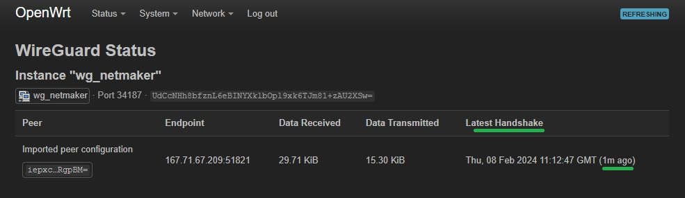

.. _integrating-non-native-devices:

===================================
Integrating Non-native Devices
===================================

Introduction
===============

Netmaker manages WireGuard configurations through the Netclient and the Remote Access Client (RAC) installed on the hosts and on the external clients respectively. Basically Netmaker makes WireGuard configurations, which are inherently static, dynamic. As you setup and change your network, Netmaker propagates these changes in the configuration to the affected machines installed with either Netclient or RAC.

However in some cases, it might not be ideal or even possible to install Netclient or RAC on some of your machines/devices. In these cases, Netmaker will rely upon your intervention to install WireGuard on these machines/devices and then to manually set up or change their WireGuard configurations whenever necessary. Basically, you just need to get the current WireGuard configuration (or VPN config files) from your Netmaker Remote Access Gateway and then stick it to your device in order for it to connect to your Netmaker network.

Generating a WireGuard Configuration File on Remote Access Gateway
=====================================================================

Netmaker allows you to generate and manage your VPN configuration files. For instructions on how to make a node a Remote Access Gateway and on how to create/generate VPN configuration files, please refer to the "Ingress Gateway/External Clients" section under the "How-to-Guides".

You can also get the WireGuard VPN configuration by following these steps:

1. Navigate to your network's Remote Access tab. You should see the Gateways table to the left-hand side and then the VPN Config Files table to the right-hand side of the page

2. If you have multiple gateways, select the specific one by clicking on it if it hasn't been selected already

3. If necessary, find the VPN configuration by inputting its name in the Search box

4. Once you've located the configuration file, hover over or click on its 'kebab' icon to the right-hand side corner of the row. A context menu should show up similar to the screenshot below

5. Now you can view and copy the configuration file by clicking on the 'View Config' option. Or you can click on the 'Download' option to get a copy of the configuration file

.. image:: images/integration-sample-config.jpg
   :width: 80%
   :alt: Sample Client Config
   :align: center

Once you have the configuration information or the configuration file, you can now stick it to your router, IoT, or other edge devices.

Routers and Firewall Appliances (Virtual or Bare metal)
========================================================

While Netclient can be installed on some routers and firewall appliances after which you can then configure as egress gateways, it is generally ideal to use these devices' built-in VPN feature for seamless integration. Since most modern VPN routers and firewalls today support WireGuard, they can connect to a Netmaker network as an external client, after which you can then responsibly expose the resources behind them by inputting specific IP address ranges in the 'Additional Addresses' field. For more information about the Egressing External Clients, please refer to this link: https://docs.netmaker.io/egress-gateway.html#egressing-external-clients.

.. image:: images/integration-config-additional-addresses.jpg
   :width: 80%
   :alt: Client additional IP addresses range
   :align: center

The general guidelines for integrating routers and firewall appliances (FWA) to Netmaker are the following:

   - Before doing any further configuration, take note of your current firmware version and back up the current configuration settings
   - Upgrade your firmware if necessary
   - Install WireGuard via your router's or FWA's Package Manager. Usually this can be done from its web interface (GUI) instead of from its shell (CLI)
   - Input the VPN configuration information from Netmaker; or upload the configuration file if your device supports it
   - If necessary, create a routing entry for the WireGuard tunnel interface
   - Create tight and specific firewall rules for traffic going in and out between the VPN interface and your LAN [or depending on your use case, your specific device, interface/port, VLAN, DMZ, WAN, etc.]

1) pfSense
-------------------

This guide will help you set up WireGuard on pfSense 2.7.2. We will connect to a Netmaker network via a Remote Access Gateway

A. install WireGuard using the Package Manager in System -> Package Manager -> Available Packages

.. image:: images/integration-pfsense-pkgmgr.jpg
   :width: 80%
   :alt: pfSense Package Manager
   :align: center

B. go to VPN -> WireGuard -> Tunnels, and then create a new WireGuard tunnel using the configuration information provided by Netmaker. Click on the Generate button under the Interface Keys fields before pasting the Private Key (from the configuration file generated by Netmaker). Save or submit the form and then take note of the tunnel interface name
   

C. go to VPN -> WireGuard -> Peers, and then create a peer. Input the necessary configuration infomation similar to what is shown in the image below

.. image:: images/integration-pfsense-peer.jpg
   :width: 80%
   :alt: pfSense Peer Configuration
   :align: center

D. enable WireGuard in VPN -> WireGuard -> Settings, and then click on the Apply Changes button. Make sure that the 'handshake' icon is green under the Status tab before proceeding any further 

.. image:: images/integration-pfsense-enable-wg.jpg
   :width: 80%
   :alt: pfSense enable WireGuard
   :align: center

E. go to Interfaces -> Assignments, and then assign or add a new interface for the WireGuard tunnel you created in Step 2. Take note of the interface name (say OPT1)

F. go to Interfaces -> [OPT1], and then tick the 'Enable interface' checkbox, input the MTU, static IP address, and the Netmaker network prefix

.. image:: images/integration-pfsense-enable-if-init.jpg
   :width: 80%
   :alt: pfSense go to the WireGuard tunnel interface
   :align: center

.. image:: images/integration-pfsense-enable-if.jpg
   :width: 80%
   :alt: pfSense enable WireGuard tunnel interface
   :align: center

If you're trying to connect to a Netmaker Internet Gateway, then click on the 'Add a new gateway' button. Depending on your use case, you may tick the Default Gateway checkbox so that all internet traffic will route through the Netmaker Internet Gateway. Then go to System -> General Setup and, [again] depending on your use case, select the Netmaker Internet Gateway in the DNS Server Settings so that domain name resolution traffic will pass through it instead of the other gateways

.. image:: images/integration-pfsense-if-internet-gw.jpg
   :width: 80%
   :alt: pfSense create an internet gateway
   :align: center

G. If you just need to connect to an Internet Gateway, you don't need to do this step. Otherwise, create a Firewall rule allowing traffic from the Netmaker network to the target resource. In this guide we are going to allow ICMP traffic to the LAN so that we can do pings. Go to Firewall -> Rules -> [OPT1] and add a rule similar to what is shown in the screenshot below

.. image:: images/integration-pfsense-fw-init.jpg
   :width: 80%
   :alt: pfSense add firewall rule
   :align: center

After saving the firewall rule, nodes from your netmaker network should now be able to ping the egress ranges you've specified, and vice versa. Edit the firewall rule above or create another one specific to your needs.

2) OPNsense
-------------------

This guide will help you set up WireGuard on OPNsense 24.1_1. We will connect to a Netmaker network via a Remote Access Gateway:

A. WireGuard comes pre-installed on OPNsense 24.1_1. For OPNsense 23.7.12 and below, install WireGuard as a plug-in in System -> Firmware -> Plugins

B. go to VPN -> WireGuard -> Settings -> Instances, and then create a new WireGuard tunnel instance using the configuration information provided by Netmaker. Click on the Generate [gear] icon in the Public Key field before pasting the Private Key (from the configuration file generated by Netmaker). Save and then take note of the tunnel interface name
   
.. image:: images/integration-opnsense-tunnel-interface.jpg
   :width: 80%
   :alt: OPNsense Tunnel Configuration
   :align: center

C. go to VPN -> WireGuard -> Settings -> Peers, and then create a WireGuard peer using the information provided by Netmaker

D. enable WireGuard in VPN -> WireGuard -> Settings -> General. And then click on the Apply Changes button 

E. go to Interfaces -> Assignments, and then assign or add a new interface for the WireGuard tunnel you created in Step 2. Take note of the interface name (say OPT1)

F. go to Interfaces -> [OPT1], and then tick the 'Enable interface' and the 'Prevent interface removal' checkboxes

.. image:: images/integration-opnsense-enable-if.jpg
   :width: 80%
   :alt: OPNsense enable WireGuard tunnel interface
   :align: center

G. Create a route to the Netmaker network by first creating a gateway. Go to System -> Gateways -> Configuration, then click on the add icon and specify the tunnel interface [OPT1] and its IP:

H. Add the necessary routing entry. Go to System -> Routes -> Configuration, then click on the 'add' icon and specify a route to the Netmaker network via the gateway created in the previous step:

I. Create a Firewall rule for WireGuard allowing traffic between it and the target resource. In this guide we are going to allow ICMP traffic between WireGuard tunnel interface and the LAN so that we can do pings. Go to Firewall -> Rules -> [OPT1] and add a rule similar to what is shown in the screenshot below

.. image:: images/integration-opnsense-fw.jpg
   :width: 80%
   :alt: OPNsense add firewall rule - form
   :align: center

After saving the firewall rule, devices in your LAN should now be able to ping machines in your Netmaker network, and vice versa. Edit the firewall rule above or create one that would suit your needs. 

3) MikroTik
-------------------

This guide will help you set up WireGuard on MikroTik 7.13.3. We will connect to a Netmaker network via a Remote Access Gateway:

A. WireGuard comes pre-installed on MikroTik 7.13.3 so you don't have to do anything.

B. given a sample WireGuard configuration below, you can access MikroTik's CLI and issue the corresponding commands

WireGuard interface configuration:

.. code-block::

   /interface/wireguard
   add name=wg-netmaker mtu=1420 private-key="iMfHqGANXMJHGMBKwuo89txiU3/9edC20TxWpFtmU2Y="

Peer configuration:

.. code-block::

   /interface/wireguard/peers
   add allowed-address=10.40.70.0/24 endpoint-address=188.166.235.45 endpoint-port=51821 interface=wg-netmaker public-key="GM80g/eeXgkOrk0yYtdhhU73ETHffpojG2Ewd+N4kXI=" persistent-keepalive=20 client-dns=159.159.159.159

IP and routing configuration:

.. code-block::

   /ip/address
   add address=10.40.70.254/32 interface=wg-netmaker
   /ip/route
   add dst-address=10.40.70.0/24 gateway=wg-netmaker

And that's it. Devices from your LAN should now be able to reach machines in your Netmaker network, and vice versa. 

For more information, please refer to this guide from MikroTik's documentation page: https://help.mikrotik.com/docs/display/ROS/WireGuard.

Routing internet traffic to a Netmaker Internet Gateway is also possible by adding the necessary firewall NAT rules. Please refer to the MikroTik documentation for more information.

4) OpenWrt
-------------------

This guide will help you set up WireGuard on OpenWrt 23.05.2. We will connect to a Netmaker network via a Remote Access Gateway:

A. Go to System -> Software. Click on the `Update lists...` button then search for `WireGuard`. Install `WireGuard-tools` and `luci-proto-WireGuard` (for Web GUI). Reboot.

B. go to Network -> Interfaces, and then add a new WireGuard tunnel interface
   

C. click on the `Load Configuration...`, paste the WireGuard configuration and then click `Import settings`

D. go to the `Peers` tab. Edit the generated peer, tick the `Route Allowed IPs` field. Save and apply the changes made.

E. go to Status -> WireGuard and make sure that a handshake has taken place. If successful, OpenWrt should be able to reach the Netmaker Remote Access Gateway but not the other way around

F. go to Network -> Firewall, and then add a zone allowing traffic between the WireGuard tunnel and the LAN. Please do add your own version of Firewall rule that is tight and specific to your needs. Save and apply the changes made.

And that's about it. Routing internet traffic to a Netmaker Internet Gateway is also possible by adding the necessary firewall NAT rules. Please refer to the OpenWrt documentation for more information.

5) Other routers
-------------------

Please refer to these links for instructions on how to configure WireGuard:

   A. TP-Link - https://www.tp-link.com/fr/support/faq/3772/
   B. Asus - https://www.asus.com/support/faq/1048281/
   C. GL.iNet - https://docs.gl-inet.com/router/en/3/tutorials/WireGuard_client/#setup-WireGuard-client
   D. Teltonika - https://wiki.teltonika-networks.com/view/WireGuard_Configuration_Example
   E. pcWRT - https://www.pcwrt.com/2019/12/how-to-set-up-a-WireGuard-vpn-client-connection-on-the-pcwrt-router/
   F. DD-WRT - https://windscribe.com/knowledge-base/articles/WireGuard-router-setup-guide-dd-wrt

Internet of Things (IoT Devices)
========================================================

Please refer to these links for instructions on how to configure WireGuard:

   A. IOTstack - https://sensorsiot.github.io/IOTstack/Containers/WireGuard/
   B. Embedded Linux - https://www.toradex.com/blog/embedded-linux-vpn-application
   C. lwIP IP stack - https://github.com/smartalock/WireGuard-lwip

Other Devices
======================================

For other devices not covered above, please refer to your device's documentation for instructions on how to install and configure WireGuard.  

Disclaimer
======================================

The information provided by us on this how-to guide is for general informational purposes only. All information on this page is provided in good faith, however we make no representation or warranty of any kind, express or implied, regarding the accuracy, adequacy, validity, reliability, availability or completeness of any information on the page.

Under no circumstance shall we have any liability to you for any loss or damage of any kind incurred as a result of the use of this how-to guide or reliance on any information provided on the page. Your use of the how-to guide and your reliance on any information on the page is solely at your own risk.