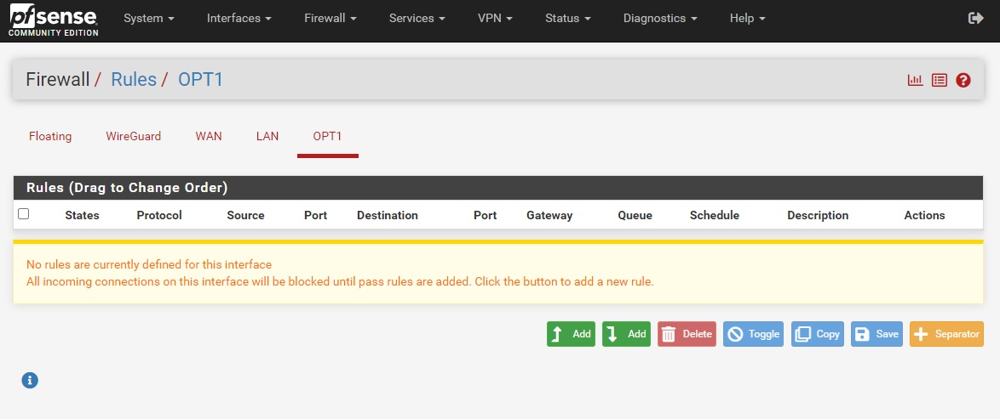

.. _integrating-non-native:

=======
Integrating Non-native Devices
=======

Introduction
===============

Netmaker manages Wireguard configurations through the Netclient and the Remote Access Client (RAC) installed on the hosts and on the external clients repectively. Basically Netmaker makes Wireguard configurations, which are inherently static, dynamic. As you setup and change your network, Netmaker propagates these changes in the configuration to the affected machines installed with either Netclient or RAC.

However in some cases, it might not be ideal or even possible to install Netclient or RAC on your machine/device. In these cases Netmaker will rely upon your intervention to manually set up and/or change Wireguard configurations on these machines/devices whenever necessary.  

Generating a Wireguard Configuration File on Remote Access Gateway
==================================

Using only Wireguard, you can connect to a Netmaker network via a Remote Access gateway.

For instructions on how to create a node as a Remote Access Gateway and on how to create/generate and get VPN configuration files, please refer to the "Ingress Gateway/External Clients" section under the "How-to-Guides".

You can also get the Wireguard VPN configuration by following these steps:

1. Navigate to your network's Remote Access tab. You should see the Gateways table to the left-hand side and then the VPN Config Files table to the right-hand side of the page

2. If you have multiple gateways, select the specific one by clicking on it if it hasn't been selected already

3. If necessary, find the VPN configuration by inputting its name in the Search box

4. Once you've located the configuration file, hover over or click on its 'kebab' icon to the right-hand side corner of the row. A context menu should show up similar to the screenshot below

.. image:: images/integration-get-config.jpg
   :width: 80%
   :alt: Get Client Config
   :align: center

5. Now you can view and copy the configuration file by clicking on the 'View Config' option. Or you can click on the 'Download' option to get a copy of the configuration file

.. image:: images/integration-sample-config.jpg
   :width: 80%
   :alt: Sample Client Config
   :align: center

Once you have the configuration information or the configuration file, you can now stick it to your router, IoT, or other edge devices.

Routers and Firewall Appliances (Virtual or Bare metal)
============

While Netclient can be installed in some routers and firewall appliances and then configure them as egress gateways, it is generally ideal to use these devices' built-in VPN feature for seamless integration. Since most modern VPN routers and firewalls today support Wireguard, they can connect to a Netmaker network as an external client and then responsibly expose the resources behind them by inputting their IP address ranges in the 'Additional Addresses' field.

.. image:: images/integration-config-additional-addresses.jpg
   :width: 80%
   :alt: Client additional IP addresses range
   :align: center

The general guidelines for integrating routers and firewall appliances to Netmaker are the following:

   - Before doing any further configuration, take note of your current firmware version and back up the current configuration settings
   - Upgrade your firmware if necessary
   - Install Wireguard via your router's or FWA's Package Manager. Usually this can be done from its web interface (GUI) instead of from its shell (CLI)
   - Input the VPN configuration information from Netmaker; or upload the configuration file if your device supports it
   - If necessary, create a routing entry for the Wireguard interface
   - Create tight and specific firewall rules for traffic going in and out between the VPN interface and your LAN [or depending on your use case your specific device, interface/port, VLAN, DMZ, WAN, etc.]

1) pfSense
-------------------

This guide will help you set up WireGuard on pfSense 2.7.2. We will connect to a Netmaker network via a Remote Access Gateway:

   A. install Wireguard using the Package Manager in System -> Package Manager -> Available Packages

   B. go to VPN -> WireGuard -> Tunnels, and then create a new WireGuard tunnel using the information provided by Netmaker. Click on the Generate button under the Interface Keys fields then paste the Private Key from the configuration file generated by Netmaker. Take note of the tunnel interface name
   
.. image:: images/integration-pfsense-tunnel-interface.jpg
   :width: 80%
   :alt: pfSense Tunnel Configuration
   :align: center

   C. go to VPN -> WireGuard -> Peers, and then create a WireGuard peer using the information provided by Netmaker

.. image:: images/integration-pfsense-peer.jpg
   :width: 80%
   :alt: pfSense Peer Configuration
   :align: center

   D. enable WireGuard in VPN -> WireGuard -> Settings. And then click on the Apply Changes button. Make sure that the 'handshake' icon is green under the Status tab before proceeding any further 

.. image:: images/integration-pfsense-enable-wg.jpg
   :width: 80%
   :alt: pfSense enable WireGuard
   :align: center

   E. go to Interfaces -> Assignments, and then assign or add a new interface for the WireGuard tunnel you created in Step B. Take note of the interface name (say OPT1)

.. image:: images/integration-pfsense-assign-if.jpg
   :width: 80%
   :alt: pfSense assign WireGuard tunnel interface
   :align: center

   F. go to Interfaces -> [OPT1], and then tick the 'Enable interface' checkbox, input the MTU, static IP address, and the Netmaker network prefix

   If you're trying to connect to an Internet Gateway, then click on the 'Add a new gateway' button. Depending on your use case, you may tick the Default Gateway checkbox so that all internet traffic routes through the Netmaker Internet Gateway. Then go to System -> General Setup and, again depending on your use case, in the DNS Server Settings select the Netmaker Internet Gateway so that domain name resolution traffic will pass through it instead of the other gateways

   G. If you just want to connect to an Internet Gateway, you don't need to do this step. Otherwire, create a Firewall rule for WireGuard allowing traffic between it and the target resource. For this guide we are going to allow ICMP traffic between WireGuard tunnel interface and the LAN so that we can do pings. Go to Firewall -> Rules -> [OPT1] and add a rule similar to what is shown in the screenshot below

.. image:: images/integration-pfsense-fw.jpg
   :width: 80%
   :alt: pfSense add firewall rule - form
   :align: center

2) OPNsense
-------------------

This guide will help you set up WireGuard on OPNsense 24.1_1. We will connect to a Netmaker network via a Remote Access Gateway:

   A. WireGuard comes pre-installed on OPNsense 24.1_1. For OPNsense 23.7.12 and below install Wireguard as a plug-in in System -> Firmware -> Plugins

   B. go to VPN -> WireGuard -> Settings -> Instances, and then create a new WireGuard tunnel instance using the information provided by Netmaker. Click on the Generate [gear] icon in the Public Key field then paste the Private Key from the configuration file generated by Netmaker. Take note of the tunnel interface name
   

   C. go to VPN -> WireGuard -> Settings -> Peers, and then create a WireGuard peer using the information provided by Netmaker

.. image:: images/integration-opnsense-peer.jpg
   :width: 80%
   :alt: OPNsense Peer Configuration
   :align: center

   D. enable WireGuard in VPN -> WireGuard -> Settings -> General. And then click on the Apply Changes button. Make sure that the 'handshake' icon is green under the Status tab before proceeding any further 

.. image:: images/integration-opnsense-enable-wg.jpg
   :width: 80%
   :alt: OPNsense enable WireGuard
   :align: center

   E. go to Interfaces -> Assignments, and then assign or add a new interface for the WireGuard tunnel you created in Step B. Take note of the interface name (say OPT1)

.. image:: images/integration-opnsense-assign-if.jpg
   :width: 80%
   :alt: OPNsense assign WireGuard tunnel interface
   :align: center

   F. go to Interfaces -> [OPT1], and then tick the 'Enable interface' and the 'Prevent interface removal' checkboxes

   G. Create a Firewall rule for WireGuard allowing traffic between it and the target resource. For this guide we are going to allow ICMP traffic between WireGuard tunnel interface and the LAN so that we can do pings. Go to Firewall -> Rules -> [OPT1] and add a rule similar to what is shown in the screenshot below

3) MikroTik
-------------------

A Test 

4) OpenWrt
-------------------

A Test 

IoT / edge devices
======================

Todo

Others
======================

Todo