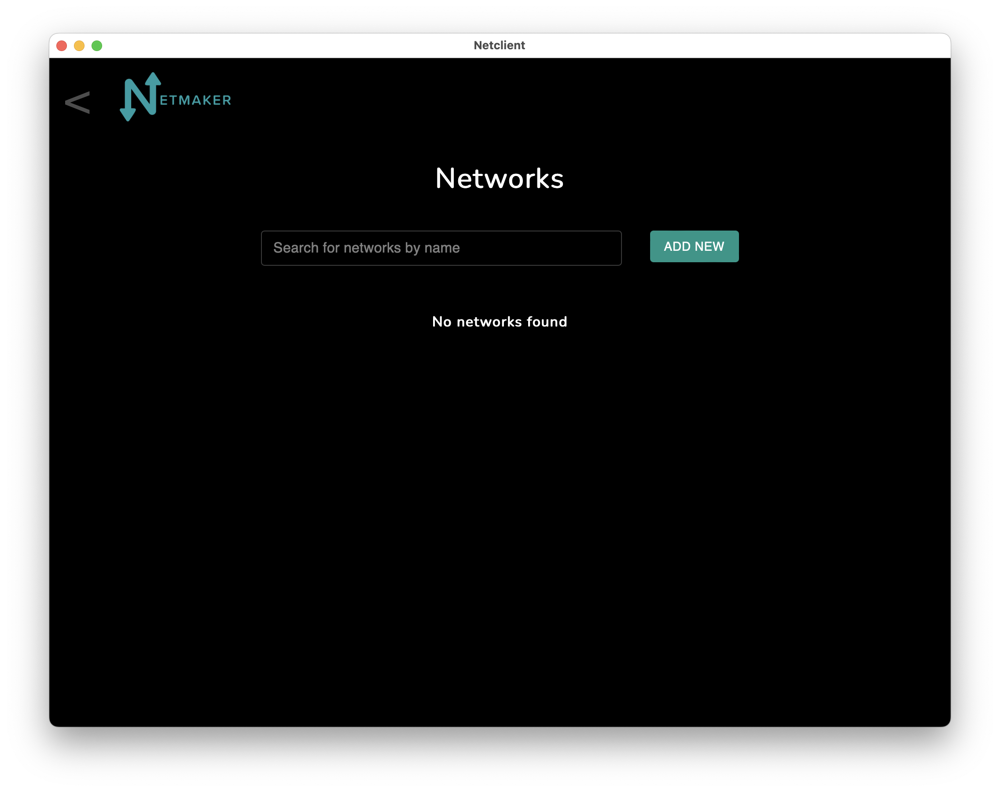
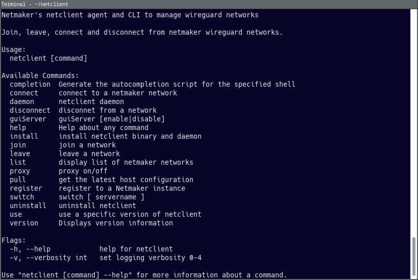
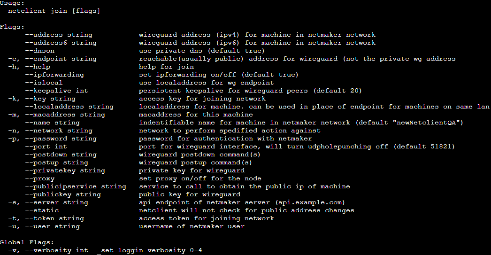
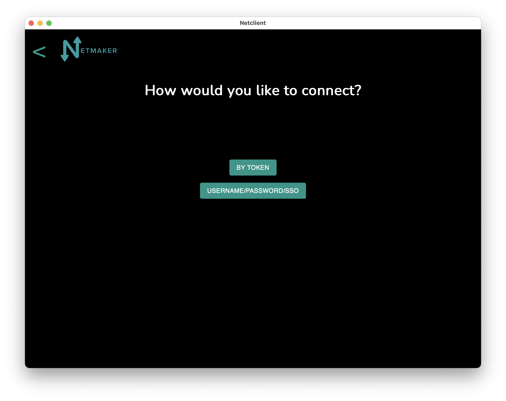
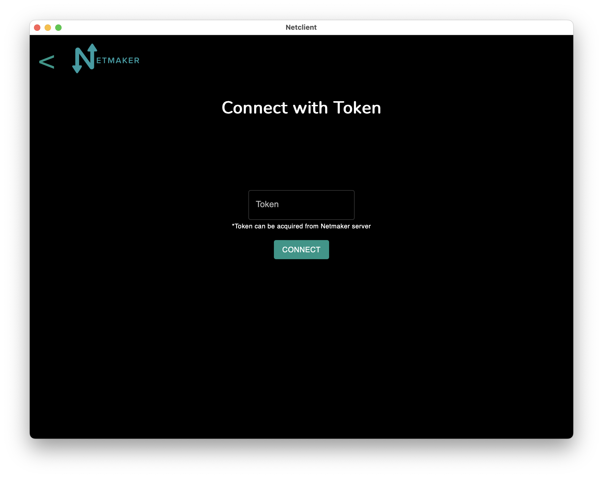
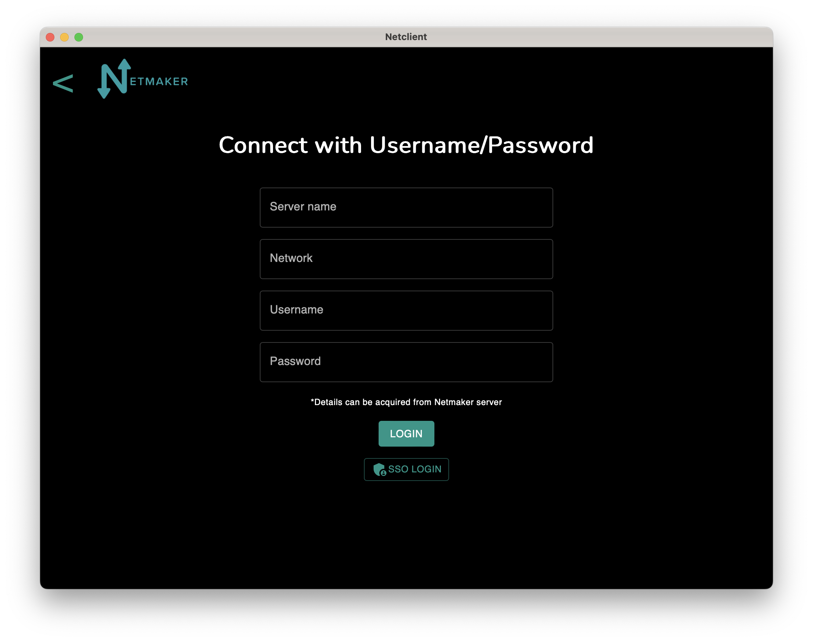
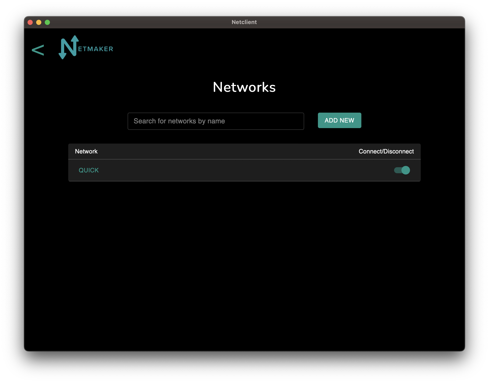
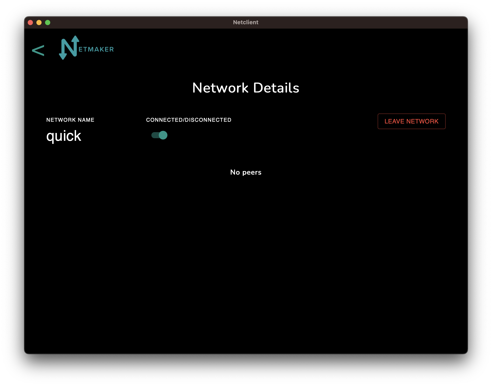
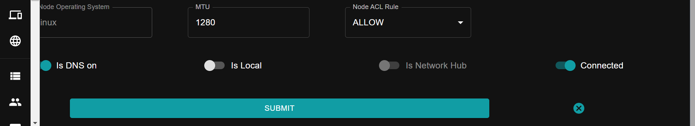

==========
Netclient 
==========

As of v0.18.0 Netclient is now in its own standalone repo seperate from netmaker.

The UI has been updated for Mac and Windows,

And the CLI has been updated.

The Netclient manages WireGuard on client devices (nodes). This document walks through setting up the netclient on machines, including install, management, and uninstall.

The Netclient is supported on the following operating systems:

* Linux (most distributions)
* Windows
* macOS
* FreeBSD

For unsupported devices, please use the external client, which is just a static, vanilla, WireGuard configuration file, which can be added to any device that supports WireGuard.

******************
Installation
******************

Before adding the machine to a network, the netclient must be installed. A successful installation sets up the netclient executable on the machine and adds it as a system daemon. The daemon will listen for changes for any network it joins.

The client install **does not** add the client as a member of any network. Once the client is installed, you must run:

.. code-block::

  netclient join -t <token>

The following are install instructions for most operating systems.

Linux
=============

Debian Distros (debian/ubuntu/mint/pop-os)
------------------------------------------------------

.. code-block::

  curl -sL 'https://apt.netmaker.org/gpg.key' | sudo tee /etc/apt/trusted.gpg.d/netclient.asc
  curl -sL 'https://apt.netmaker.org/debian.deb.txt' | sudo tee /etc/apt/sources.list.d/netclient.list
  sudo apt update
  sudo apt install netclient

Red Hat Distros (fedora/redhat/centos/rocky)
---------------------------------------------------------------------

.. code-block::

  curl -sL 'https://rpm.netmaker.org/gpg.key' | sudo tee /tmp/gpg.key
  curl -sL 'https://rpm.netmaker.org/netclient-repo' | sudo tee /etc/yum.repos.d/netclient.repo
  sudo rpm --import /tmp/gpg.key
  sudo dnf check-update
  sudo dnf install netclient

Arch Distros (arch/manjaro/endeavouros)
------------------------------------------------

.. code-block::

  yay -S netclient

OpenWRT Distros (mips/mipsle)
------------------------------------------------

.. code-block::

refer to Advanced Client Installation :ref:`advanced-client-install:Notes on OpenWRT` 

OpenSUSE (tumbleweed/leap)
---------------------------------------------------------------------

.. code-block:: shell

  sudo rpm --import https://rpm.netmaker.org/gpg.key
  curl -sL 'https://rpm.netmaker.org/netclient-repo' | sudo tee /etc/zypp/repos.d/netclient.repo
  sudo zypper refresh
  sudo zypper install netclient

Windows
===============

MSI Installer
--------------

Download Link: https://fileserver.netmaker.org/latest/netclient_x86.msi 

Mac
============

Brew Install
---------------

.. code-block::

  brew tap gravitl/netclient
  (optional) brew audit netclient
  brew install netclient

GUI Installer
---------------

Download Link for Apple silicon: https://fileserver.netmaker.org/latest/Netclient-M1.pkg

Download Link for Apple Intel: https://fileserver.netmaker.org/latest/Netclient-Intel.pkg

FreeBSD
=============

A FreeBSD package is planned. In the meantime, please use one of the following commands (select the correct one for your version of FreeBSD) to install the netclient on FreeBSD. 
To install on pfSense or OPNsense, ensure that wireguard package is installed and enabled. Use the FreeBSD version corresponding to your installation (use uname -r to check your version).
.. code-block::

  fetch -o /tmp/netclient https://fileserver.netmaker.io/releases/download/v0.20.5/netclient-freebsd13-amd64 && chmod +x /tmp/netclient && sudo /tmp/netclient install
  fetch -o /tmp/netclient https://fileserver.netmaker.io/releases/download/v0.20.5/netclient-freebsd14-amd64 && chmod +x /tmp/netclient && sudo /tmp/netclient install

Docker
=============

You can run Netclient using Docker instead of installing it on your local machine.  To ensure that the correct commands are present in order to use Docker use these steps:

.. code-block::

  sudo apt-get update
  sudo apt-get install -y docker.io docker-compose 

After that you can proceed to join the network using the docker command from the access key for the network you wish to join.  The docker command is available from the access key view in the Netmaker UI.  To have the netclient docker container restart (eg after the system reboots) you'll want to use the following option when running docker run:

.. code-block::

  --restart=always

If you prefer (e.g., when specifying a lot of environment variables), you can use a docker-compose.yml file such as the following instead of the docker run command:

.. code-block::

  version: "3.4"

  services:
      netclient:
          network_mode: host
          privileged: true
          restart: always
          environment:
              - TOKEN=<networktoken>
              - PORT=<wg interface port>
              - ENDPOINT=<endpoint ip>
              - MTU=<mtu>
              - HOST_NAME=<host name>
              - IS_STATIC=<static host (true/false)>
          volumes:
              - '/etc/netclient:/etc/netclient'
          container_name: netclient
          image: 'gravitl/netclient:latest'

where <networktoken> is the Access Token available from the "Viewing your Access Key Details" window in the Netmaker UI.

If you are making a docker container on a server that already has a baremetal version of netclient on there, this will create a conflict. Netmaker will only make one host for that machine and not see the container as another node. Meanwhile on the client, both daemons will be running (bare metal and container), causing conflicts (both receive the peer updates) and the node becomes unreachable.

You can work around this by running the docker netclient using a seperate netclient folder and having host networking NOT enabled. Host networking must be turned off when running with multiple netclients. This means that the host will not have the private address of the container and it will be segmented.

Your compose would look more like this:

.. code-block::

  version: "3.4"

  services:
      netclient:
          privileged: true
          network_mode: host
          restart: always
          environment:
              - TOKEN=<networktoken>
              - PORT=<wg interface port>
              - ENDPOINT=<endpoint ip>
              - MTU=<mtu>
              - HOST_NAME=nc-docker-2
              - IS_STATIC=<static host (true/false)>
              - IFACE_NAME=netmaker-2
          volumes:
              - '/etc/netclient2:/etc/netclient'
          container_name: netclient2
          image: 'gravitl/netclient:latest'

By using this method, you can run many netclients on the same host and just incrementing up the volumes (netclient3, netclient4 ..... netclientN) and make sure to set the interface name, so that it won't conflict with existing netclients running on same host.

**IMPORTANT:**
 For docker netclient to function correctly as either ingress/egress gateway, you need to additionally run the following commands on the host machine:

  1. `iptables -I DOCKER-USER -i netmaker  -j ACCEPT`
  2. `iptables -I DOCKER-USER -o netmaker  -j ACCEPT`

******************
Joining a Network
******************

The join command provides the following flags with short descriptions on what each one does.

With a token:

.. code-block::

  netclient join -t <token>

With username/password:

.. code-block::

  netclient join -n <net name> -u <username> -s api.<netmaker domain>
  (example: netclient join -n mynet -u admin -s api.nm.example-domain.io)

With SSO (oauth must be configured):

.. code-block::

  netclient join -n <net name> -s api.<netmaker domain>

With docker:

.. code-block::

  docker run -d --network host  --privileged -e TOKEN=<TOKEN> -v /etc/netclient:/etc/netclient --name netclient gravitl/netclient:<CURRENT_VERSION>

Again, if you are making a docker container on an already existing baremetal netclient, you will have to modify the join command like this for example:

.. code-block::

  docker run -d --network host --privileged -e TOKEN=<TOKEN> -e HOST_NAME=nc-docker-2 -e IFACE_NAME="netmaker-2" -v /etc/netclient2:/etc/netclient --name netclient2 gravitl/new-netclient:<CURRENT_VERSION>

Make sure interface name you pass when running multiple netclient containers on same host doesn't conflict with each other.

These commands will be available to copy and paste in the access keys section of your netmaker UI. You can set the verbosity to a level 0-4 with the flag ``-v <number 0-4>`` in the join command if you need more info about the join.

To join on the GUI with Windows or Mac, just click the ADD NEW button and you will be given a choice of token or Username/Password.

Choose token and you will be taken to a screen where you will enter the Access Token found in the access keys tab of the netmaker UI.

Choose Username/Password and you will be taken to this screen:

You can fill out these fields by parsing out the Join via Basic Auth part of the Access Key Details

The Server name will be in the <netmaker api domain> and the network will be in the <network-name> placeholder. Username and password is the same as you would use to sign into your netmaker dashboard.

If the join was successful, you should see the network on the GUI.

You should be able to click on that network and see the details page on that network.

*********************
Managing Netclient
*********************

Connecting/Disconnecting from a network
=======================================

You can connect/disconnect from the network from either the netclient, or from the UI. in the last image above, you can see the connect/disconnect switch is located in the network details of the GUI.

From the CLI, you can use the following:

.. code-block::

  netclient connect <network_name>
  netclient disconnect <network_name>

You can also disconnect and reconnect from the UI. Click on the node you want to disconnect/reconnect and click on edit.

On the bottom, you should see a switch labeled connected like this one. toggle the switch and hit submit. That client will connect or disconnect accordingly.

If you disconnected from the CLI, This switch should be off.

Leave a network
===============

In the GUI, the leave network button is located in the network details. You can also leave from the CLI with the following command.

.. code-block::

  netclient leave <network>

List Networks
=============

.. code-block::

  netclient list

Multi-Server
============

Netclient can be registered with multiple netmaker servers. You can list the servers you are registered with using netclient server list command. 
The server you are currently connected to will be marked with "active: ".
.. code-block::

  netclient server list

You can switch between different netmaker servers using netclient switch command.
*Warning: Switching to another server will disconnect netclient from all the networks on the current server, but you can always switch back using the netclient switch command.*
.. code-block::

  netclient server switch <server name>

You can completely leave a server using the netclient server leave command.
*Warning: Leaving a server will remove the host from all networks on the server and delete the host from the server.*  
In order to reconnect to server you must join or register*

.. code-block::

  netclient server leave <server name>

Use a different version
=======================

Netclient as of v0.18.0 has an option to choose which version of netclient you would like to use. This only applies to versions v0.18.0 and later.

.. code-block::

  netclient use <version>

Netclient also has an auto-update feature as of v0.18.0

******************
Uninstalling
******************

Leave a network:

Uninstall from CLI:

.. code-block::

  netclient uninstall

Uninstall using package manager (use equivalent command for your OS):

.. code-block::

  apt remove netclient

With a Mac, just go to applications in your finder and throw netclient in the trash bin, or use

.. code-block::

  brew uninstall netclient

if it was installed through Homebrew

With windows go to "Add or remove programs" in your system settings and remove netclient.
