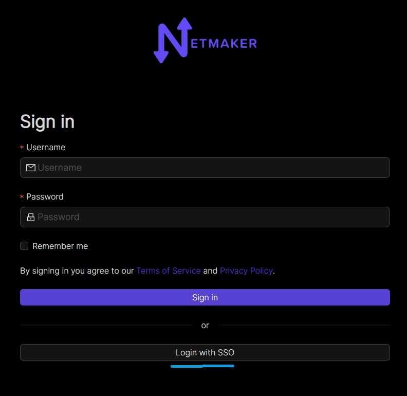
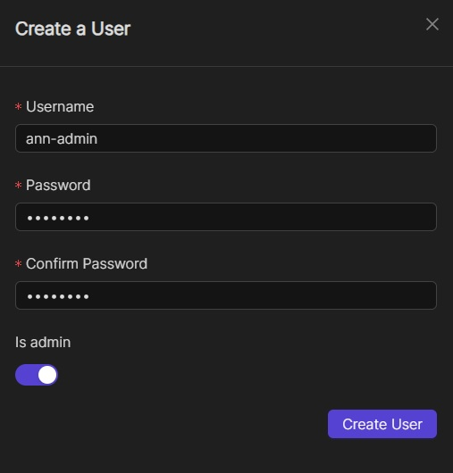
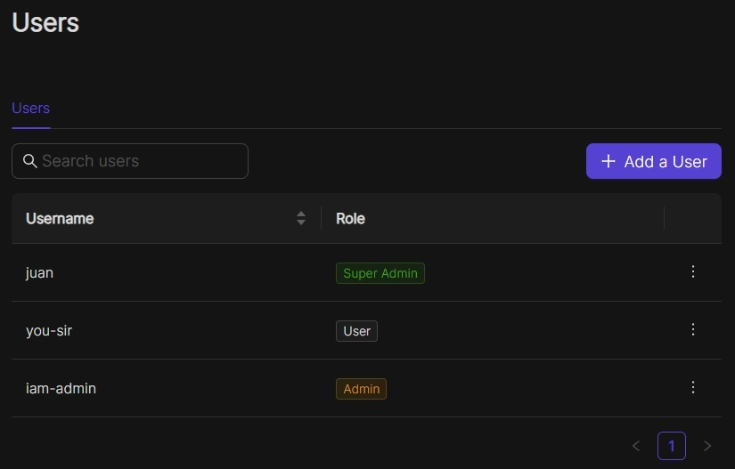

====================
Integrating OAuth
====================

Introduction
==============

As of v0.14.5, Netmaker offers integration with the following OAuth providers: 

- GitHub
- Google
- Microsoft Azure AD
- Open ID Connect (OIDC)

By integrating with an OAuth provider, your Netmaker users can log in via the provider, rather than the default simple auth.

Configuring your provider
===========================

In order to use OAuth, configure your OAuth provider (GitHub, Google, Azure AD).

You must configure your provider (except for Azure AD) to use the Netmaker Dashboard URI dashboard.<netmaker.base.domain> as the origin URL.

For example: `https://dashboard.netmaker.mydomain.com`

You must configure your provider to use the Netmaker API URI redirect route with the following format: https://api.<netmaker base domain>/api/oauth/callback.

For example: `https://api.netmaker.mydomain.com/api/oauth/callback`

General provider instructions can be found with the following links:

Instructions for GitHub: https://oauth2-proxy.github.io/oauth2-proxy/docs/configuration/oauth_provider/#github-auth-provider
Instructions for Google: https://oauth2-proxy.github.io/oauth2-proxy/docs/configuration/oauth_provider/#google-auth-provider
Instructions for Microsoft Azure AD: https://oauth2-proxy.github.io/oauth2-proxy/docs/configuration/oauth_provider/#microsoft-azure-ad-provider 
Instructions for OIDC: https://oauth2-proxy.github.io/oauth2-proxy/docs/configuration/oauth_provider/#openid-connect-provider

Configuring Netmaker
======================

After you have configured your OAuth provider, take note of the CLIENT_ID and CLIENT_SECRET. If you are using Azure for oauth, you may also want to note down the Azure tenant ID you wish to use.

Next, Configure Netmaker with the following environment variables. If any are left blank, OAuth will fail.

.. code-block::

    AUTH_PROVIDER: "<azure-ad|github|google|oidc>"
    CLIENT_ID: "<client id of your oauth provider>"
    CLIENT_SECRET: "<client secret of your oauth provider>"
    SERVER_HTTP_HOST: "api.<netmaker base domain>"
    FRONTEND_URL: "https://dashboard.<netmaker base domain>"
    AZURE_TENANT: "<only for azure, you may optionally specify the tenant for the OAuth>"
    OIDC_ISSUER: "<only for oidc, your issuer endpoint for OIDC ie. http://127.0.0.1:5556/dex"

After restarting your server, the Netmaker logs will indicate if the OAuth provider was successfully initialized:

.. code-block::

   sudo docker logs netmaker

Once successful, users can click the key symbol on the login page to sign-in with your configured OAuth provider.

Configuring User Permissions
===============================

All users logging in will have zero permissions on first sign-in. An admin must configure all user permissions.

Admins must navigate to the "Users" screen to configure permissions.

For each user, an admin must specify which networks that user has access to configure. Additionally, an Admin can elevate a user to Admin permissions.

