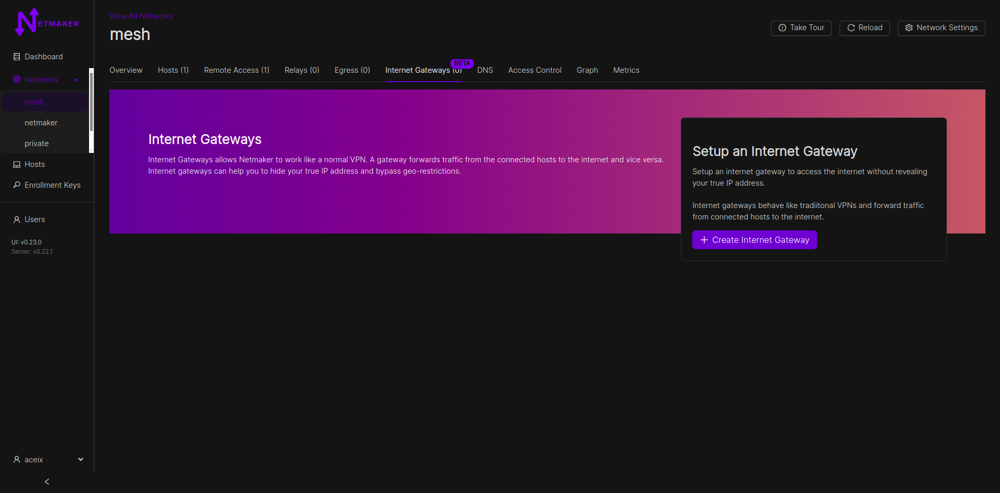
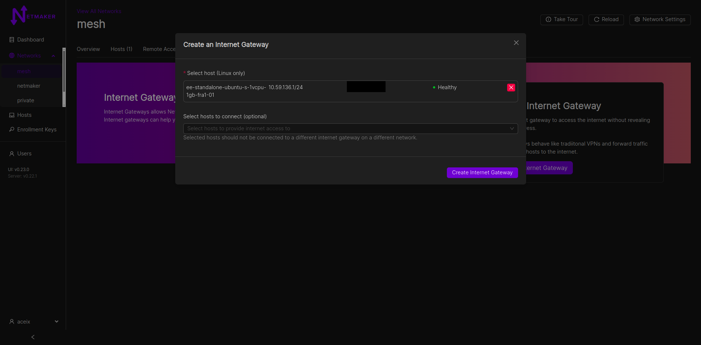
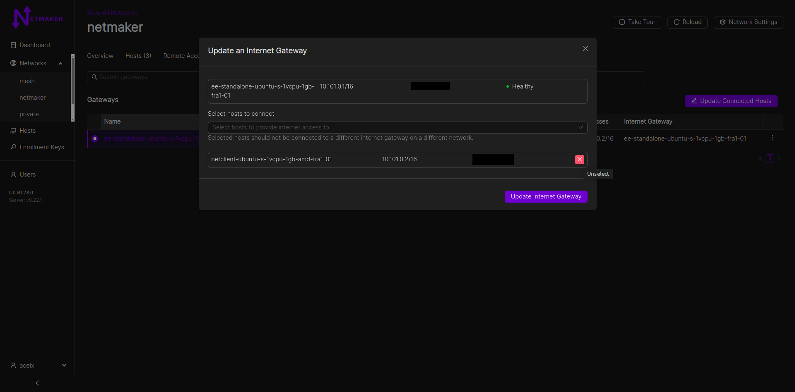
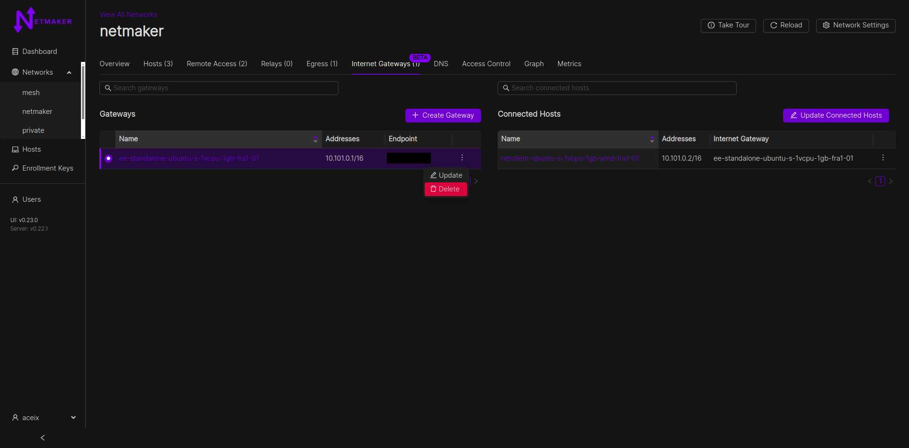

===================================
Internet Gateways
===================================

Internet gateways is a Pro-only feature that allows hosts in a Netmaker mesh network to connect to the internet via a gateway. This brings the possibility of a traditional VPN to machines with netclient installed on them. Internet gateways can be configured from the Internet gateway tab.

Only Linux hosts can be setup as internet gateways. Both Windows and Linux hosts can be connected to an internet gateway however. Remote clients can also be connected to internet gateways via a client config.

This feature was introduced in v0.23.0 and is in beta (for this release).

Any relay behind an internet gateway will have its traffic, as well as traffic of its relayed hosts going through the internet gateway.
This behaviour also happens with remote access gateways and their connected clients; a remote access gateway behind an internet gateway would have its traffic, as well as traffic of its clients, passing through the internet gateway.

**For Community Edition (CE) Users**, clients can still access internet gateways via the `Remote Access tab`. View `here for more info <../external-clients.html#internet-gateway-traditional-vpn>`_.

Usage
======

**Create an internet gateway**

1. Under a network, switch to the "Internet Gateways" tab
2. Click on Create Gateway
3. Select the desired Linux host to serve as the internet gateway (VPN server, in traditional parlance)
4. Optionally choose the hosts you want to connect to the internet gateway
5. Click on create

**NOTE:** A host can only be connected to at most one internet gateway, regardless of the networks the host is in.

**NOTE:** A host already connected to an internet gateway cannot be a gateway itself. ie: internet gateway chaining is not supported currently.

**Update an internet gateway**

1. Select an internet gateway from the gateways table
2. Click on the update gateway button (from the table row actions dropdown or "Update connected hosts" button on top of the associated "Connected Hosts" table)
3. Update the gateway and save changes

**Delete an internet gateway**

1. Click on the delete button from the table row actions dropdown
2. Confirm gateway deletion. This does not entirely remove the host from the network; it only stops the host from serving as an internet gateway.

FAQs and Known Issues
=====================

**Q: Why not Remote Access Gateway as an internet gateway.**

A: Although possible, that serves a similar but different use case. Internet gateways allow not only remote clients, but also and peculiarly, hosts in the Netmaker mesh network to also connect to the internet via a gateway.
This brings the possiblility of a traditional VPN to machines with netclient installed on them. This feature can be accessed from the Internet gateway tab.
