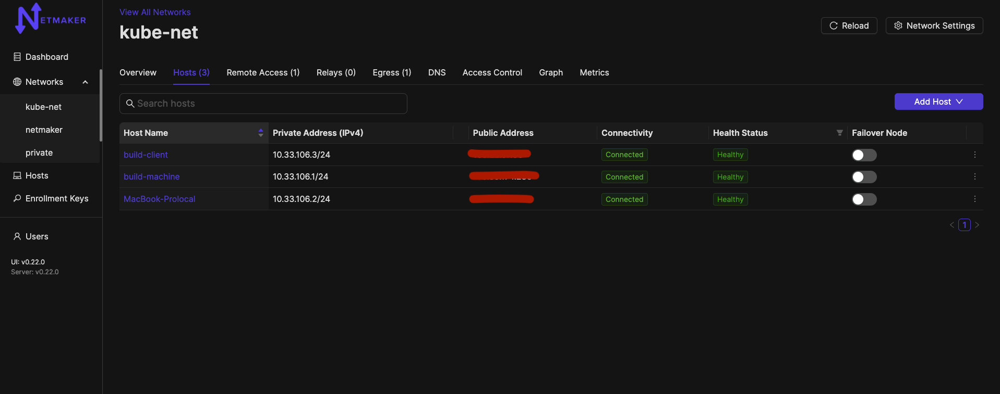
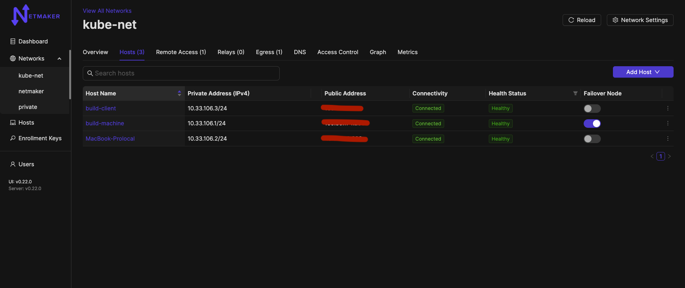

=====================================
FailOver Servers
=====================================

Introduction
===============

Sometimes nodes are in hard-to-reach places. Typically this will be due to a CGNAT, Double NAT, or a restrictive firewall. In such scenarios, a direct peer-to-peer connection with all other nodes might be impossible.

For this reason, Netmaker has a FailOver functionality. At any time you may designate a publicly reachable node (such as the Netmaker Server) as a FailOver, and netmaker will identify if any peers in the network are not able to
communicate directly then their connection will automatically fallback  through the failOver node in the network

Configuring a FailOver node
==================================

To create a failover, you can use any host in your network, but it should have a public IP address (not behind a NAT).

Navigate to the network tab and click on the hosts tab

You can choose any public node in the network to be a failover, Once chosen any peers facing difficulties to communicate directly with each other, will have connection go over the failover node.

To reset the network connections, you can remove the failover node, and network will go back to original state from if any connections are getting failed over.

