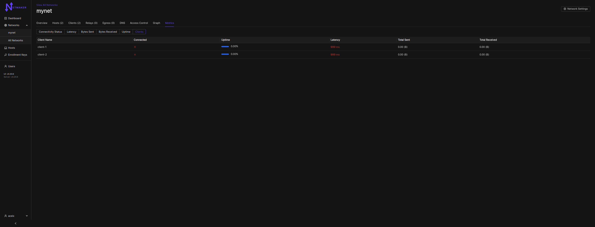
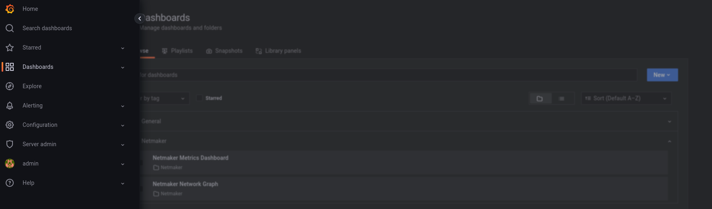
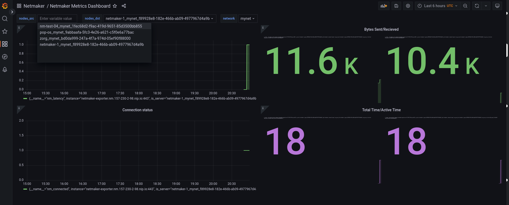
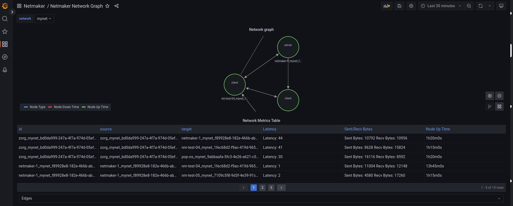

=================================
Netmaker Professional Metrics
=================================

Navigation
===============

Netmaker Pro offers metrics. With Metrics, admin users can view connectivity,
latency and data transferred between two peers or nodes on a Netmaker network. Client metrics are also available.  
All of this data may be visualised in the Netmaker UI. In addition, Netmaker 
has included a custom exporter for Prometheus/Grafana integration to view 
the data as well.

Below are the steps in order to view metrics on your Netmaker Pro instance.

**NOTE: Metrics currently relies on ICMP to be allowed between nodes.**

Network metrics can be viewed under the Metrics tab within a network. 

Viewing Details
===============

To view the metrics in the Netmaker Dashboard, select a network, then click the Metrics tab.
From here, you can switch to any metric you are interested in, including metrics from clients.

NOTE: Metrics may take up to 5 minutes for nodes to report data. 

Grafana Dashboard
=================================

If your Netmaker instance includes the Prometheus/Grafana setup and is configured with the `METRICS_EXPORTER="on"`, you 
can also view your metrics via Grafana. Simply navigate to the `dashboards` section of your Grafana instance. 
.. code-block::

    URL: "https://grafana.<YOUR_DOMAIN_NAME>"
    Username: "admin"
    Password: "admin" 

There, you will be presented with two out-of-the-box Netmaker options of the following:
- `Netmaker Metrics Dashboard`
- `Netmaker Network Graph`

First try viewing the `Netmaker Metrics Dashboard`.
This view will give you the option to select and view data on individual nodes in your Netmaker network.

Then try out the `Netmaker Network Graph` view.
This graph gives a Network graph, in which the user may hover individual nodes to see statistics of that node.
Or hover an edge to view information about the connection between two nodes. The node edges will vary depending on connection status (green for connected or red for disconnected).

Also you can view your metrics on `prometheus dashboard`, for the first time you will be prompted for credentials in your brower when you visit your prometheus dashboard.
.. code-block::

    URL: "https://prometheus.<YOUR_DOMAIN_NAME>"
    Username: "Netmaker-Prometheus"
    Password: "<YOUR_LICENSE_KEY>" 