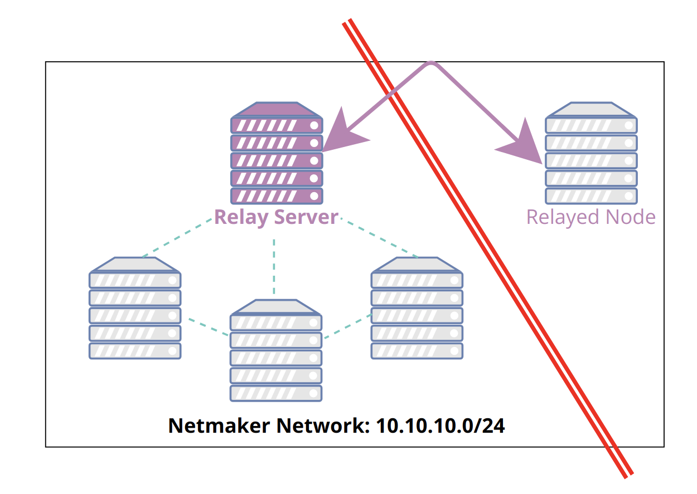
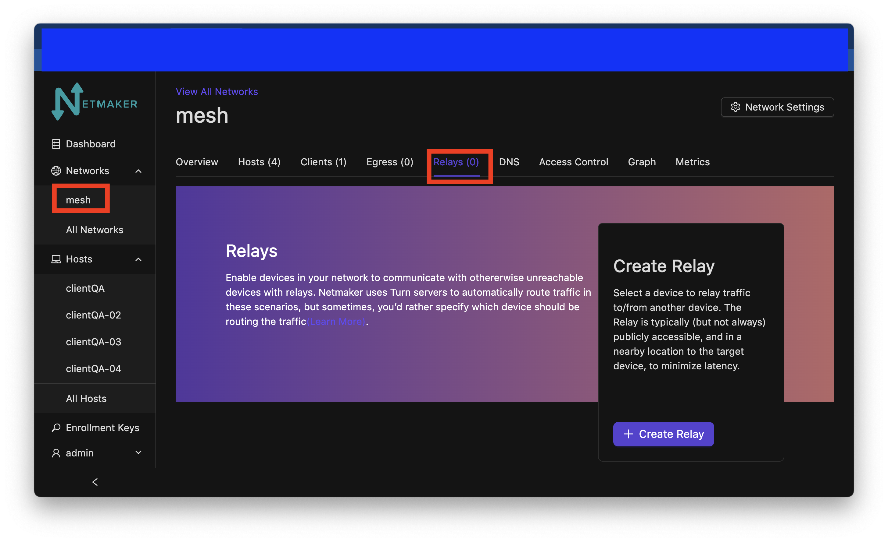
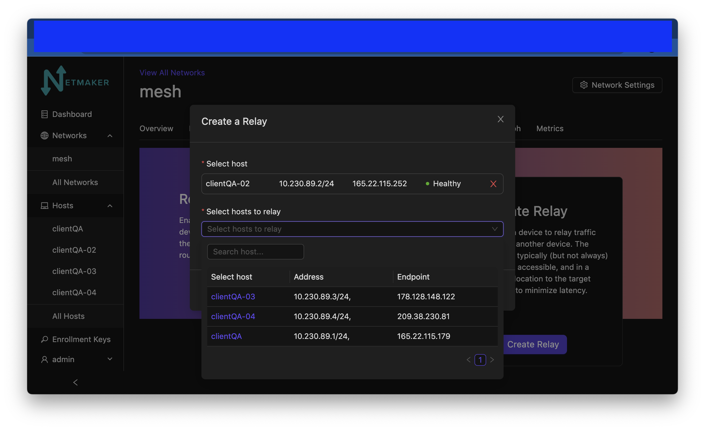
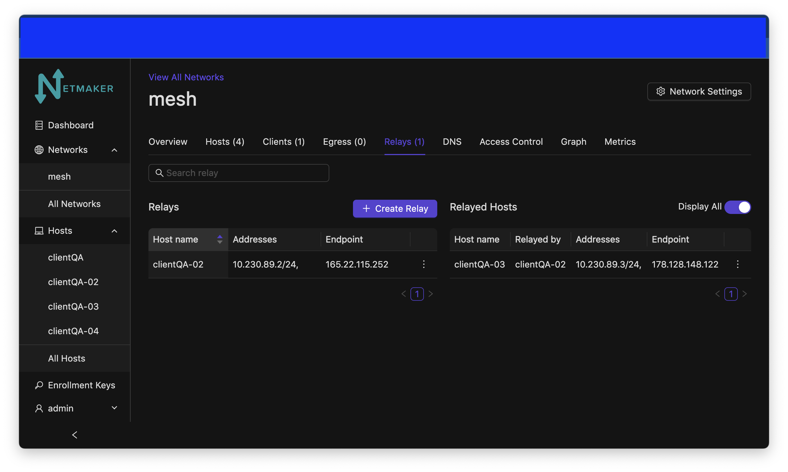
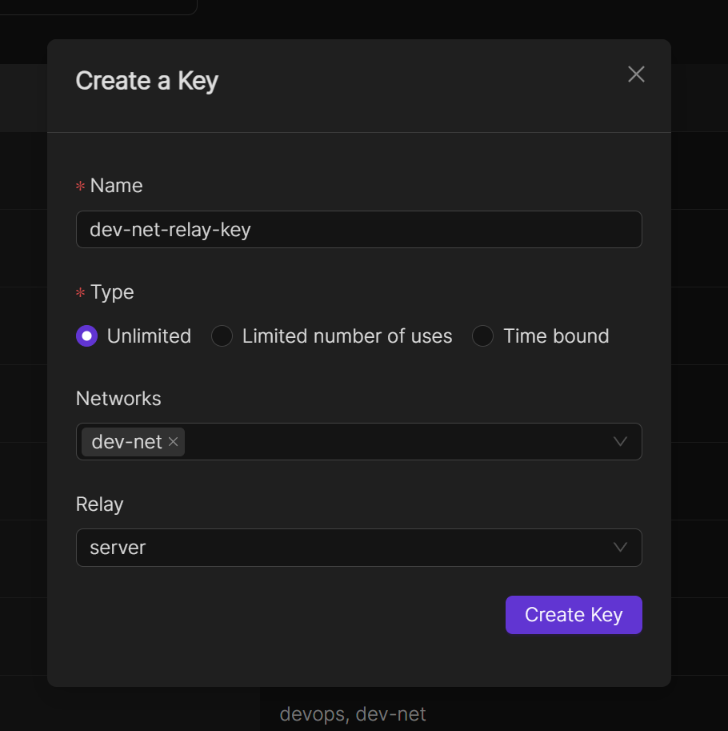
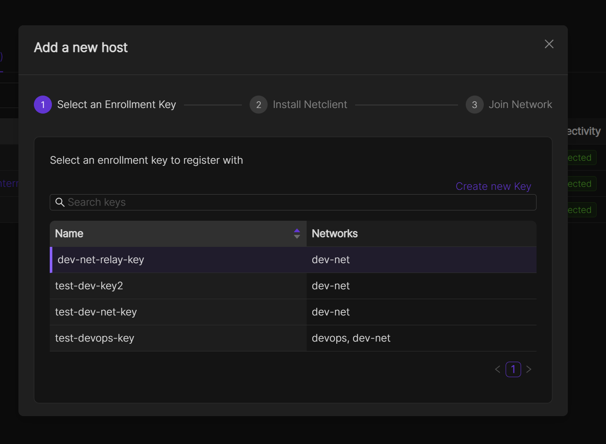

=====================================
Relay Servers
=====================================

Introduction
===============

Sometimes nodes are in hard-to-reach places. Typically this will be due to a CGNAT, Double NAT, or a restrictive firewall. In such scenarios, a direct peer-to-peer connection with all other nodes might be impossible.

For this reason, Netmaker has a Relay Server functionality. At any time you may designate a publicly reachable node (such as the Netmaker Server) as a Relay, and tell it which machines it should relay. Then, all traffic routing to and from that machine will go through the relay. This allows you to circumvent the above issues and ensure connectivity when direct measures do not work.

Configuring a Relay
==================================

To create a relay, you can use any host in your network, but it should have a public IP address (not behind a NAT).

Navigate to the network name and click on the relay tab

When clicking on the create button, you should be prompted to select a host to use as the relaying server.

.. image:: images/selectrelaying.png
   :width: 80%
   :alt: Relay
   :align: center

After that, select the server you would like to be relayed. Choose from the dropdown menu.

After creation, you should see your relayed host show up on a list of relayed hosts on the page.

Auto Relays 
=========================
When incorporating a new host into a network, you have the option to set it up as a relayed node. 
To accomplish this, the initial step involves generating an enrollment key and specifying both the network and the relay to which the host will be added.

When integrating a new host into a network, choose the recently generated enrollment key and proceed with the remaining setup steps.
After completing this process, you should observe your new host being successfully relayed.

