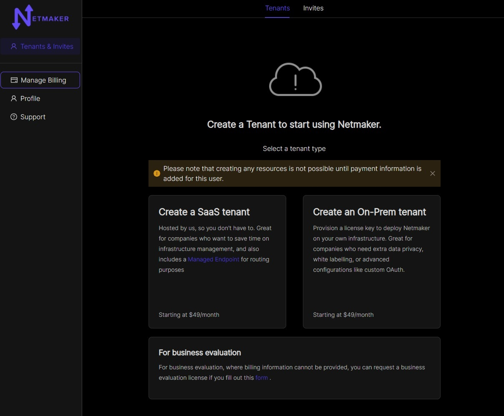
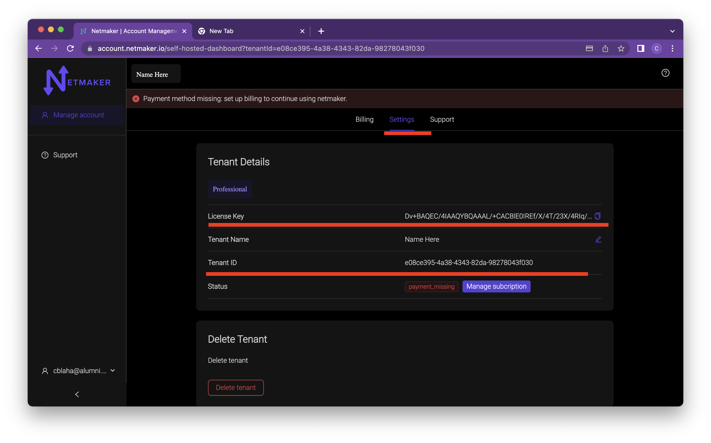

=================================
Netmaker Professional
=================================

This guide covers how to get setup with Netmaker Professional. For pricing,visit `our pricing page <https://www.netmaker.io/pricing>`_

Get a License
=================================

Visit `<https://app.netmaker.io>`_ to set up a self-hosted instance on the Netmaker SAAS platform. When you first visit the site, You should be prompted to create an account. After you make one, you will be automatically directed to a free SAAS instance. You will need to go to account managemement. Click on the manage account button located on the side bar.

You will then need to click on settings and click the delete tenant button. 

You will then be redirected to the tennants page.

Click the Create Tenant button and a modal will pop up allowing you to name your tenant. Click the switch to make the Tenant self-hosted.

You will need to add payment details before you can use your tenant. click on the stripe button to go to the stripe page and enter your payment info.

Setup your server
=================================

You will need the licence key and tenant id from the settings page back at the account management page on the settings tab.

Once you have your license key and account ID, you can get the nm-quick installer and run it. 

.. code-block::
    
    wget https://raw.githubusercontent.com/gravitl/netmaker/master/scripts/nm-quick.sh
    chmod +x nm-quick.sh
    bash nm-quick.sh

Upgrade to Pro from Community Edition
======================================

You can upgrade from an existing community server to a pro server with this script. Follow the prompts to setup a pro server and the script will make the necessary changes to your netmaker.env file and grab the pro docker-compose.override.yml file.

If you prefer to upgrade manually, go to your netmaker server and add the following to your netmaker.env file.

.. code-block:: yaml

    LICENSE_KEY: “<license key>”
    NETMAKER_TENANT_ID: "<tenant id>"

Also change ``SERVER_IMAGE_TAG`` in netmaker.env to ``<version>-ee``. For example: ``SERVER_IMAGE_TAG=v0.20.3-ee`` 

Also change the ``INSTALL_TYPE`` from ce to pro.

Then you will need to get the docker-compose pro file from here

.. code-block::

    wget -O docker-compose.override.yml https://github.com/gravitl/netmaker/blob/master/compose/docker-compose.pro.yml

No changes will need to be made to that file. It will use the configs listed in your netmaker.env file.

After that ``docker kill netmaker netmaker-ui && docker-compose up -d`` and you should see the professional UI on dashboard.<YOUR_BASE_DOMAIN>

You should see a new Dashboard. The top menu bar will have relays and metrics added.

(Optional) Setup your server for Prometheus and Grafana
==========================================================

If you would like to use Netmaker's custom Prometheus exporter and Grafana dashboard, your docker-compose.override.yml file will already have those section.

In Netmaker.env, change the following:

.. code-block::

    METRICS_EXPORTER=on
    PROMETHEUS=on