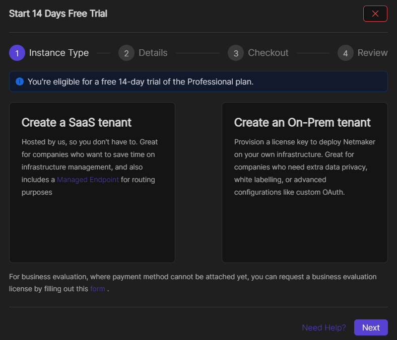
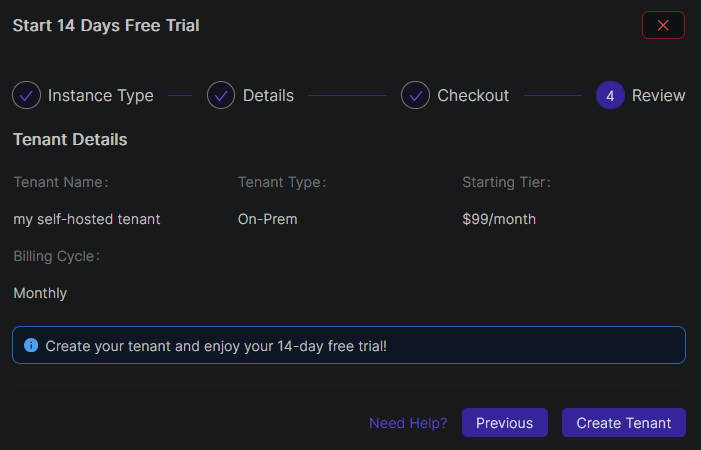

===========================
Netmaker Professional Setup
===========================

This guide covers how to get setup with Netmaker Professional. For pricing, visit `our pricing page <https://www.netmaker.io/pricing>`_

Get a License
=================================

Signup here `<https://account.netmaker.io/signup>`_ to get a license for your self-hosted Netmaker. Never miss to input your Firstname and Lastname.

|

When you login to the site for the first time, normally you will be automatically directed to the tenant creation modal as shown in the first image below. But if, for some reason, you happen to have missed inputting your Firstname and Lastname after signing up, the Profile page will show up instead. Click on the [>] icon to expand the Profile form where you can input your profile info. This is required when creating tenants.

|

For first time users Netmaker offers a free 14-day trial of the Professional plan of either a SaaS tenant or an On-Prem tenant. Click on the "Create an On-Prem tenant" option. Input the name of your new tenant then click on the Next button.  

You can toggle between a Monthly or a Yearly subscription plan for when your trial period ends. Click on the "Tier breakdown" button to view the details of the plan. Once you're done, click on the "Add Payment Details in Stripe" button.

Like many cloud service providers, payment information is required in order to create resources even during trial period. This can be in a form of Debit/Credit card information or a US Bank account. Fillout the form and then click on the "Add" button.

You should automatically be redirected back to the tenant creation modal. Review your new tenant details then click on the Create Tenant button.

Once created, your new tenant should show up in the Tenants page. Click on the Manage Account button to view its details.

Setup your server
=================================

You will need the Licence Key and the Tenant ID which are found on the Settings tab.

Once you have your license key and tenant ID, you can get the nm-quick installer and run it. 

.. code-block::
    
    wget https://raw.githubusercontent.com/gravitl/netmaker/master/scripts/nm-quick.sh
    chmod +x nm-quick.sh
    bash nm-quick.sh -u

Follow the prompts for a pro edition server. provide the License Key and Tenant ID when prompted. 

Upgrade to Pro from Community Edition
======================================

You can upgrade from an existing community server to a pro server with this script. Follow the prompts to setup a pro server and the script will make the necessary changes to your netmaker.env file and grab the pro docker-compose.override.yml file.

If you prefer to upgrade manually, go to your netmaker server and add the following to your netmaker.env file:

.. code-block::

    LICENSE_KEY=<license key>
    NETMAKER_TENANT_ID=<tenant id>

Also change ``SERVER_IMAGE_TAG`` in netmaker.env to ``<version>-ee``. For example: ``SERVER_IMAGE_TAG=v0.21.2-ee`` 

Also change the ``INSTALL_TYPE`` from ce to pro.

Then you will need to get the docker-compose pro file from here

.. code-block::

    wget -O /root/docker-compose.override.yml https://raw.githubusercontent.com/gravitl/netmaker/master/compose/docker-compose.pro.yml

No changes will need to be made to that file. It will use the configs listed in your netmaker.env file.

After that run the following command: 

.. code-block::

    docker kill netmaker netmaker-ui && docker compose up -d 

When you browse to your self-hosted Netmaker via dashboard.<YOUR_BASE_DOMAIN>, you should see the professional UI and a new Dashboard. The top menu bar will have relays and metrics added.

(Optional) Setup your server for Prometheus and Grafana
==========================================================

If you would like to use Netmaker's custom Prometheus exporter and Grafana dashboard, your docker-compose.override.yml file will already have those section.

In Netmaker.env, change the following:

.. code-block::

    METRICS_EXPORTER=on
    PROMETHEUS=on
