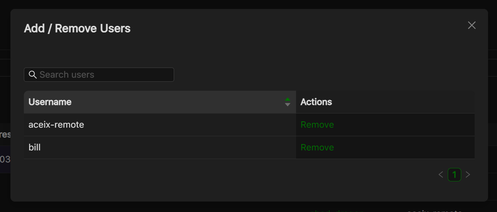
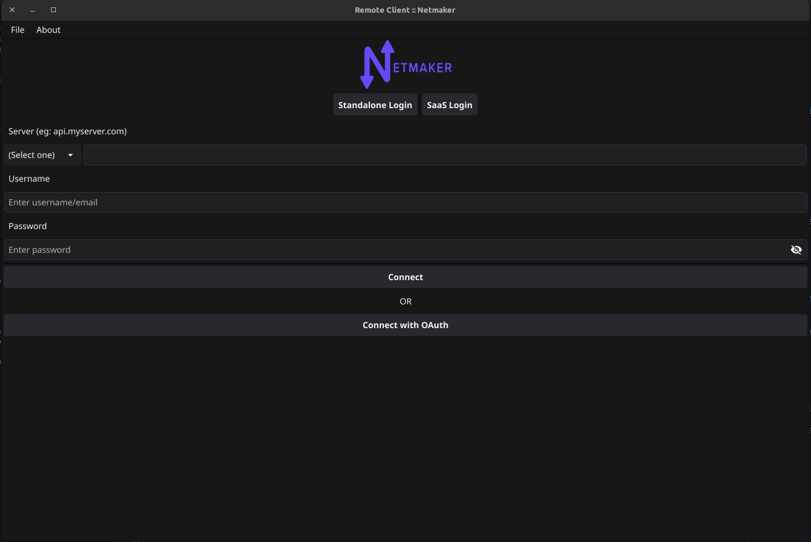

=================================
Users in Netmaker Professional
=================================
Netmaker Professional offers advanced user management features. The super admin can create users with either a user or admin role. Only Admins can access the dashboard, the normal users can use remote access client to join the network through a gateway.
Admins can add users and assign them to client gateways, which includes managing the user's access to different client gateways.

Here is a breakdown of the different user types and their permissions:

* User: Users do not have access to the Netmaker dashboard. They can only use the remote access client to connect to a gateway.

* Admin: They can create and manage users, networks, and gateways. They cannot create/manage other admins

* Super Admin: Super admins have full access to Netmaker. They can create and manage users, admins, networks, and gateways. They can also manage user and admin permissions.

Adding users
=================================
To add a user, go to the Users section and click the Add User button. Fill in the user's details, including their name, password, and role.

* As a super admin, you can add users with the role of admin or user.
* As an admin, you can only add users with the role of user.

.. image:: images/users/add-user.png
   :width: 80%
   :alt: Add User
   :align: center

The credentials will need to be shared with the added user.

Attaching or removing user from a client gateway
================================================
To attach users to a client gateway or remove users from a gateway, you will need to have the client gateway set up. 
Once the client gateway is set up, you will see an option to remove users from the dropdown menu.

.. image:: images/users/gateway-dropdown.png
   :width: 80%
   :alt: Add Remove User dropdown
   :align: center

You can click the button to either attach or remove a user

Transferring super admin rights
===============================

Super admin rights can be transferred only to another admin. To do this, on the users page, go to the superadmin row and hover over the ellipsis.
You will see an option to transfer admin rights. On clicking it, a dialog box will open allowing you to select any admin 
to transfer super admin rights to.

Using the Remote Access Client (RAC)
====================================
Once a user has been added to a client gateway, they can connect to a network using the remote access client. To do this, they will first need to log in using the credentials that were provided to them.

After successful login you will be shown all the networks and gateways you have given access to, so now you will be able to connect/disconnect/refresh your connection to a gateway

.. image:: images/users/remote-access-client-2.png
   :width: 80%
   :alt: Connect and disconnect
   :align: center

The remote access client also has the following options:

* Refresh connection: This disconnects the current connection to the client gateway and then reconnects to it.
* Reload clients: This reloads the client data on the page, which can be useful if the data has changed since the page was last loaded.

.. image:: images/users/remote-access-client-3.png
   :width: 80%
   :alt: Reload clients
   :align: center

Controlling RAC user sessions
=============================

On pro servers/tenants, the duration of a non-admin user's remote session can be controlled.
This can be done by setting `RAC_AUTO_DISABLE` (to `true`) and `JWT_VALIDITY_DURATION` (to an integer in seconds) environment variables on the server. 

With `RAC_AUTO_DISABLE` set to true, a non-admin user's remote sessions will be disabled after the duration specified in `JWT_VALIDITY_DURATION` has elapsed.
The user will have to relogin to enable their remote session again.

NOTE: The `JWT_VALIDITY_DURATION` environment variable also configures all the JWT token validity duration for all users, regardless of whether `RAC_AUTO_DISABLE` is set to `true` or not.
