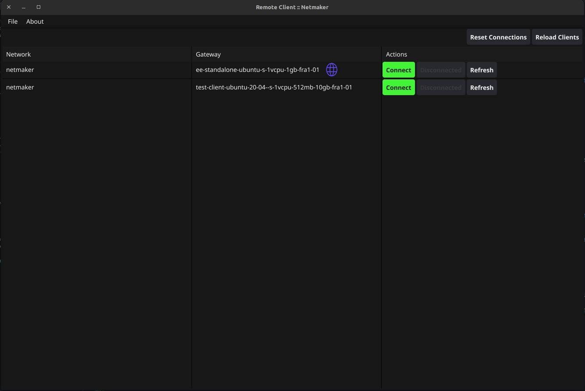
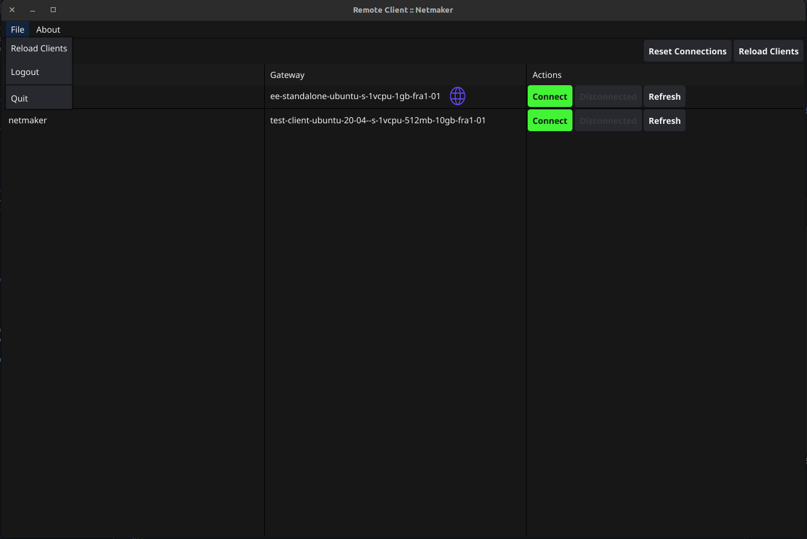

===================================
Netmaker Remote Access Client (RAC)
===================================

The Netmaker Remote Access Client, RAC for short is a GUI tool for easily getting access to a Netmaker network.
RAC is mostly suited for offsite machines that need access to a Netmaker network. It supports Windows, Mac and Linux (mobile support coming soon).

***********************
Download/Installation
***********************

You can download the latest version of RAC from the Netmaker file server:

.. code-block::

  https://fileserver.netmaker.org/releases/download/<version>

Search for remote client and download the appropriate version for your operating system.

For Linux (Debian/Ubuntu), you can also use the following command to download the latest version:

.. code-block:: 

   curl -sL 'https://apt.netmaker.org/remote-client/gpg.key' | sudo tee /etc/apt/trusted.gpg.d/remote-client.asc
   curl -sL 'https://apt.netmaker.org/remote-client/debian.deb.txt' | sudo tee /etc/apt/sources.list.d/remote-client.list
   sudo apt update
   sudo apt search remote-client  # to see available versions
   sudo apt install remote-client

Following the above instructions, you can run RAC from your Linux desktop environment launcher or from the command line using the `remote-client` command.

For Mac, You can download the mac installer from the fileserver link above and run it. Because the app needs to be run as root, open a teminal. Enter the command ``sudo /Applications/NetmakerRemoteClient.app/Contents/MacOS/remote-client``.

For Windows, you can download the remote-access-client_86.msi installer and run it to install on your windows machine. The app will need to be run as administrator. Right click on the desktop icon after installation and click on ``run as administrator``. 

******************
Quick Start
******************

To use RAC, you will need to have a Netmaker server running and have a user account on that server. You will also need to have a client gateway set up on the server that you have access to.

Check :ref:`this section <pro/pro-users:adding users>` on how to create a non-admin user.
RAC is for non-admin users who want to gain remote access to the network, this also provides admins fine-grained control over users in the network by attaching/removing them from a client gateway.

Using the Remote Access Client (RAC)
====================================
Once a user has been added to a client gateway, they can connect to a network using the remote access client. To do this, they will first need to log in using the credentials that were provided to them.

.. image:: images/users/remote-access-client.png
   :width: 80%
   :alt: Remote access login
   :align: center

After successful login you will be shown all the networks and gateways you have given access to, so now you will be able to connect/disconnect/refresh your connection to a gateway

The remote access client also has the following options:

* Refresh connection: This disconnects the current connection to the client gateway and then reconnects to it.
* Reload clients: This reloads the client data on the page, which can be useful if the data has changed since the page was last loaded.

Controlling RAC user sessions
=============================

On pro servers/tenants, the duration of a non-admin user's remote session can be controlled.
This can be done by setting `RAC_AUTO_DISABLE` (to `true`) and `JWT_VALIDITY_DURATION` (to an integer in seconds) environment variables on the server. 

With `RAC_AUTO_DISABLE` set to true, a non-admin user's remote sessions will be disabled after the duration specified in `JWT_VALIDITY_DURATION` has elapsed.
The user will have to relogin to enable their remote session again.

NOTE: The `JWT_VALIDITY_DURATION` environment variable also configures all the JWT token validity duration for all users, regardless of whether `RAC_AUTO_DISABLE` is set to `true` or not.
