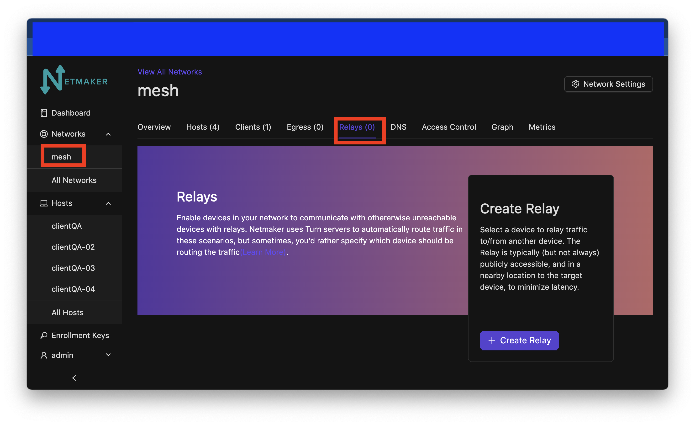
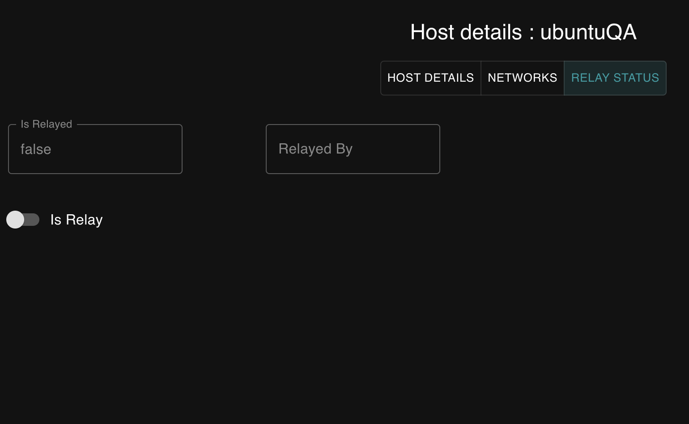
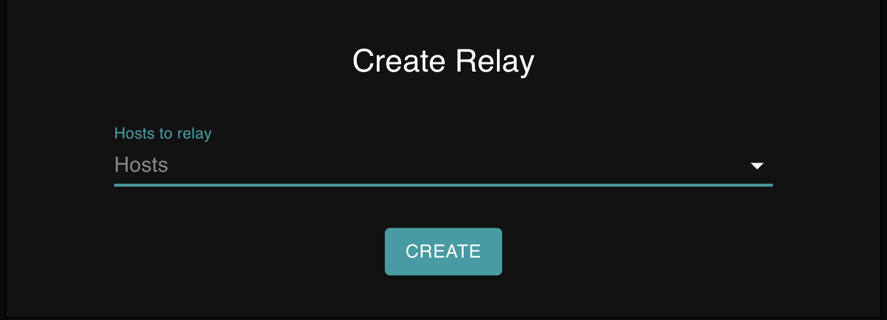
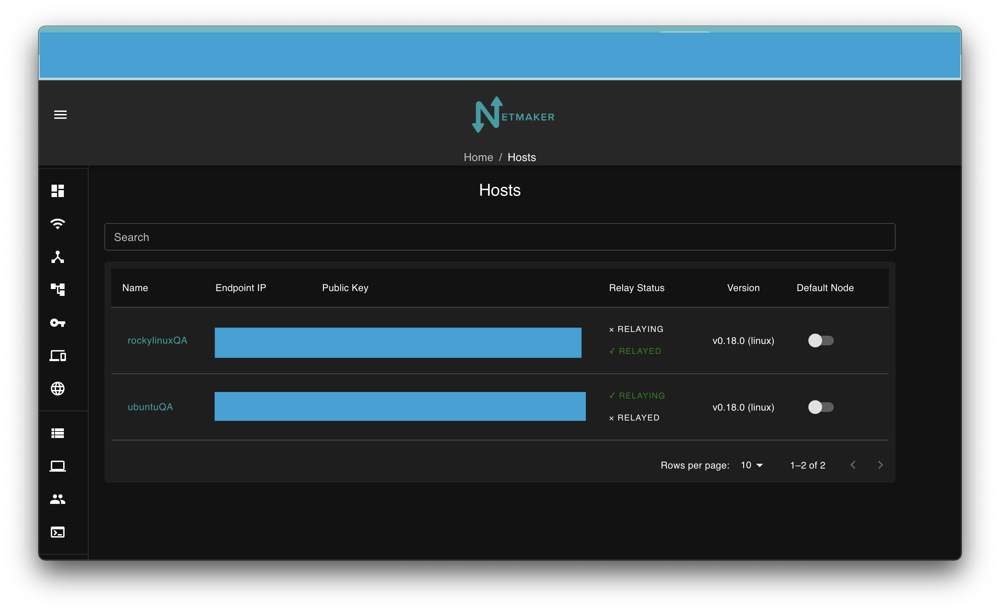

=====================================
Relay Servers
=====================================

Introduction
===============

.. image:: images/relay1.png
   :width: 80%
   :alt: Relay
   :align: center

Sometimes nodes are in hard-to-reach places. Typically this will be due to a CGNAT, Double NAT, or a restrictive firewall. In such scenarios, a direct peer-to-peer connection with all other nodes might be impossible.

For this reason, Netmaker has a Relay Server functionality. At any time you may designate a publicly reachable node (such as the Netmaker Server) as a Relay, and tell it which machines it should relay. Then, all traffic routing to and from that machine will go through the relay. This allows you to circumvent the above issues and ensure connectivity when direct measures do not work.

Configuring a Relay
==================================

To create a relay, you can use any host in your network, but it should have a public IP address (not behind a NAT).

Simply navigate to the Hosts tab and click on the name of the host you would like to use to relay another server. You should see three butons at the top like in the picture below. Navigate to the relay status tab.

You should see this.

click on the Is Relay switch and you should see a window pop up asking what server you sould like to relay. Choose from the dropdown menu.

After creation, you should see your relayed host show up on a list of relayed hosts at the bottom of the page. You should also see the list of hosts showing if a host is relaying or being relayed with green lettering. (figure below)

