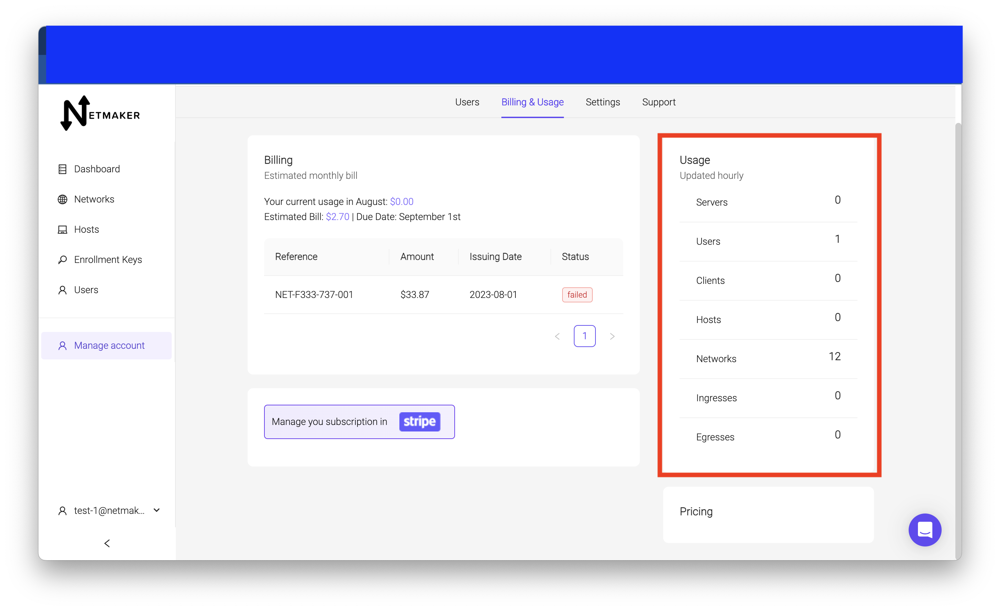

=================================
Billing
=================================

The billing section is located in the account management in the billing and usage section

This is where you enter payment information for your tenant, and view your usage and invoices.

Setting up Payment
===================

In the billing and usage tab click on the ``manage your subscription in stripe`` button

.. image:: images/saas-setup-payment.png
    :width: 80%
    :alt: navigate to stripe button
    :align: center

You should be brought to a stripe page that will allow you to enter card info.

click on ``add payment method``

Enter your card information and submit. You should see your payment info on the screen. Click the ``return to netmaker`` button to go back to your saas account.

Each tenant needs its own payment. If you make another paid tier or self-hosted tenant, you will need to enter payment info for each tenant.

Usage 
========

You can see your tenant's usage on the right side of the screen.

This is updated hourly and will tell you how many of each resource is on that instance.

Invoices
=========

Invoices are sent out monthly. You can view your invoices on the billing and usage tab. 

You can see the invoice number, the amount, the date the invoice is issued and a status. If it is a failed status like the one in the example above, you may need to double check your payment info for accuracy, or contact us for troubleshooting. 

You will also get an email when your invoice is ready.

