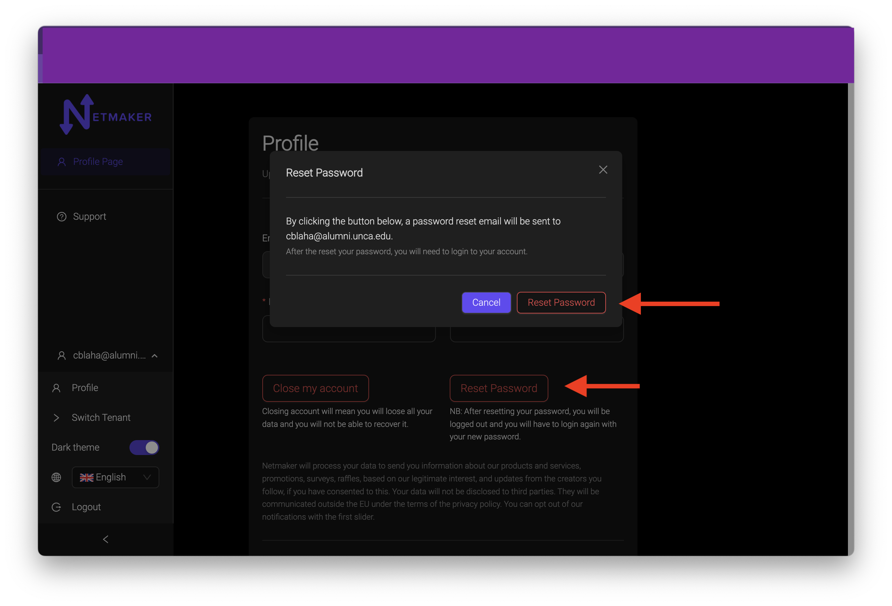

=====================================
Profile Management
=====================================

Change Name
============

Changing your name on your saas profile is easy. simply navigate to Manage Account and click on the profile button.

.. image:: images/saas-change-name.png
    :width: 80%
    :alt: signup link at the bottom
    :align: center

In the text boxes, change the first and last name to whatever you like, and click the save button. That name will now be saved as part of your profile.

note: emails cannot be changed. If you would like to change your email, you will need to create an account with that different email, then you can transfer any tenants over to that account. To see how to transfer a tenant to another user, checkout :doc:`The users <./saas-user>`

Change Password
================

In the same profile section, click on the reset password button. this will bring up a confirmation modal to send a password reset email to you.

After confirming the password reset, you will be redirected back to the login screen. Look for an email from ``Netmaker-Account-Manager noreply@supertokens.io``. You may  need to look in your spam folder if it does not show up in your inbox. Follow the instructions in the email to reset your password.

Close Account
===============

To close out your account, just click the close acount button on your profile.

.. image:: images/saas-close-account.png
    :width: 80%
    :alt: close account
    :align: center

This will remove all your tenants and information from that account and is not reversable. If there are any tenants you don't want permenantly removed, transfer them over to :doc:`Another user <./saas-user>` . 