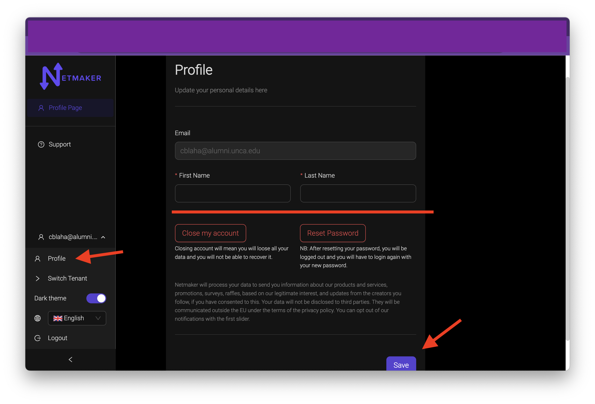

=====================================
Profile Management
=====================================

Change Name
============

Changing your name on your saas profile is easy. simply navigate to Manage Account and click on the profile button.

In the text boxes, change the first and last name to whatever you like, and click the save button. That name will now be saved as part of your profile.

note: emails cannot be changed. If you would like to change your email, you will need to create an account with that different email, then you can transfer any tenants over to that account. To see how to transfer a tenant to another user, checkout :doc:`The users <./egress-gateway>`