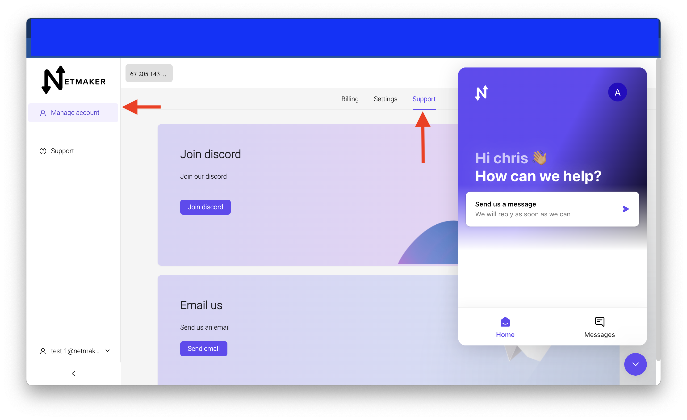
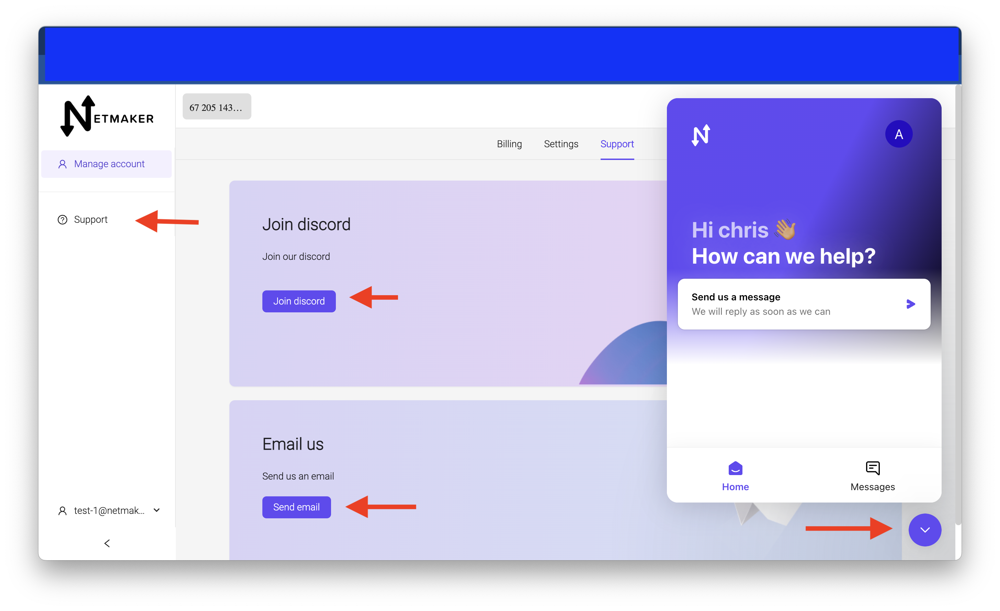

=====================================
Support
=====================================

Introduction
===============

Navigate to Account managemanet and click on the support tab

You will see a few options. 

1) You can click on the discord button to recieve an invitation to join our discord server where you can ask for help.

2) There is an email button to email us directly with any questions.

3) The support button on the side menu will navigate you to the netmaker docs here.

4) There is a chat icon in the bottom right corner. You can click that and a window will pop up. You can send us a message and we will respond as early as possible.

