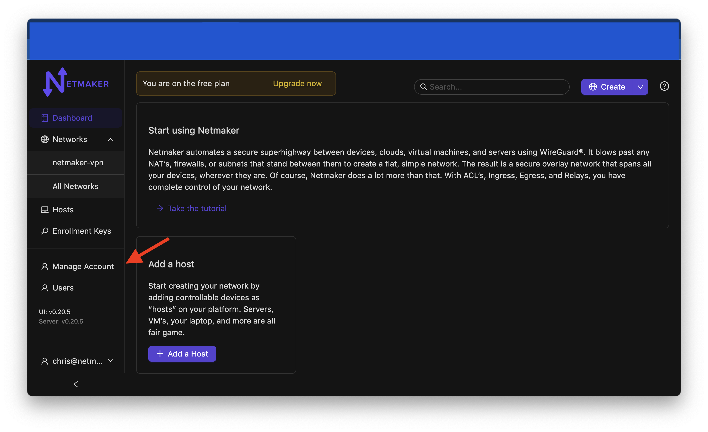
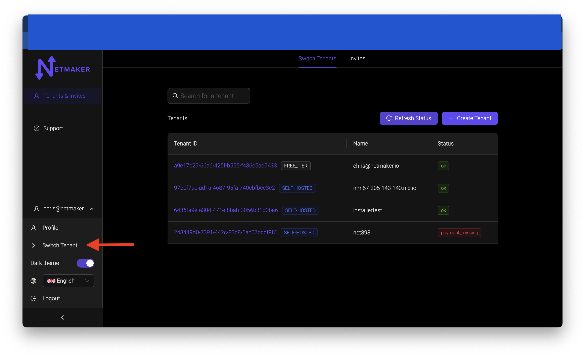
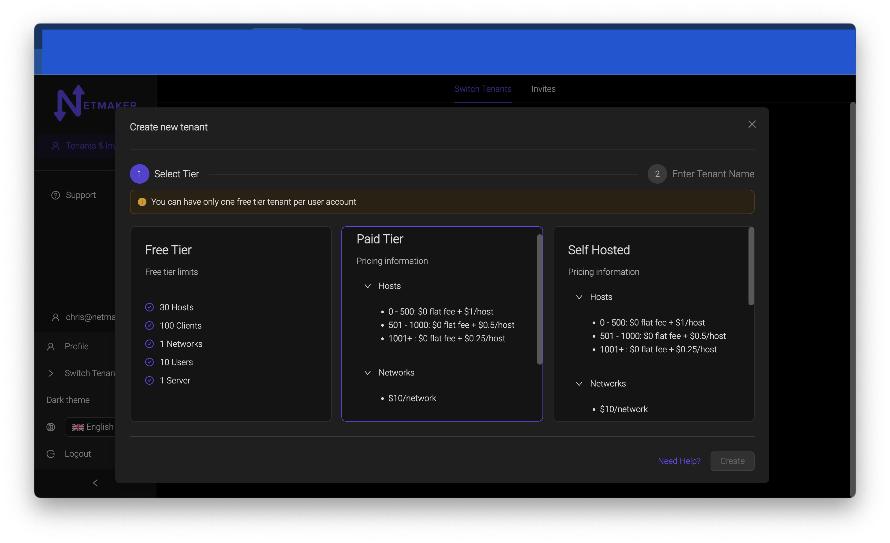
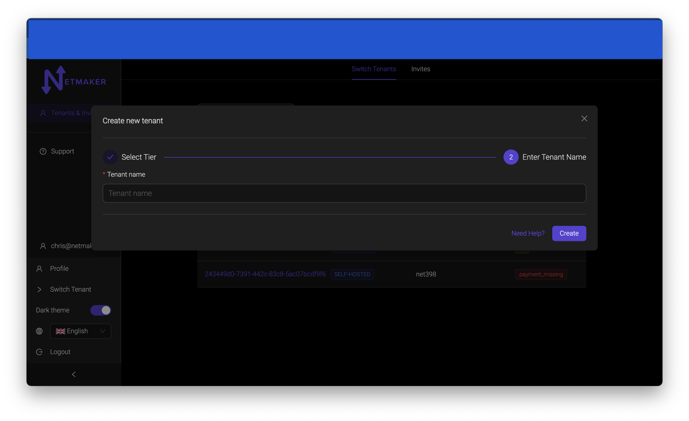
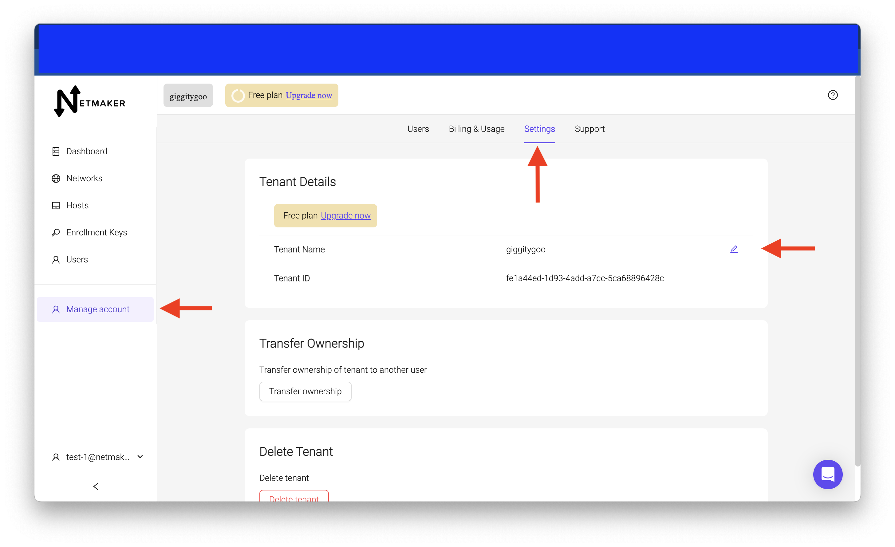

=====================================
Tenant Creation and Management
=====================================

Introduction
===============
Software as a Service (SaaS) has revolutionized the way businesses and individuals access and use software applications. SaaS offerings provide a cloud-based model where software is hosted and maintained by a service provider, and users can access these applications through the internet. Each individual or organization that subscribes to a SaaS service is referred to as a "tenant."

Netmaker offers three types of tenants. Pricing for each tenant are listed on `our pricing page of our website <https://www.netmaker.io/pricing>`_

Free Tier 
-----------

Our free tier is what is built for you automatically when you sign up for our SAAS platform. There are limits to our free tier. They are listed on the link above.

You can only have one free Tier tenant at a time per account. If you would like to get another free tier tenant, you will have to delete the existing one.

Paid Tier
-----------

Our paid tier has the same limits as the free tier. Instead, you will be charged for usage outside of those tier limits. pricing listed on link above.

The paid tier has all the features of the pro version like meterics and relays. Once you create a paid tier tenant, you will have to enter payment information before you can use the paid tenant. Info on how to do that will be in our :doc:`billing section <./saas-billing>`.

Self Hosted
-------------

Our self-hosted tier is where you will get your license key and tenant id to build a Netmaker Pro server. Instead of using a paid tier that is hosted on our cluster, you provide the server.

Accessing Your tenants
=======================

To access tenant management, navigate to manage account,

and bring up the bottom menu where you will see a ``switch tenant`` button.

This will bring you to a screen where you will see a list of all your tenants.

Creating a Tenant
===================

To create a tenant, start at your switch tenant screen. There is a ``+ create tenant`` button. clicking that will pop up this modal.

You'll have three choices of which tier to choose. If you already have a free tier, you will not be allowed to create another one unless you delete the existing free tier.

You'll notice as well that the paid tier and self-hosted tier also have pricing info listed. After you make your selection, click on the 2 button above the self-hosted box to name your tenant. This name can be changed at any point in the settings.

After you enter a name, click the ``create`` button and your tenant is now in the list. You may see a status of ``unavailable`` at first. This is normal. Netmaker is building your instance at that time. After a few minutes, click the ``refresh status`` button above the list to see if that status goes away. If the ``unavailable`` status persists after a few minutes, contact us to troubleshoot the issue.

Once the ``unavailable`` status goes away, the tenant is ready for use. If you made a free tier, You can click on that tenant and use it right away. If you made a paid or self-hosted tier, you must enter payment information before the tier is ready to use. You will see a ``payment missing`` status on that tenant. Our :doc:`billing section <./saas-billing>` will cover how to enter payment information for your tenant.

Tenant Status
===============

Status indicators for each tenant are shown in the status column.

OK
------

Tenant is running and functioning normally

Payment Missing 
----------------

There is no payment on file for that tenant. Our :doc:`billing section <./saas-billing>` will show you how to enter your payment information.

Payment Method Invalid
------------------------

Double check if your payment info is correct.

No Admin
---------

Your tenant does not have an admin yet. That should go away when you first sign into the tenant. If it does not, contact us to get the issue fixed.

Error
--------

Could be any of multiple different issues that would cause this status. Contact us to troubleshoot.

Unavailable
-------------

The instance is down. This could be due to an error that caused the instance to shut down, or we could be doing maintainance on our servers.

Manage and View Name and id
=============================

To view the name and id of the tenant, simply go to account management and click on the settings tab. You can change the name of the tenant by clicking on the pencil icon. You can change the name to whatever you like.

Upgrade and Downgrade Your Tenant
===================================

On a free tier tenant, you have the option to upgrade to a paid tier tenant.