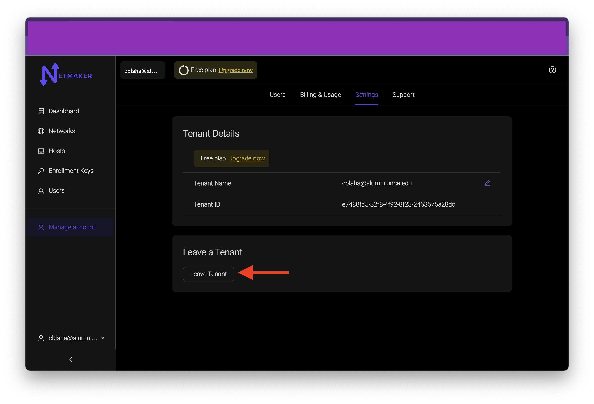

=================================
Users
=================================

Two Different User Pages
=========================

There are two routes to get to the users section. one is through the Users tab and the other is through the Manage Account tab.

The Manage Account route will allow you to invite users to your netmaker instance, remove users from your nemtaker instance, and transfer ownership of a netmaker instance to another user. 

The User tab route will let you manage user permissions of the users that are invited to your netmaker instance.

Adding a User
==================

send an invite
---------------

In the Manage Account section, click on the Add User button. This will bring up a modal to enter the email address of the user you would like to invite to your netmaker party.

That user will recieve an invite via email from ``admin@mail.netmaker.io``. If the invited user has not made an account yet with `<https://app.netmaker.io>`_, now is the time to do so.

You should see your invited user in your users section with an invite label next to it.

Accept the invite
------------------

After the invited recieves the email. there will be a link to `<https://app.netmaker.io>`_ to access their account or create one if they have not already.

In their account management, they should see a notification in the invite section to accept. 

After accepting the invite, you should see the Netmaker instance on your list of tenants. like the one in the bottom of this list.

you are initally invited as a non-admin user by default. The owner of the tenant will have to change your permissions if needed in the users tab. More about that will be in the next section.

Transfer Ownership to another user
===================================

Make the newly joined user an admin
------------------------------------

Lets take our new user and transfer ownership of our tenant to it. Start by making sure the user is given admin privileges. Go to the users tab and hover over the vertical elipses. click on edit.

Click the isadmin switch and click the update user button. You should then see your invited user set to admin.

.. image:: images/saas-user-set-to-admin.png
    :width: 80%
    :alt: user is admin now.
    :align: center

Transfer Ownership
-------------------

You are now ready to transfer ownership to the new user. Navigate to account management and click on your username to bring up a bottom menu. click on the switch tenants button.

Navigate to the Manage Account section and go to the settings. Click on the Transfer Ownership button and you should see an option to choose the new owner from a dropdown.

After a successful transfer, you should see the new user labeled as the owner.

Leave Tenant
=============

As an invited user to a tenant, (or after transferring ownership) you can leave a tenant. This can be done in two ways.

Leave as an invited user
-------------------------

Navigate to Account Management and go to settings. click the `leave tenant` button

Remove a User as an Owner
--------------------------

As an owner, navigate to the User section and click on the elipses of the user you would like to remove.

After that the user should be gone from your users section and the removed user will no longer have access to that tenant.

