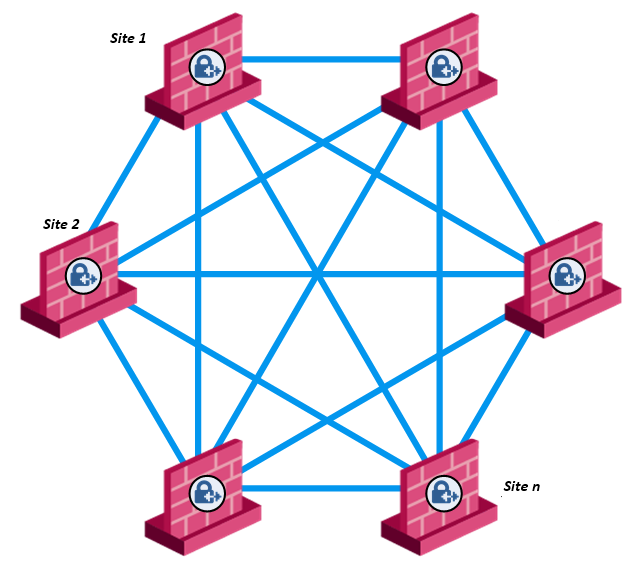
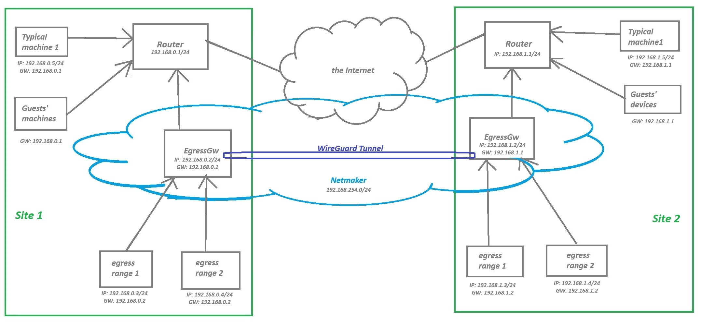
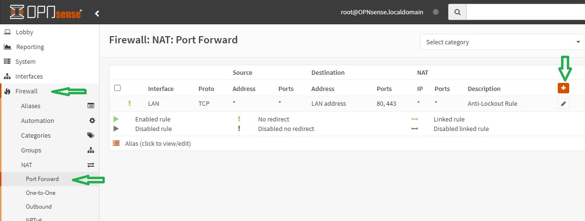
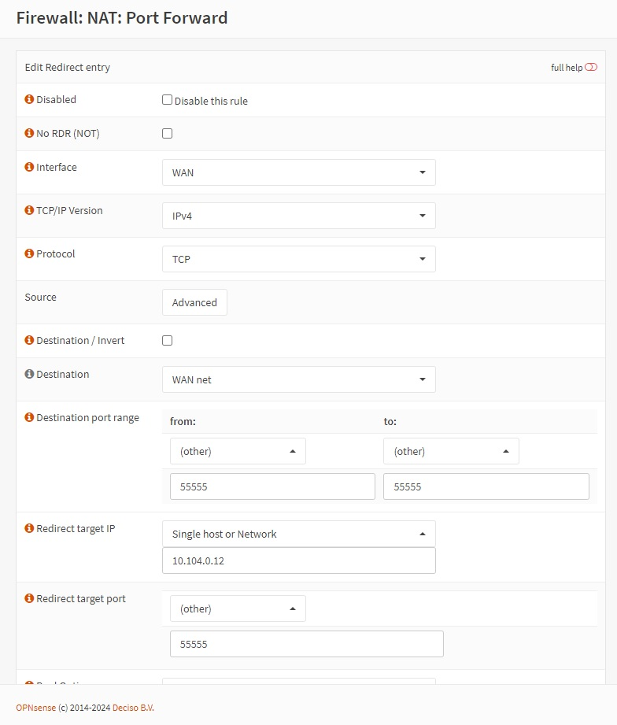
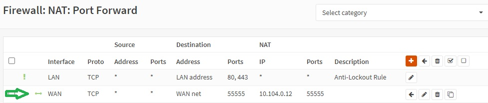
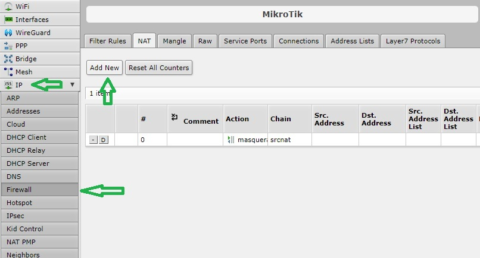
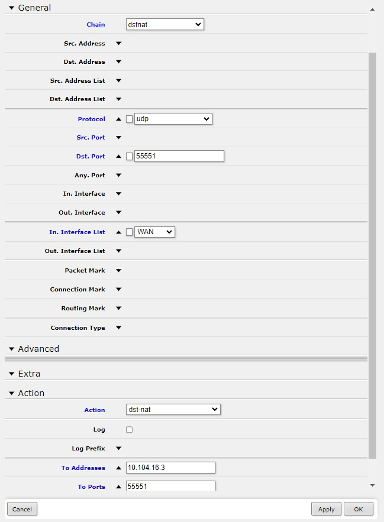
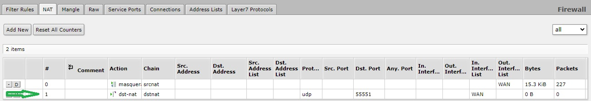
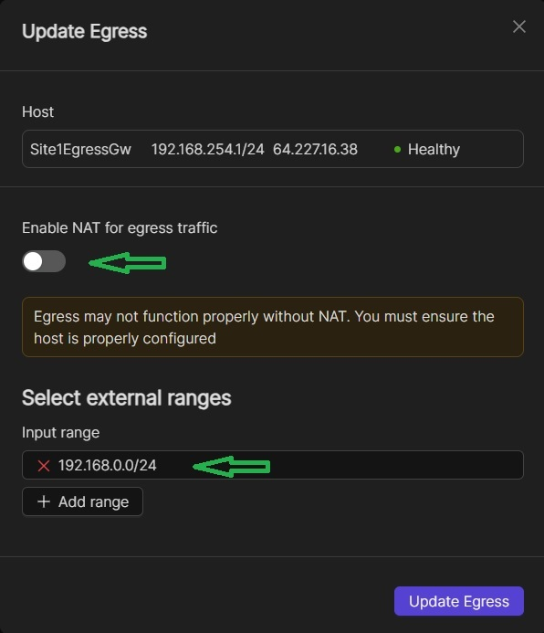
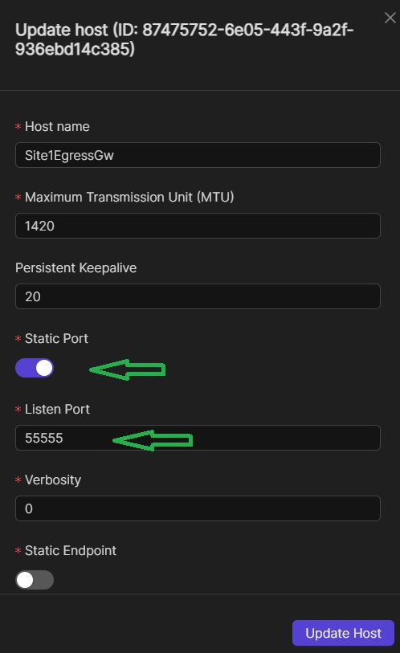

.. _site2site-mesh-vpn:

===================================
Setting up Site-to-site Mesh VPN
===================================

.. epigraph::

   I have three sites, one of them is a data center. Each site has multiple ISP connections. I'm interested in setting up a mesh VPN with… Netmaker… to facilitate automated failover when a given ISP link goes down. I want network resources at each site to be able to access network resources at other sites, without having to directly install a software client themselves.

   -- alvin0747 (Discord user)

If you have more or less similar use case as ‘alvin0747’, or if you are him, then this guide is for you.  Netmaker is very much capable in overlaying your private sites with a mesh blankie, a reliable opaque covering. Getting the TLDR; feeling? The following is a general guideline.

General Guideline
======================

1.	Make sure that all the networks, including the Netmaker network, do not overlap with each other in part nor in whole
2.	On routers or firewall appliances in each of your site, specify port forwarding rules to the corresponding machines you’ve prepared to be installed with Netclient. Some custom ports like say for example, 55555
3.	On each site, setup a Netclient Egress Gateway node where NAT is disabled, and then the whole (or part) of the site’s private network specifically inputted (or enumerated) on the address range field. These machines are going to be the ‘virtual routers’ for each site. They are going to be the only machines on each of your site to be needing the software Netclient. Goes without saying that the Egress Gateway on each site must be part of the local private network (or VLAN)
4.	To prevent the Egress Gateways from being or needing to be “failedover” from each other, set their ‘Ports’ to ‘static’ on NMUI and then specify the custom port you’ve made on Step 2, say 55555. 
5.	For network resources on each site, their default gateway settings must point to the local Egress Gateway machine. You might be able to automatically facilitate this with your DHCP server. With this setup, internet and VPN traffic from each site’s machines are going to route through the Egress Gateway. If you’re concerned about performance, you can setup Link Aggregation, aka network/link bonding. Please note that you only need to do this for those machines you want to be in the VPN network. Other machines or devices on the site that only needs the Internet can point directly to the router
6.	For multiple ISP links, let your router, firewall appliance (FWA), or manageable switch handle internet failover

And that’s it! Just sheepishly obey this guideline and you should have a working mesh site-to-site VPN with Netmaker. And good news, you can do this on community version. Hurray!
If it’s still fuzzy then let’s go through the details one step at a time.

Overview of the Setup
========================

Below are some rough conceptual diagrams of the setup. The first shows the macro side of things and the second one a relevant microcosm.

   

Note that in the second image, the arrows represent the default gateway that the devices point to. They do not represent [fully] the connecting cables. The following are some examples to illustrate the flow of traffic:

   - Each site has direct tunnel connection to all the other sites, thus a mesh connection
   - Flow of traffic from Site1EgressRange1 to Site2EgressRange2 is through [Site1EgressRange1] => [Site1EgressGateway] => through the tunnel => [Site2EgressGateway] => [Site2EgressRange2]. “Through the tunnel” in physical terms is flow of traffic from [Site1Router1] => [the Internet] => [Site2Router2], and vice versa
   - Flow of traffic from EgressRange to the internet is through [EgressRange] => [EgressGateway] => [Router] => [the Internet]
   - Flow of traffic for other machines/devices (that don’t need to be in the VPN network) to the internet is through [Smartphone] => [Router] => [the Internet]

Make Sure There are No Overlapping Networks
---------------------------------------------

It is vital that you make sure all the networks, including your Netmaker network, do not overlap with each other in part nor in whole. 

For example, you could have this setup:
   - Netmaker network – 192.168.254.0/24
   - Site 1 – 192.168.0.0/24
   - Site 2 – 192.168.1.0/24
   - Site n – 192.168.[n].0/24

To make the transition seamless, you may set this up on each site’s router, managed switch, DHCP server, and local DNS server if you have one. If there’s too much friction, you could also setup a new VLAN and build up from there.

Add Port Forwarding Rules
---------------------------------------------

On routers in each of your site, specify port forwarding rules to the corresponding machines you’ve prepared to be installed with Netclient. Some custom ports like say for example, 55555. In OPNsense or pfSense you can do this by navigating to Firewall => NAT => Port Forward, then click on the add icon.

If you have multiple ISP connections, then you might choose “WAN net” in the Destination field, otherwise the more specific “Wan address”. Specify your Netclient machine’s IP in the “Redirect target IP” field. 

Save the configuration then click on the Apply button. You should have something similar to what is shown in the image below.

On Mikrotik, you might navigate to IP => Firewall => NAT then click on “Add New” button. 

Under the Action section, specify the Netclient machine’s IP in the “To Addresses” field. Then click on Apply and OK.
   

You should have something similar to what is shown in the image below.

Please refer to your own router’s manual or documentation on how you can effectively add one up.

Setting up a Netclient Egress Gateway on Each Site
---------------------------------------------------

On each site, setup a machine (preferably Linux) that will fill the role as the ‘virtual’ router. It should be part of the local network (or VLAN) by setting its default gateway to point to the router. Install Netclient on it and then join it into your Netmaker network. Set it up as an Egress Gateway where NAT is disabled, and then input the whole (or part) of the site’s private network on the address range field. So, for example on one of your sites (say Site1) where the network address is 192.168.0.0/24 you’ve setup a Linux machine called “Site1EgressGw”, you may do as shown in the image below.

For more information on setting up a Netmaker network, check this link: https://docs.netmaker.io/getting-started.html#create-a-network.

For more information on setting up an Egress Gateway, check this link: https://docs.netmaker.io/egress-gateway.html#egress.

Specify Static Ports
-------------------------

By default, Netmaker routes traffic between nodes behind NAT routers through a failover node. This would result to getting a star connection. This feature is ideal in many scenarios. But since we want a mesh connection, we need to prevent this by manually adding port forwarding rules on the routers as we did in the preceding sections. What we’re going to do now is to statically set the port number that your Egress Gateway listens to. 

Browse the NMUI and navigate to the Hosts page. Locate the Egress Gateway host in the table and then edit it.
   

Set the Proper Default Gateway IP
--------------------------------------

For network resources on each site, their default gateway settings must point to the local Egress Gateway machine. You might be able to automatically facilitate this with your DHCP server. With this setup, internet and VPN traffic from each site’s machines are going to route through the Egress Gateway. If you’re concerned about performance, you can setup Link Aggregation aka network/link bonding on your Egress Gateway machine. That is if your manageable switch supports it.

Please note that you only need to do this for those machines you want to be in the VPN network. Other machines or devices on the site that only needs to access the Internet can point directly to the router’s IP as their default gateway.

You could choose to setup VLANS to properly segregate your network resources.

ISP Failover
----------------

In case of multiple ISP links, let your router, firewall appliance (FWA), or manageable switch handle internet load balancing and failover. Please refer to your devices’ user’s manual or documentation for more information. There will be some momentary breakage in connection when internet traffic fails-over to another ISP but Netmaker should be able to handle the public IP change just as it is able to handle dynamic public IPs.

Limitations
----------------

In the meantime, the Internet Gateway feature of Netmaker doesn’t apply to Egress range machines. You cannot set the Egress Gateway as an Internet Client and expect the egress range machines’ internet traffic to route through the Internet Gateway. Okay, maybe you can do this but you’d have to add at least one routing entry on the local Egress Gateway and then on each network resource, point to the CoreDNS server as the primary nameserver to prevent DNS leaks.

Disclaimer
======================================

The information provided by us on this how-to guide is for general informational purposes only. All information on this page is provided in good faith, however we make no representation or warranty of any kind, express or implied, regarding the accuracy, adequacy, validity, reliability, availability or completeness of any information on the page.

Under no circumstance shall we have any liability to you for any loss or damage of any kind incurred as a result of the use of this how-to guide or reliance on any information provided on the page. Your use of the how-to guide and your reliance on any information on the page is solely at your own risk.