This page contains annotated screenshots of most UI components, detailing the configuration options of each field across Nodes, Networks, DNS, Ext Clients, Users, and more.

`Here is an arcade showing a walkthrough of our new UI. <https://app.arcade.software/share/Jdl7PnnqIbot3IkqvIaf>`_

Authentication
=================

Signup
--------

When you start Netmaker for the first time, you will be prompted to create an admin account from the UI like below

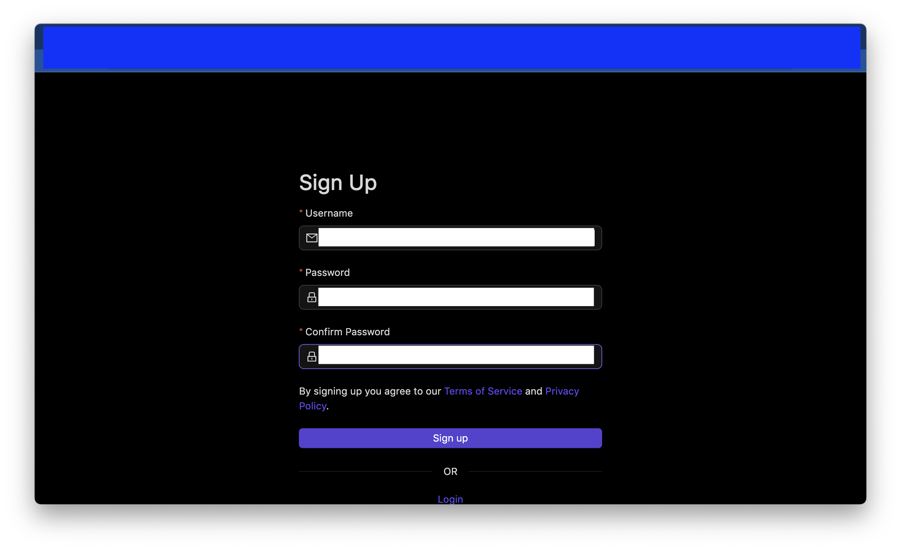

(1) **Username:** Enter a unique username for the admin user.
(2) **Password:** Enter a secure password for your new user.
(3) **Password Confirmation:** Repeat the password for verification.
(4) **Signup with OAuth:** Button to signup with OAuth.

Login
--------

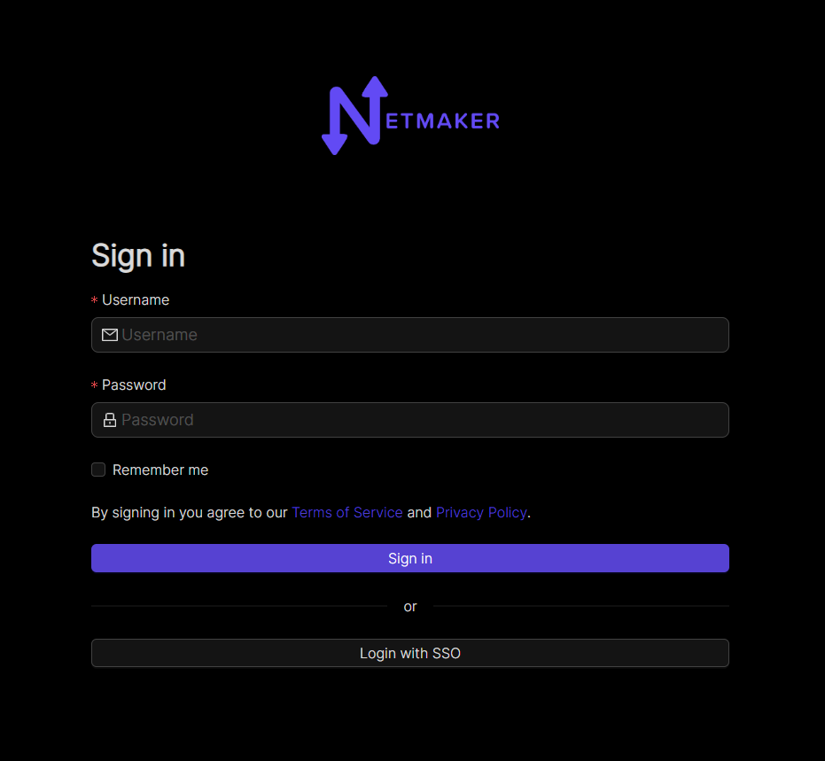

(1) **Username:** Enter your username.
(2) **Password:** Enter your password.
(3) **Login:** Button to login.
(4) **Login with OAuth:** Button to login with OAuth.

Dashboard
=================

.. image:: images/ui-1.jpg
   :width: 80%
   :alt: dashboard
   :align: center

Networks
=================

Create
--------

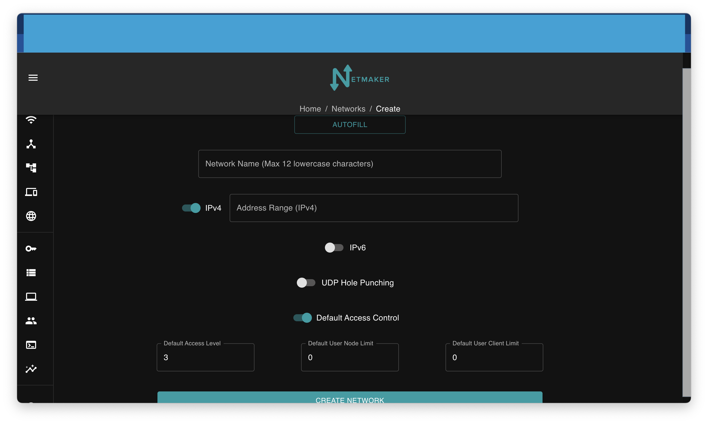

.. code-block::

(1) **Autofill:** Provides sensible defaults for network details and makes up a name.
(2) **Network Name:** The name of the network. Character limited, as this translates to the interface name on hosts (nm-<network name>)
(3) **Address Range:** The CIDR of the network. Must be a valid IPv4 Subnet and should be a private address range.
(4) **Default Access Control:** Indicates the default ACL value for a node when it joins in respect to it's peers (enabled or disabled).

Hosts
======

In simple terms, a host is a computer or machine running the netclient software. Netmaker UI allows an admin to conviniently view and configure some host settings remotely.

Host List
---------

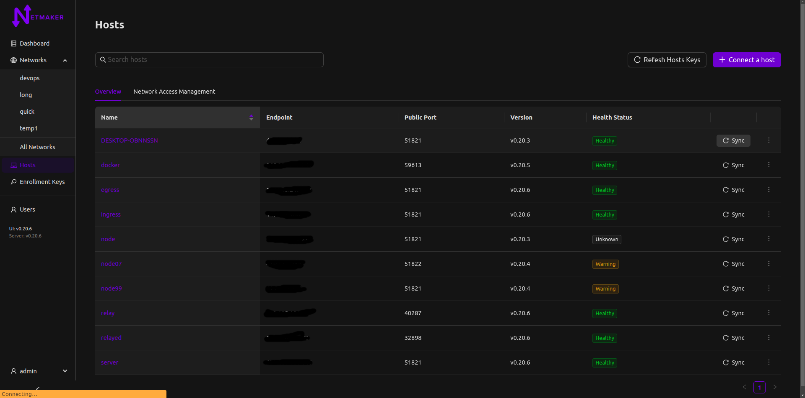

(1) **Host Name:** Friendly name of the host. Clicking it opens a view to allow admins manage hosts.
(2) **Endpoint:** The public IP address of the host.
(3) **Public Port:** Public port of the host.
(4) **Version:** Indicates the version of netclient the host is running.
(5) **Health Status:** Indicates the connectivity of the host.
(6) **Sync:** Synchronise the host with the server; this triggers the host to pull latest network/server state.
(7) **Actions:** Quick actions that can be performed on the host.

Host Create
-----------

A host is automatically created on a server once a netclient (a machine running netclient) joins any network on the server.

Host Details
------------

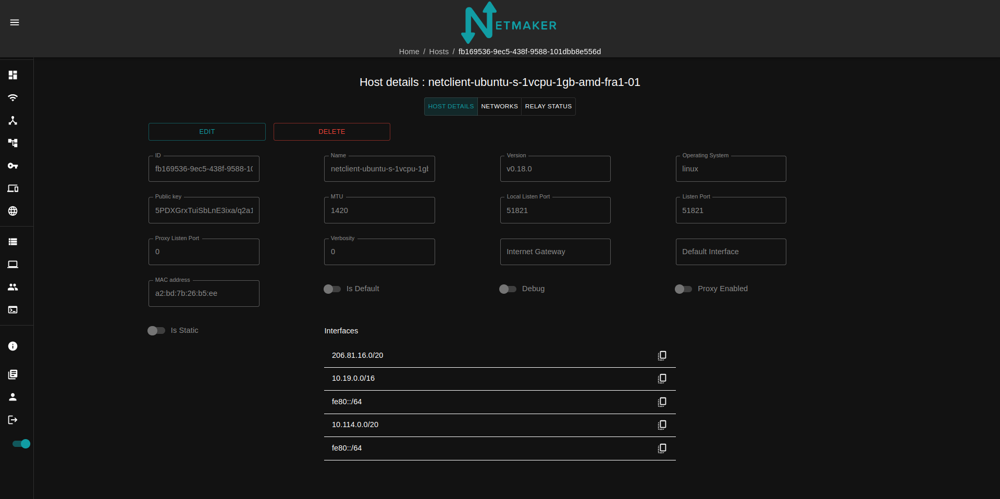

The following information is present under the host details tab:

(1) **ID:** Unique identifier for the host
(2) **Name:** Name of the host. Defaults to the machine's name.
(3) **Version:** Version of netclient the host is running.
(4) **Operating System:** Operating system (OS) the machine is running.
(5) **Public Key:** Public key of the host. distributed to other hosts.
(6) **MTU:** Maximum Transmission Unit (MTU) of the host
(7) **Listen Port:** The wiregaurd listen port.
(8) **Proxy Listen Port:** The netclient proxy listen port. this is used if `Proxy Enabled` is set to `true`. (No longer available from v0.20.5)
(9) **Verbosity:** Log verbosity (ranges from 1-4). Indicates level of detail the host (netclient) will output to logs.
(10) **Default Interface:** Default network interface used by the host.
(11) **MAC Address:** Media Access Control (MAC) address of the host machine.
(12) **Is Default:** Indicates whether the host is a default node. Hosts that are default nodes will automatically join any created network.
(13) **Debug:** Flag to enable additional logging on client.
(14) **Proxy Enabled:** Indicates whether a host is running netclient proxy. (No longer available from v0.20.5)
(15) **Is Static:** Indicaates whether the host's endpoint is static or not.
(16) **Interfaces:** Lists the available network interface for the host.

A host can be deleted from the UI. All associated nodes must be manually removed however, before deleting a host.

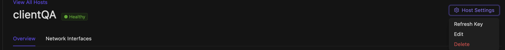

Nodes
========

Node List
-------------

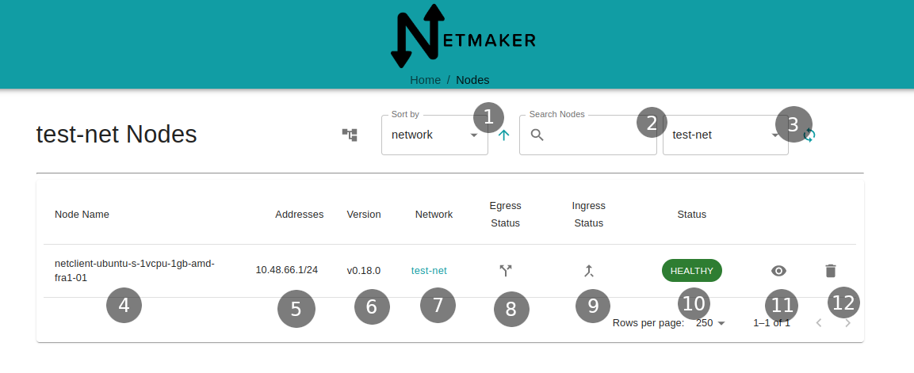

(1) **Search Hosts:** Look up a host by name.
(2) **Host Name:** Name of host. By default set to hostname of machine.
(3) **Private Addresses:** Private IPs of host within network.
(4) **Public Address:** Public IP of host.
(5) **Status:** Indicates how recently the host checked into the server. Displays "Warning" after 5 minutes and "Error" after 30 minutes without a check in. Does **not** explicitly indicate the health of the node's virtual network connections; however a healthy host will check-in regularly.
(6) **Actions:** Dropdown list of actions that can be performed on a host, including disconnecting and deleting the host.

A node pending deletion will be grayed out.

Create Egress
---------------

.. image:: images/ui-6.png
   :width: 80%
   :alt: dashboard
   :align: center

(1) **Egress Gateway Ranges:** A comma-separated list of the subnets for which the gateway will route traffic. For instance, with Kubernetes this could be both the Service Network and Pod Network. For a standard VPN, Netmaker can use a list of the public CIDR's (see the docs). Typically, this will be something like a data center network, VPC, or home network.
(2) **Interface:** The interface on the machine used to access the provided egress gateway ranges. For instance, on a typical linux machine, the interface for public traffic would be "eth0". Usually you will need to check on the machine first to find the right interface. For instance, on Linux, you can find the interface by running this: ip route get <address in subnet>.

Create Relay
-------------

Check host section on hosts_. A relay can be created under host settings.

Edit Node / Node Details
--------------------------

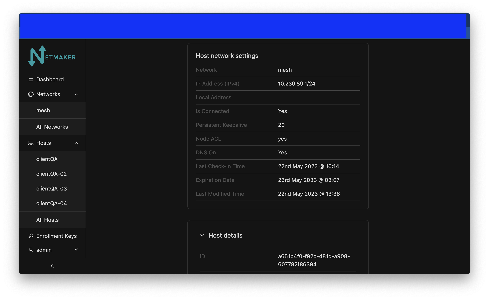

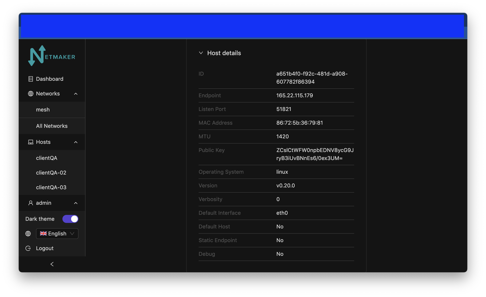

(1) **Edit** Edit the node's details
(2) **ACLs** View the node's Access Control List (ACL)
(3) **Metrics** View the node's metrics
(4) **Host** View the node's associated host
(5) **Delete** Delete the node
(6) **Endpoint:** The (typically public) IP of the machine, which peers will use to reach it, in combination with the port. If changing this value, make sure Roaming is turned off, since otherwise, the node will check to see if there is a change in the public IP regularly and update it.
(7) **Dynamic Endpoint:** The endpoint may be changed automatically. Switching this off (indicating static endpoint) means the endpoint will stay the same until you change it. This can be good to set if the machine is a server sitting in a location that is not expected to change. It is also good to have this switched off for Remote Access gateway, Egress, and Relay Servers, since they should be in a reliable location.
(8) **Listen Port:** The port used by the node locally. **This value is ignored if UDP Hole Punching is on,** because port is set dynamically every time interface is created. If UDP Hole Punching is off, the port can be set to any reasonable (and available) value you'd like for the local machine.
(9) **IP Address:** The primary private IP address of the node. Assigned automatically by Netmaker but can be changed to whatever you want within the Network CIDR.
(10) **IPv6 Address:** (Only if running dual stack) the primary private IPv6 address of the node. Assigned automatically by Netmaker but can be changed to whatever you want within the Network CIDR.
(11) **Local Address:** The "locally reachable" address of the node. Other nodes will take note of this to see if this node is on the same network. If so, they will use this address instead of the public "Endpoint." If running a few nodes inside of a VPC, home network, or similar, make sure the local address is populated correctly for faster and more secure inter-node communication.
(12) **Node Name:** The name of the node within the network. Hostname by default but can be anything (within the character limits).
(13) **Public Key:** (Uneditable) The public key of the node, distributed to other peers in the network.
(14) **Persistent Keepalive:** How often packets are sent to keep connections open with other peers.
(15) **Last Modified:** Timestamp of the last time the node config was changed.
(16) **Node Expiration Datetime:** If a node should become invalid after a length of time, you can set it in this field, after which time, it will lose access to the network and will not populate to other nodes. Useful for scenarios where temporary access is granted to 3rd parties.
(17) **Last Checkin:** Unix timestamp of the last time the node checked in with the server. Used to determine generic health of node.
(18) **MAC Address:** The hardware Media Access Control (MAC) address of the machine. Used to be used as the unique ID, but is being depreciated.
(19) **Egress Gateway Ranges:** If Egress is enabled, the gateway ranges that this machine routes to.
(20) **Local Range:** If IsLocal has been enabled on the network, this is the local range in which the node will look for a private address from it's local interfaces, to use as an endpoint.
(21) **Node Operating System:** The OS of the machine.
(22) **MTU:** The MTU that the node will use on the interface. If "wg show" displays a valid handshake but pings are not working, many times the issue is MTU. Making this value lower can solve this issue. Some typical values are 1024, 1280, and 1420.
(23) **Network:** The network this node belongs to.
(24) **Node ACL Rule** The current ACL rule for this node in the network
(25) **Is DNS On:** DNS is solely handled by resolvectl at the moment, which is on many Linux distributions. For anything else, this value should remain off. If you wish to configure DNS for non-compatible systems, you must do so manually.
(26) **Is Local:** If on, will only communicate over the local address (Assumes IsLocal tuned to 'yes' on the network level.)
(27) **Connected** Indicates whether the node has is connected to the network

Remote Access
=============

.. image:: images/ui-8.jpg
   :width: 80%
   :alt: dashboard
   :align: center

(1) **Gateway Name / IP Address:** Information about which Node is the Remote Access Gateway.
(2) **Add Client Config:** Button to generate a new Remote Access Client configuration file.
(3) **Client ID:** The randomly-generated name of the client. Click on the ID to change the name to something sensible. 
(4) **IP Address:** The private ip address of the ext client.
(5) **QR Code:** If joining form iOS or Android, open the WireGuard app and scan the QR code to join the network.
(6) **Download Client Configuration:** If joining from a laptop/desktop, download the config file and run "wg-quick up /path/to/config"
(7) **Delete:** Delete the ext client and remove its network access.

DNS
===========

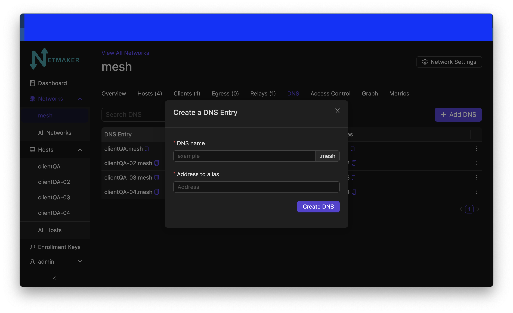

(1) **DNS Name:** The private DNS entry. Must end in ".<network name>" (added automatically). This avoids conflicts between networks.
(2) **IP Address:** The IP address of the entry. Can be anything (public addresses too!) but typically a node IP.
(3) **Select Node Address:** Select a node name to populate its IP address automatically.

Create / Edit Users
=====================

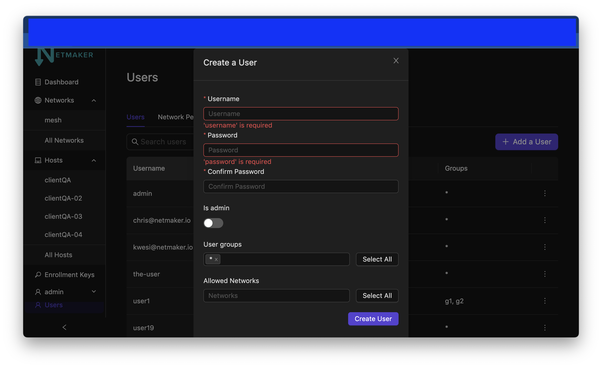

(1) **Username:** Specify Username.
(2) **Password:** Specify password.
(3) **Confirm Password:** Confirm password.
(4) **Make Admin:** Make into a server admin or "super admin", which has access to all networks and server-level settings.
(5) **Networks:** If not made into an "admin", select the networks which this user has access to. The user will be a "network admin" of these networks, but other networks will be invisible/unaccessible.

Node Graph
=====================

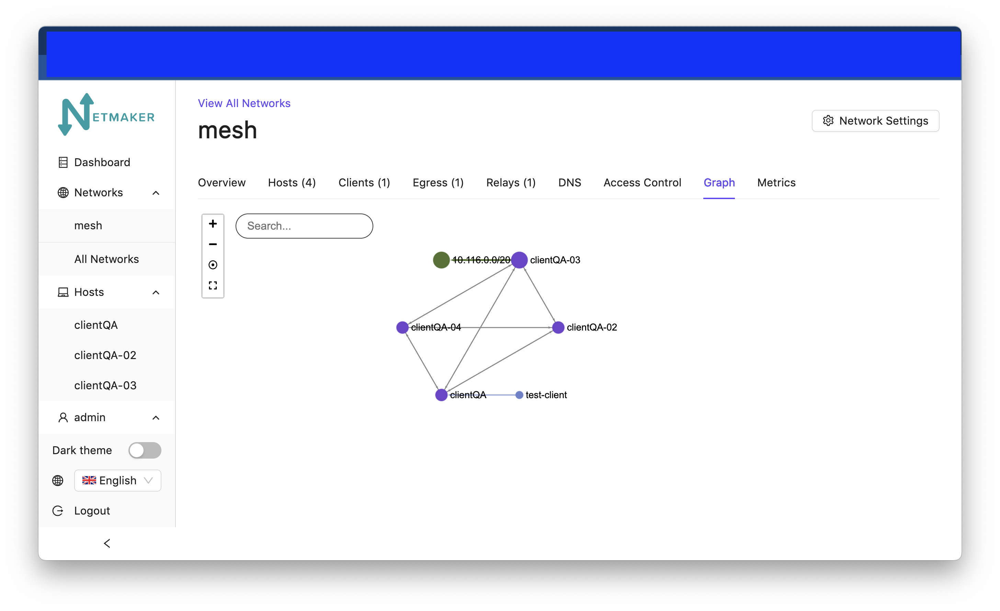

View all nodes in your network, zoom in, zoom out, and search for node names.
**hover:** Hover over a node to see its direct connections.

Access Control Lists
=====================

.. image:: images/acls-3.png
   :width: 80%
   :alt: ACLs
   :align: center

(1) **Reset:** Reset your changes without submitting.
(2) **Allow All:** Enable all p2p connections
(3) **Block All:** Disable all p2p connections. Makes building up a Zero Trust network easier.
(4) **(allowed):** Click to switch a connection to "deny." Note that node names are higlighted on the side and top to track location.
(5) **(blocked):** Click to switch a connection to "allow."
(6) **Submit Changes:** Click once you are ready to submit. Will send message to update relevant nodes in network.
